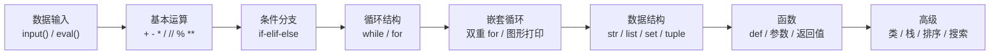

---
tags:
  - Python
Category:
  - 总结
  - 课内/笔记
---

# 计算机软件技术基础1 — 编程题1~8 知识点总结与考试预测

> 基于 [[编程题1/]] ~ [[编程题8/]] 共 40 道编程题的全面分析。

---

## 一、按模块的知识点分布

### 编程题1（a系列）：基础运算与数学判断

| 题目 | 核心知识点 |
|------|-----------|
| a1 计算时刻转换 | `//` 整除、`%` 取模、统一量纲（全部转分钟） |
| a2 水仙花数 | 数字位拆分 `n // 100 % 10`、`**` 幂运算、布尔比较 |
| a3 回文数 | 数字位拆分 + 重组、数字反转算法 |
| a4 三角形周长面积 | `eval()`、海伦公式 $\sqrt{p(p-a)(p-b)(p-c)}$、`"{0:.2f}".format(x)` 格式化输出 |
| a5 直角三角形相似 | 比例判断、**用乘法代替除法避免精度问题**、`or` 逻辑运算 |

> **解题核心思路**：将问题转化为数学公式 → 用 Python 运算符表达 → 注意浮点精度

---

### 编程题2（b系列）：条件判断与简单循环

| 题目         | 核心知识点                                                              |
| ---------- | ------------------------------------------------------------------ |
| b1 三个整数排序  | `if-else` 多分支、变量交换 `a, b = b, a`、冒泡思想                              |
| b2 点在圆内    | 距离公式 $\sqrt{x^2+y^2}$、浮点数 `eps` 容差比较 `abs(d-radius) < eps`         |
| b3 距月底几天   | **闰年判断** `year%400==0 or year%100!=0 and year%4==0`、`if-elif`、月份天数 |
| b4 找最高最低分  | `while` 循环、最值维护模式                                                  |
| b5 1到N交替求和 | `while` 循环、`i%2==0` 奇偶判断、累加器模式                                     |

> **解题核心思路**：分情况讨论 (if-elif-else) → 循环遍历 → 维护中间状态变量

---

### 编程题3（c系列）：循环进阶与数据处理

| 题目 | 核心知识点 |
|------|-----------|
| c1 找最大值及出现次数 | `while True` + `break` **哨兵模式**、最大值 + 计数同步维护 |
| c2 所有素因子 | `while n>1` 质因数分解、`//=` 整除赋值 |
| c3 分数四则运算 | 通分、约分 (GCD)、`for i in range(min, 0, -1)` 找最大公约数、符号处理 |
| c4 一年中第几天 | `for i in range(1, month)` 遍历月份累积天数、闰年判断 |
| c5 a+aa+aaa 求和 | 递推构造 `x = x*10 + a`、累加器 |

> **解题核心思路**：循环不变量维护 → 递推 / 迭代构造 → 边界处理

---

### 编程题4（d系列）：嵌套循环与字符图形

| 题目 | 核心知识点 |
|------|-----------|
| d1 反素数 | **数字反转** `while n1!=0: m=m*10+n1%10; n1//=10`、素数判断双重循环、`continue` |
| d2 斐波那契数列 | 递推 `c = a + b; a = b; b = c`、`for` 循环 |
| d3 逢七必过 | 模拟报数、取模循环 `person = (person+1) % m`、7 的倍数判断 |
| d4 打印金字塔 | **双重 for 循环**、空格打印、数字递减 + 递增 |
| d5 字母阵列 | `ord()` / `chr()` 字符编码转换、`(i+j)%26` 取模循环 |

> **解题核心思路**：外层控制行，内层控制列 → 找规律 → 用公式生成每行内容

---

### 编程题5（e系列）：字符串与列表入门

| 题目 | 核心知识点 |
|------|-----------|
| e1 最长公共前缀 | 字符串索引遍历 `s[i]`、`min(len())`、`break` 终止 |
| e2 恺撒密码 | `ord()` / `chr()`、`%26` 循环移位、字符范围判断 `'A'<=c<='Z'` |
| e3 春游报数 | `input().split()`、`map(int, ...)`、`set` 集合、**集合差集** `all - attend` |
| e4 找最大值位置 | 列表 `.append()`、`max()` 函数、`for i in range(n)` 索引遍历 |
| e5 校门外的树 | 列表初始化 `[1]*(l+1)`、**切片赋值** `a[start:end+1]`、`.count()` |

> **解题核心思路**：字符串/列表的遍历与索引 → 善用 Python 内置函数 → 集合运算简化逻辑

---

### 编程题6（f系列）：字符串处理与复杂模拟

| 题目 | 核心知识点 |
|------|-----------|
| f1 密码合法性 | **字符分类统计**（数字/大写/小写/其他）、多条件逐条判断、标志变量 |
| f2 约瑟夫环 | 列表模拟环形、`del circle[i]`、下标回绕、`'7' in str(number)` 字符包含判断 |
| f3 找兔子 | 模拟搜索、标记数组 `holes[a]=1`、等差数列递推 `a+=b; b+=1`、取模 |
| f4 平衡序列 | 多组测试 `for _ in range(t)`、`sum(a[:i])` 切片求和、**前缀和**思想、`for-else` |
| f5 神奇的幻方 | 二维列表创建、`in` 查找元素位置、规则模拟 |

> **解题核心思路**：模拟题目描述的规则 → 使用数组/列表记录状态 → 注意循环边界

---

### 编程题7（g系列）：函数编写专项

| 题目 | 核心知识点 |
|------|-----------|
| g1 判断相似词 | `sorted(list(str))`、列表直接比较 `==`、函数返回布尔值 |
| g2 整数列表去重 | **保持顺序去重** `if x not in result: result.append(x)`、不修改原列表 |
| g3 整数插入列表 | 列表分类重组、`.clear()` + `.extend()`、**原地修改**、返回索引位置 |
| g4 矩阵按列排序 | 二维列表、提取列 → 排序 → 写回、**行列转置**思想 |
| g5 矩阵找最值 | 双重遍历、最值 + 坐标同步维护、返回 `(value, tuple_of_coordinates)` |

> **解题核心思路**：函数单一职责 → 参数/返回值严格按题目要求 → 不修改不可变参数

---

### 编程题8（h系列）：高级数据结构与算法

| 题目 | 核心知识点 |
|------|-----------|
| h1 几斤几两 | **类定义**、魔法方法（`__init__`/`__str__`/`__eq__`/`__lt__`/`__gt__`/`__add__`/`__sub__`）、统一量纲 `jin*16+liang` |
| h2 成双配对 | **栈**（Stack 类）、括号 + 引号匹配、`push`/`pop`/`peek`/`isEmpty` |
| h3 冒泡排序 | 排序算法、交换计数、`exchanges` 标志优化、`passnum` 递减 |
| h4 二分搜索 | 二分查找、比较计数、`first`/`last`/`midpoint`、`first <= last` 循环条件 |
| h5 计数法异序词 | **O(n) 计数数组** `[0]*26`、`ord()-ord('a')` 映射、频率比较 |

> **解题核心思路**：经典数据结构和算法 → 理解内部机制 → 计数/比较次数是关键

---

## 二、知识点难度递进图谱

```
编程题1 ──→ 编程题2 ──→ 编程题3 ──→ 编程题4 ──→ 编程题5 ──→ 编程题6 ──→ 编程题7 ──→ 编程题8
  基础运算    条件+循环     循环进阶    嵌套+图形    字符串列表   复杂模拟     函数编写    类/栈/算法
    ⭐           ⭐⭐         ⭐⭐        ⭐⭐⭐       ⭐⭐⭐      ⭐⭐⭐⭐    ⭐⭐⭐⭐    ⭐⭐⭐⭐⭐
```

### 核心能力递进



---

## 三、高频代码模式速查

### 1. 数字位拆分
```python
n = 1234
a = n // 1000 % 10   # 千位: 1
b = n // 100  % 10   # 百位: 2
c = n // 10   % 10   # 十位: 3
d = n // 1    % 10   # 个位: 4
```

### 2. 数字反转
```python
m = 0
while n != 0:
    m = m * 10 + n % 10
    n //= 10
```

### 3. 闰年判断
```python
if year % 400 == 0 or (year % 100 != 0 and year % 4 == 0):
    days = 29   # 闰年2月
else:
    days = 28   # 平年2月
```

### 4. 素数判断
```python
isPrime = True
for i in range(2, n):
    if n % i == 0:
        isPrime = False
        break
```

### 5. 最大公约数 (GCD)
```python
gcd = 1
for i in range(min(a, b), 0, -1):
    if a % i == 0 and b % i == 0:
        gcd = i
        break
```

### 6. 哨兵模式（以0结束输入）
```python
while True:
    n = int(input())
    if n == 0:
        break
    # 处理 n
```

### 7. 凯撒密码移位
```python
if 'A' <= c <= 'Z':
    cipher += chr((ord(c) - ord('A') + shift) % 26 + ord('A'))
elif 'a' <= c <= 'z':
    cipher += chr((ord(c) - ord('a') + shift) % 26 + ord('a'))
else:
    cipher += c
```

### 8. 环形遍历（取模实现）
```python
person = (person + 1) % m    # 0 ~ m-1 循环
```

### 9. 冒泡排序（带交换计数）
```python
count = 0
exchanges = True
passnum = len(numbers) - 1
while passnum > 0 and exchanges:
    exchanges = False
    for i in range(passnum):
        if numbers[i] > numbers[i+1]:
            exchanges = True
            count += 1
            numbers[i], numbers[i+1] = numbers[i+1], numbers[i]
    passnum -= 1
```

### 10. 二分搜索（带比较计数）
```python
first, last = 0, len(numbers) - 1
count = 0
while first <= last:
    count += 1
    midpoint = (first + last) // 2
    if numbers[midpoint] == number:
        return count
    elif number < numbers[midpoint]:
        last = midpoint - 1
    else:
        first = midpoint + 1
```

---

## 四、考试预测

### 题型一：单选题（考察概念和语法细节）

**高频考点：**

1. **运算符优先级和结果** — `//` vs `/` vs `%`
   - 如：`17 // 3` = ？`17 % 3` = ？

2. **字符串/字符操作** — `ord()` / `chr()` 转换、`sorted()` 返回类型
   - 如：`chr(ord('A') + 3)` 输出什么？

3. **循环执行次数** — `for i in range(1, 5)` 执行几次？`while` 循环终止条件

4. **列表切片** — `a[1:3]`、`a[:]`、`a[::-1]` 的含义

5. **魔法方法对应关系** — `__init__`、`__str__`、`__eq__`、`__add__` 分别被什么触发？

6. **可变/不可变类型** — list vs tuple vs str 谁可修改？

7. **`eval()` 和 `input()` 的区别** — `eval(input())` 输入 `"3+5"` 会怎样？

---

### 题型二：读程序写结果

**可能出现的代码模式：**

#### (1) 数字位拆分
```python
n = 1234
a = n // 1000 % 10
b = n // 100 % 10
print(a, b)
```

#### (2) while 循环累加
```python
s = 0
x = 2
for i in range(3):
    x = x * 10 + 2
    s += x
print(s)
```

#### (3) 字符串遍历 + 分类统计
```python
s = "Ab3#K9"
count = 0
for c in s:
    if 'A' <= c <= 'Z':
        count += 1
print(count)
```

#### (4) 列表切片赋值
```python
a = [1, 2, 3, 4, 5]
a[1:3] = [0, 0, 0]
print(a)
```

#### (5) 嵌套循环（打印图形）
```python
for i in range(1, 4):
    for j in range(i):
        print(j + 1, end='')
    print()
```

#### (6) 集合操作
```python
a = {1, 2, 3, 4}
b = {3, 4, 5, 6}
print(a - b)    # 差集
print(a & b)    # 交集
```

#### (7) for-else 结构
```python
for i in range(3):
    if i == 5:
        print("found")
        break
else:
    print("not found")
```

#### (8) 二维列表遍历
```python
matrix = [[1, 2, 3], [4, 5, 6], [7, 8, 9]]
for i in range(len(matrix)):
    for j in range(len(matrix[0])):
        print(matrix[i][j], end=' ')
    print()
```

---

### 题型三：补充语句（填空题）

**重点挖空位置：**

| # | 场景 | 可能挖空的代码 | 答案 |
|---|------|---------------|------|
| 1 | 闰年判断条件 | `if ______ or ______ and ______:` | `year%400==0` `year%100!=0` `year%4==0` |
| 2 | 数字反转 | `while n != 0: m = ______; n //= 10` | `m * 10 + n % 10` |
| 3 | 找最大公约数 | `for i in range(______, 0, -1):` | `min(a, b)` |
| 4 | 凯撒移位 | `cipher += chr((ord(c)-ord('A')+______)%26+ord('A'))` | `shift` |
| 5 | 列表去重 | `if x not in ______: result.append(x)` | `result` |
| 6 | 冒泡排序交换 | `if numbers[i] ______ numbers[i+1]:` | `>` |
| 7 | 二分查找取中点 | `midpoint = (first + last) ______ 2` | `//` |
| 8 | 环形下标 | `a = (a + 1) ______ n` | `%` |
| 9 | 哨兵循环退出 | `if n == 0: ______` | `break` |
| 10 | 字符判断 | `if ______ <= c <= 'Z':` | `'A'` |

---

### 题型四：编程大题（完整写代码）

**最可能考的方向（按概率排序）：**

| 优先级 | 预测方向 | 对应练习 | 理由 |
|:------:|---------|:--------:|------|
| ⭐⭐⭐⭐⭐ | **日期计算类**（闰年/第几天/月底） | b3 / c4 | 综合考察 if-elif-else + 循环 + 闰年判断，经典必考 |
| ⭐⭐⭐⭐⭐ | **字符串处理类**（密码验证/字符统计） | f1 / e2 | 考察字符串遍历 + 分类统计 + 多条件判断 |
| ⭐⭐⭐⭐ | **列表/矩阵操作**（去重/找最值/排序） | g2 / g5 / g4 | 考察列表操作 + 二维遍历 + 函数编写 |
| ⭐⭐⭐⭐ | **数字处理类**（数位拆分/回文/素数） | a2 / a3 / d1 | 考察取模取整 + 素数判断 + 数字反转 |
| ⭐⭐⭐ | **递推/数列类**（斐波那契/a+aa+aaa） | d2 / c5 | 考察递推思想 + 循环 |
| ⭐⭐⭐ | **排序或搜索算法**（冒泡/二分） | h3 / h4 | 考察经典算法理解，可能让补充代码或计算比较次数 |
| ⭐⭐ | **类与魔法方法**（JinLiang类） | h1 | 可能以填空形式出现，让写 `__add__` 等方法 |
| ⭐⭐ | **栈的应用**（括号匹配） | h2 | 可能以读程序写结果或填空形式出现 |

---

### 终极押题：最可能出的 3 道大题

1. **日期/闰年相关**（b3 + c4 的结合体）
   - 比如"输入年月日，判断是星期几"或"计算两个日期相差几天"
   - 考点：if-elif-else、闰年判断、月份天数、for 循环累加

2. **字符串处理 + 分类统计**（f1 + e2 的结合体）
   - 比如"统计字符串中大写字母、小写字母、数字、其他字符各有多少个"
   - 考点：字符串遍历、字符范围判断、多分类计数

3. **列表/矩阵操作 + 函数编写**（g 系列风格）
   - 比如"写一个函数，输入一个二维列表，返回每列的最大值"或"写函数实现列表去重但不改变顺序"
   - 考点：函数定义、二维列表遍历、列表操作、返回值设计

---

## 五、易错陷阱清单

| # | 陷阱 | 说明 |
|---|------|------|
| 1 | **闰年判断的运算符优先级** | `year%400==0 or year%100!=0 and year%4==0` — `and` 优先于 `or`，不加括号也能正确执行，但容易误解逻辑。建议写成 `year%400==0 or (year%100!=0 and year%4==0)` |
| 2 | **`eval(input())` vs `int(input())`** | 前者可以输入表达式（如 `3+5` 得 `8`），后者只能输入纯整数 |
| 3 | **列表切片左闭右开** | `a[1:3]` 取索引 1 和 2，不取 3 |
| 4 | **`for-else` 语法** | `else` 在 `for` 正常结束（没被 `break`）时执行 |
| 5 | **浮点数不能用 `==` 比较** | 应该用 `abs(a - b) < eps`（如 `eps = 0.000001`） |
| 6 | **函数里修改列表** | `numbers.clear()` 后再 `extend()` 才是原地修改；直接 `numbers = [...]` 只是重新绑定 |
| 7 | **字符串不可变** | 不能 `s[0] = 'x'`，只能用拼接或转换 `list(s)` |
| 8 | **`range(1, 5)` 的范围** | 生成 `1, 2, 3, 4`，不包含 `5` |
| 9 | **`//` vs `/`** | `5 // 2` = `2`（整除），`5 / 2` = `2.5`（浮点除法） |
| 10 | **列表和元组的区别** | 元组不可修改 `(1, 2, 3)`，列表可修改 `[1, 2, 3]` |

---

## 六、复习建议

1. **优先级排序**：先过日期计算（b3/c4）、字符串处理（f1/e2）、列表操作（g2/g3/g4/g5）这三块
2. **手写代码练习**：数字反转、冒泡排序、二分搜索这三个算法一定要能**默写**
3. **注意细节**：`eval` vs `int`、`//` vs `/`、`%` 取模、`for-else`、`break`/`continue` 的区别
4. **函数题专项**：g 系列 5 道函数题重新看一遍，注意模板代码的格式要求（`# TODO` 位置、不能修改 main 等）
5. **过一遍每个编程题文件夹中的代码**：重点关注代码中的注释和变量命名，考试可能让你填空

---
