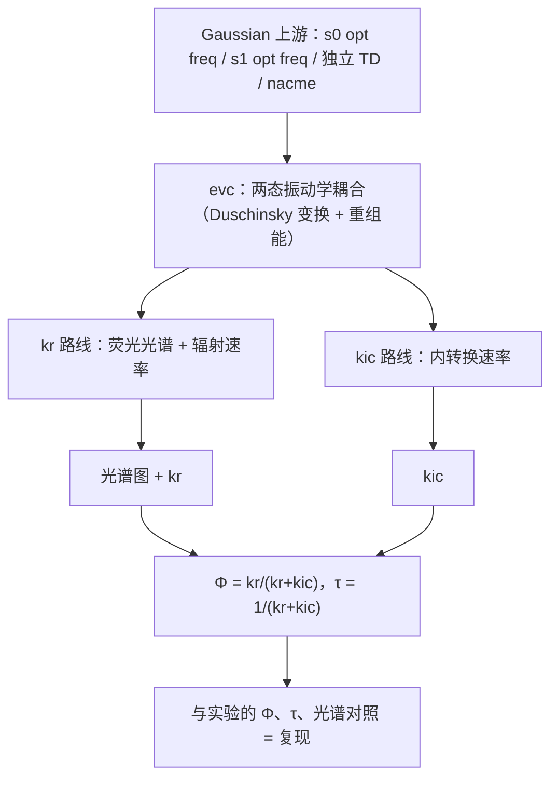

---
tags:
  - 计算化学
  - research
  - MOMAP
  - 后处理
Category:
  - 总结
---

# 0. 这篇笔记解决什么问题

Gaussian 给出电子态能量、振子强度等信息，但不直接给出带振动精细结构的荧光光谱和速率常数。MOMAP 的作用是将两个电子态势能面的振动信息联系起来，产出三部分结果：带振动精细结构的荧光光谱、辐射速率 kr（荧光通道）、内转换速率 kic（无辐射通道）。由两个速率可计算荧光量子产率 Φ 和荧光寿命 τ，与实验文献对照即为复现。对 DHR 这类反-Kasha 分子，最终目的是分别得到 S1 与 S9 各态的 kr/kic，解释高激发态直接发光的机制。

全流程一句话：Gaussian 上游准备几何/频率/能量/偶极 → evc 耦合两态振动学 → 分两路算 kr 与 kic → 合成 Φ、τ 与光谱，对照文献。

最终产出表（每个文件是什么、拿去干什么）：

| 文件名 | 里面是什么 | 用来干什么 |
| --- | --- | --- |
| `evc.cart.dat` | 频率、Duschinsky 矩阵、Huang-Rhys 因子、重组能 | kr 与 kic 计算的基础输入 |
| `evc.dint.dat` | 内坐标口径的重组能 + 笛卡尔 S 矩阵 | 与 cart 对照，选口径 |
| `evc.cart.nac` | 非绝热耦合矩阵元（仅 kic 路线有） | kic 的输入 |
| `spec.tvcf.ft.dat` | 发射相关函数随时间演化（5 列） | 画图验证收敛 |
| `spec.tvcf.log` | kr、E0-0 等汇总 | 读辐射速率 |
| `spec.tvcf.spec.dat` | 荧光光谱数据（7 列） | 画论文里的荧光谱 |
| `spec.tvcf.fo.dat` | 速率按能量的分布 | 看哪些跃迁贡献大 |
| `ic.tvcf.ft.dat` | 内转换相关函数（3 列） | kic 收敛验证 |
| `ic.tvcf.log` | kic 速率表 | 读内转换速率 |
| `ic.tvcf.fo.dat` | kic 速率-能隙分布 | 机制分析 |

# 1. 背景概念

## 吸收与发射

分子吸收光子后，电子从 HOMO 跃迁至 LUMO，进入激发态；激发态返回基态时释放光子，即荧光。发射光子能量低于吸收光子能量，其差与 Stokes 位移相关（见下一节）。

## Franck-Condon 原理与重组能

电子跃迁的时间尺度（飞秒量级）远小于核运动的时间尺度，因此跃迁可视为核坐标固定下的垂直跃迁，在势能图上表现为一条竖直线。跃迁完成后，体系沿新态势能面弛豫至新的平衡几何。两个电子态平衡几何的差异使发射能量低于吸收能量，其差称为 **Stokes 位移**；该几何差异对应的能量称为**重组能 λ**。λ 越大，吸收峰与发射峰间距越大，谱带越宽。

## 光谱上的振动结构

分子振动可分解为 3N−6 个独立的简正模式，各有一特征频率。电子跃迁可同时改变多个模式的振动量子数，因此一个电子跃迁对应一系列振动子峰：0-0 峰（两态均处于振动基态）、0-1 峰（初态振动基态 → 末态第一振动激发态）等。MOMAP 光谱中的振动精细结构即由此产生。

## 激发态的失活通道与 Φ、τ

激发态分子返回基态有三条相互竞争的失活通道：

1. 辐射 kr：发射一个光子（荧光）。
2. 内转换 kic：S1→S0 无辐射跃迁，能量以热的形式耗散。
3. 系间窜越 kisc：跃迁至三重态（本项目未计算）。

荧光量子产率 Φ = kr/(kr+kic)（忽略 kisc 时），即经辐射通道失活的分子所占比例；荧光寿命 τ = 1/(kr+kic)，即激发态的平均寿命。

## 振子强度与 kr 的关系

振子强度 f 表征跃迁的允许程度；f 越大，辐射通道越强，kr 越大（细节见 [[振子强度]] 与 [[激发态的平均寿命]]）。但 f 大不等于荧光量子产率高：Φ 还取决于 kic 的大小，见 2.5 的例子。

## Kasha 规则与反-Kasha

通常高激发态通过快速内转换弛豫至 S1，再从 S1 发光（Kasha 规则）。DHR 从高态（S9）直接发光，违反这条经验规则，叫**反-Kasha**。要解释它，就得分别算 S1 与 S9 的 kr 和 kic，比较各失活通道的速率——这正是本流程的用途。

# 2. 全流程分步详解

每步统一格式：**目的**（做什么、为什么做）→ 输入输出表 → 结果读取 → 检查标准。

## 2.1 上游 Gaussian 四件套（简述）

MOMAP 不计算电子结构，所有输入数据均由 Gaussian 提供。四件套及用途：

| 作业 | 干什么 | 输出里搜什么 | 用于哪一步 |
| --- | --- | --- | --- |
| s0 opt freq | S0 平衡几何 + 振动频率 | `SCF Done`（基态能量）；检查无虚频 | evc 的 `ffreq(1)`；能量给 Ead |
| s1 opt freq（TD root=1） | S1 平衡几何 + 频率 | 同上；优化中激发能/振子强度是否连续（防态翻转） | evc 的 `ffreq(2)` |
| 独立 s1 TD | S1 几何上的垂直发射 | `Excited State` 行（发射能）、`Dip. S.`（发射偶极） | Ead 与 EDME |
| s0 TD | S0 几何上的垂直吸收 | `Dip. S.`（吸收偶极） | EDMA |
| nacme（仅 kic） | 激发态几何上算非绝热耦合 | 正常终止即可 | evc 的 `fnacme` → evc.cart.nac |

细节：

- 每个 opt freq 的 .log 旁必须放同名 .fchk，MOMAP 才读得了。
- Ead = 两态各自优化几何下电子总能量差的绝对值，决定谱的位置；EDMA/EDME 是吸收/发射偶极矩，决定谱强度与速率量级。`Dip. S.` 输出的是 μ²，要开根号再乘 2.5417 才换成 Debye（1 a.u. = 2.5417 D）。
- nacme 的 route 必须带 `prop=(fitcharge,field)` `iop(6/22=-4,6/29=1,6/30=0,6/17=2)`，且含溶剂 `scrf`，否则与水里算的频率不自洽。

> [!warning] Ead/EDME 必须取独立 TD 的非平衡值
> `opt freq` 复合作业日志里的 TD 段用平衡溶剂，发射偶极口径不同（DHR：1.7878 eV/9.91 D vs 1.9357 eV/7.25 D）。Ead、EDME 一律从独立 TD 读，不要从 opt 日志的 TD 段取。

上游怎么算详见 [[激发态和光谱计算]]。

## 2.2 evc：两态振动学缝合

**这步在干什么。** 读两个 opt freq 的 log+fchk，通过 Duschinsky 变换（旋转与平移）将两个电子态的简正坐标相互关联，进而计算各模式的简正模式位移、Huang-Rhys 因子与总重组能。

| 项目 | 内容 |
| --- | --- |
| 输入 | momap.inp 里 `ffreq(1)`=s0 opt freq、`ffreq(2)`=s1 opt freq（+同名 .fchk）；kic 路线再加 `fnacme`=nacme log |
| 输出 | `evc.cart.dat`、`evc.dint.dat`、`evc.out`（kic 路线再加 `evc.cart.nac`） |
| 关键词 | 作业 log 搜 `ALL SUCCESSFULLY DONE` |

**看什么数据（evc.cart.dat）。**

- 头部：`ZPE1 (Ground )` / `ZPE2 (Excited)` / `ZPE2 - ZPE1`（零点能及差值，0-0 修正用）。
- 逐模式表各列：`freq`（频率）、`D`（质量加权位移）、`delta`（无量纲位移）、`HR = ½δ²`（该模式平均激发的振动量子数）、`lam = HR·ħω`（该模式重组能）。前 6 行是平转动伪模式（freq≈0），忽略。
- 尾部：`Total reorganization energy`（总重组能，cm⁻¹）。
- Duschinsky 段：`Delta DUSH = xx %`（两个电子态简正坐标系的混合程度，0 表示无混合）。

**看什么数据（evc.cart.nac，仅 kic）。** 头部能量差应等于垂直发射能（自洽核对）；看 `nacm_jpca(s-1)` 列，量级大的模式是内转换的主要贡献通道。

**检查标准。**

1. cart 与 dint 的 `Total reorganization energy` 差 <1000 cm⁻¹ → 后续用 cart（`DSFile=evc.cart.dat`），否则用 dint。
2. 无虚频（模式表 freq 无负值）。
3. Delta DUSH 大（经验上 >50%）→ 后续 momap.inp 必须 `DUSHIN = .t.`。
4. `BEGIN_DUSH_ORTH_TEST EPS = 0.001` 段无 FAIL → 矩阵正交性通过。

**物理意义。** 本步将两个电子态势能面的几何差异与模式位移量化为 λ、HR 等参数：λ 大 → Stokes 位移大、谱带越宽、振动结构越丰富。

## 2.3 kr：荧光光谱 + 辐射速率

**这步在干什么。** 将 evc 的振动信息与 Ead（决定谱的位置）、EDMA/EDME（决定谱强度）结合，计算发射相关函数，经傅里叶变换得到荧光光谱；对谱按频率加权积分得到 kr。相关函数是跃迁偶极矩的时间关联函数，其振荡编码了振动结构信息。

| 项目 | 内容 |
| --- | --- |
| 输入 | `DSFile=evc.cart.dat` + momap.inp 参数（下表） |
| 输出 | `spec.tvcf.ft.dat`、`spec.tvcf.log`、`spec.tvcf.spec.dat`、`spec.tvcf.fo.dat` |
| 关键词 | log 末尾 `radiative rate` |

momap.inp 关键参数：

| 参数 | 含义 | 例值 |
| --- | --- | --- |
| Ead | 两态能量差（a.u.），定谱的位置 | 0.078804 |
| EDMA / EDME | 吸收/发射偶极矩（Debye），定谱高与速率 | 6.93 / 7.25 |
| Temp | 温度（K） | 300 |
| tmax / dt | 相关函数积分时长/步长（fs） | 1000 / 0.01（kic 路线 tmax 用 10000） |
| FWHM | 展宽（cm⁻¹），决定谱峰宽度 | 200 |
| DUSHIN | Duschinsky 混合开关，Delta DUSH 大时必须 `.t.` | .t. |

**收敛验证（需作图检查，不可省略）。** 画 `spec.tvcf.ft.dat` 第 1 列（time）vs 第 4 列（`emi_FC_Re`，发射相关函数实部）。判据：包络在 tmax 之前衰减到接近 0、不再大幅振荡。为什么必须看：傅里叶变换在数学上需积至无穷时间；相关函数未衰减至零等价于硬截断，将使光谱出现虚假振荡峰。

**读结果。** log 末尾 `radiative rate` 行取 `/s` 与 `ns` 两个数（同行的极小 a.u. 值不用）。`E0-0`（0-0 跃迁能量）≈ 谱主峰位置参考。

**画光谱。** `spec.tvcf.spec.dat` 共 7 列：`#1Energy(Hartree) 2Energy(eV) 3WaveNumber(cm-1) 4WaveLength(nm) 5FC_abs 6FC_emi 7FC_emi_intensity`。x 取第 4 列波长（或第 3 列波数），y 取第 7 列 `FC_emi_intensity`。

**物理意义。** kr 大表示辐射通道强。kr 主要由 EDME 与 Ead 决定：跃迁偶极越大、跃迁能量越高，辐射速率越大。

## 2.4 kic：内转换速率

**这步在干什么。** 与 kr 同一框架，但多一个输入 `evc.cart.nac`（非绝热耦合），计算 S1→S0 无辐射内转换的速率。非绝热耦合描述两个电子态的耦合强度：耦合越大，无辐射跃迁越容易发生。

| 项目 | 内容 |
| --- | --- |
| 输入 | evc 的 dat + nac（必须来自含 `fnacme` 的 evc 目录） |
| 输出 | `ic.tvcf.ft.dat`（**只有 3 列**：`#time(fs) IC_ft_Re(au) IC_ft_Im(au)`，与 kr 的 5 列不同！）、`ic.tvcf.log`、`ic.tvcf.fo.dat` |
| 关键词 | log 末尾 `Calculate absorption and emission spectra` 表 |

**收敛验证。** 画 `ic.tvcf.ft.dat` 第 1 列 vs 第 2 列（`IC_ft_Re`），判据同 2.3。

**读结果。** log 末尾 `Calculate absorption and emission spectra` 表只有一行（在 Ead 处），取 `6kic(s^{-1})` 列的值；同行的 time(ps) 即 1/kic。`ic.tvcf.fo.dat` 是速率-能隙分布，机制分析用。

> [!warning] kic 的输出不是光谱
> 只有 kr 路线产出荧光光谱。kic 表示单位时间内发生无辐射跃迁的次数，不构成光谱，不应绘入荧光光谱图。

**物理意义。** kic 是与 kr 竞争的非辐射通道。经验上能隙越大 kic 越小（能隙定律）：能隙增大时，两态振动波函数的重叠减小，无辐射跃迁变慢。

## 2.5 两个速率合起来用

拿到 kr 与 kic 后：

- 荧光量子产率 Φ = kr/(kr+kic)（忽略 kisc）：即经辐射通道失活的分子比例。
- 荧光寿命 τ = 1/(kr+kic)：即激发态的平均寿命。
- 与文献对照：论文报道光谱 + Φ + τ，计算值与实验值一致即完成复现。

**对反-Kasha 的意义。** S1 流程是模板：S9 算完后把同一套步骤复制过去，得到 S9 的 kr/kic，然后比较各态的辐射速率与高态向低态的内转换速率，构成反-Kasha 机制的解释框架。

**例（DHR，S1，垂直口径）：** kr = 5.50×10⁷ s⁻¹，kic = 1.09×10¹⁰ s⁻¹。

| 量 | 计算 | 结果 |
| --- | --- | --- |
| Φ | 5.50×10⁷ / (5.50×10⁷ + 1.09×10¹⁰) | ≈ 0.5% |
| τ | 1 / (5.50×10⁷ + 1.09×10¹⁰) | ≈ 91 ps |

> [!tip] 易误解点：f 大但 Φ 可以很低
> DHR 的 S1 振子强度不小（"强发射"），但 kic 比 kr 大约 200 倍，绝大多数激发态分子经无辐射通道失活，Φ 仅 0.5%。"强发射"指辐射通道本身强（f 大），最终发光效率由 Φ 决定。

# 3. 常见问题（FAQ）

> [!warning] `Oscillator strength = 0.0000000000` 而 radiative rate 正常
> 属显示问题，不要采用该 f 值；需要 f 可由 kr 反推。

> [!tip] `radiative rate` 一行两个数
> 前者是 a.u.，取 `/s` 与 `ns`。

> [!warning] ft.dat 画错列
> kr 的 ft.dat 是 5 列、kic 的是 3 列。荧光收敛画第 1 列 vs 第 4 列 `emi_FC_Re`；kic 画第 1 列 vs 第 2 列 `IC_ft_Re`。第 2 列 `abs_FC_Re` 对应吸收过程。

> [!note] evc.cart.dat 前 6 行
> 平转动伪模式（freq≈0），无物理意义，忽略。

> [!warning] kic 拿错 evc 目录
> kr 路线的 evc（momap.inp 只有 `ffreq` 两项）不产 nac。kic 必须用含 `fnacme` 的 evc 目录里的 `evc.cart.nac`。

> [!warning] Ead/EDME 取错 TD
> 必须来自独立 TD（非平衡溶剂），不要从 opt 日志的 TD 段取。

> [!note] 光谱画哪列
> `spec.tvcf.spec.dat` 第 4 列是波长、第 7 列 `FC_emi_intensity` 才是发射谱强度；第 5 列是吸收谱。

# 4. 相关笔记

- [[激发态和光谱计算]]——上游 Gaussian 怎么算（opt/TD 细节）
- [[振子强度]]、[[激发态的平均寿命]]——f 与 kr、τ 的关系
- [[MOMAP 7 QC准备]]——Gaussian 输出如何备成 MOMAP 输入
- [[MOMAP 3  Duschinsky旋转矩阵和振动分析]]——Duschinsky 变换细节
- [[MOMAP 4 荧光光谱计算]]——kr 路线讲义
- [[MOMAP 5 NACME]]——非绝热耦合计算
