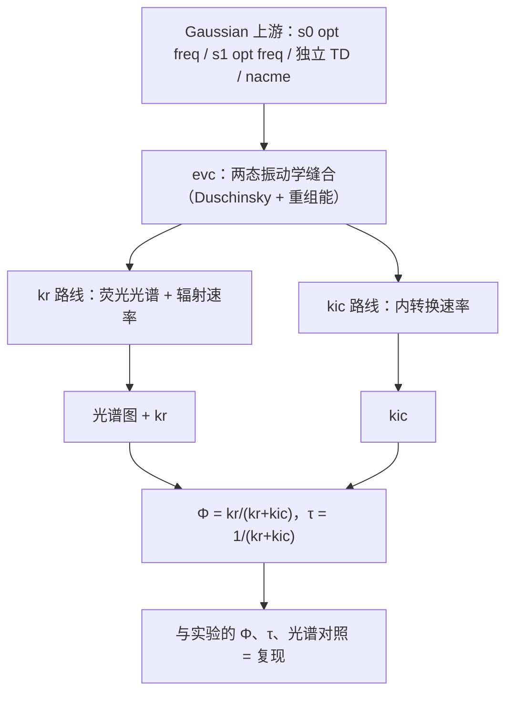

---
tags:
  - 计算化学
  - research
  - MOMAP
  - 后处理
Category:
  - 总结
---

# 0. 这篇笔记解决什么问题

Gaussian 只能告诉你"电子态能量是多少、振子强度多大"，给不出文献里那种带振动精细结构的荧光光谱，也给不出速率。分子算完 Gaussian 之后，MOMAP 干的事是把两个电子态势能面上的振动信息"缝"起来，一次产出三样东西：带振动精细结构的荧光光谱、辐射速率 kr（发光多快）、内转换速率 kic（发热多快）。两个速率合起来算出荧光量子产率 Φ 和荧光寿命 τ，与实验文献对照，就是"复现"。对 DHR 这种反-Kasha 分子，最终目的是把 S1 与 S9 各态的 kr/kic 都算出来，解释"为什么从高激发态直接发光"。

全流程一句话：Gaussian 上游准备几何/频率/能量/偶极 → evc 缝合振动学 → 分两路算 kr 与 kic → 合成 Φ、τ 与光谱，对照文献。

最终产出表（每个文件是什么、拿去干什么）：

| 文件名 | 里面是什么 | 用来干什么 |
| --- | --- | --- |
| `evc.cart.dat` | 频率、Duschinsky 矩阵、Huang-Rhys 因子、重组能 | 后续一切计算的"振动学底座"，kr 与 kic 都读它 |
| `evc.dint.dat` | 内坐标口径的重组能 + 笛卡尔 S 矩阵 | 与 cart 对照，选口径 |
| `evc.cart.nac` | 非绝热耦合矩阵元（仅 kic 路线有） | kic 的输入 |
| `spec.tvcf.ft.dat` | 发射相关函数随时间演化（5 列） | 画图验证收敛 |
| `spec.tvcf.log` | kr、E0-0 等汇总 | 读辐射速率 |
| `spec.tvcf.spec.dat` | 荧光光谱数据（7 列） | 画论文里的荧光谱 |
| `spec.tvcf.fo.dat` | 速率按能量的分布 | 看哪些跃迁贡献大 |
| `ic.tvcf.ft.dat` | 内转换相关函数（3 列） | kic 收敛验证 |
| `ic.tvcf.log` | kic 速率表 | 读内转换速率 |
| `ic.tvcf.fo.dat` | kic 速率-能隙分布 | 机制分析 |

# 1. 背景概念（大白话）

## 吸收与发射

光子把电子从 HOMO 顶到 LUMO（粗略说法），分子进入激发态；激发态电子掉回基态时把能量以光子吐出来，就是荧光。吸收吃掉一个高能光子，发射吐出一个低能光子，中间差的能量去哪了？下一节回答。

## Franck-Condon 原理与重组能

电子跃迁极快（飞秒量级），原子核太重、来不及动。所以跃迁在势能图上是一条**竖直线**（垂直跃迁）：电子云先变，几何原地不动；跃迁之后原子核才慢慢"追赶"新的电子云，弛豫到新平衡位置。两个态的平衡几何沿坐标错开 → 发射能量比吸收低，这个差值叫 **Stokes 位移**；错开的程度折算成能量，叫**重组能 λ**。λ 越大，吸收峰与发射峰离得越远、谱带越宽。

## 光谱上的振动结构

分子振动像一组互相独立的弹簧（3N−6 个"简正模式"，各有一个频率）。电子跃迁时每个弹簧可能同时被"敲响"：两个电子态各自的振动能级之间都能跃迁，所以一个电子峰下面挂一串小峰——0-0 峰（两边都停在振动基态）、0-1 峰（上态振动基态 → 下态振动第一激发）……MOMAP 光谱的"振动精细结构"就是这么来的。

## 激发态的三条出路与 Φ、τ

激发态分子总要回基态，有三条竞争通道：

1. 辐射 kr：放出一个光子（荧光）——我们要的。
2. 内转换 kic：S1→S0，不放光，能量变成热。
3. 系间窜越 kisc：翻去三重态（本项目不算）。

荧光量子产率 Φ = kr/(kr+kic)（忽略 kisc 时）：每 100 个激发分子里有几个靠发光回家。荧光寿命 τ = 1/(kr+kic)：激发态平均活多久。

## 振子强度与 kr 的关系

振子强度 f 衡量一次跃迁"多被允许"；f 越大，辐射通道越强，kr 越大（细节见 [[振子强度]] 与 [[激发态的平均寿命]]）。但 f 大不等于最终发光强——Φ 还要看 kic 抢走多少，见 2.5 的 DHR 例子。

## Kasha 规则与反-Kasha

通常高激发态极快内转换落到 S1，再从 S1 发光（Kasha 规则）。DHR 从高态（S9）直接发光，违反这条经验规则，叫**反-Kasha**。要解释它，就得分别算 S1 与 S9 的 kr 和 kic，看哪条通道占上风——这正是本流程的用途。

# 2. 全流程分步详解

每步统一格式：**这步在干什么**（干什么/为什么）→ 输入输出表 → 看什么数据 → 检查标准。

## 2.1 上游 Gaussian 四件套（简述）

MOMAP 不自己算电子结构，所有"原料"都来自 Gaussian。四件套及用途：

| 作业 | 干什么 | 输出里搜什么 | 拿去用在哪 |
| --- | --- | --- | --- |
| s0 opt freq | S0 平衡几何 + 振动频率 | `SCF Done`（基态能量）；检查无虚频 | evc 的 `ffreq(1)`；能量给 Ead |
| s1 opt freq（TD root=1） | S1 平衡几何 + 频率 | 同上；优化中激发能/振子强度是否连续（防态翻转） | evc 的 `ffreq(2)` |
| 独立 s1 TD | S1 几何上的垂直发射 | `Excited State` 行（发射能）、`Dip. S.`（发射偶极） | Ead 与 EDME |
| s0 TD | S0 几何上的垂直吸收 | `Dip. S.`（吸收偶极） | EDMA |
| nacme（仅 kic） | 激发态几何上算非绝热耦合 | 正常终止即可 | evc 的 `fnacme` → evc.cart.nac |

细节：

- 每个 opt freq 的 .log 旁必须放同名 .fchk，MOMAP 才读得了。
- Ead = 两态各自优化几何下电子总能量差的绝对值，定谱的位置；EDMA/EDME 是吸收/发射偶极矩，定谱的高度与速率量级。`Dip. S.` 输出的是 μ²，要开根号再乘 2.5417 才换成 Debye（1 a.u. = 2.5417 D）。
- nacme 的 route 必须带 `prop=(fitcharge,field)` `iop(6/22=-4,6/29=1,6/30=0,6/17=2)`，且含溶剂 `scrf`，否则与水里算的频率不自洽。

> [!warning] Ead/EDME 必须取独立 TD 的非平衡值
> `opt freq` 复合作业日志里的 TD 段用平衡溶剂，发射偶极口径不同（DHR：1.7878 eV/9.91 D vs 1.9357 eV/7.25 D）。Ead、EDME 一律从独立 TD 读，不要从 opt 日志的 TD 段取。

上游怎么算详见 [[激发态和光谱计算]]。

## 2.2 evc：两态振动学缝合

**这步在干什么。** 读两个 opt freq 的 log+fchk，用 Duschinsky 变换把 S1 的简正坐标旋转一下、平移一段，接到 S0 的坐标系上，然后算出每个振动模式在跃迁时"被敲多响"（Huang-Rhys 因子）和总重组能。

| 项目 | 内容 |
| --- | --- |
| 输入 | momap.inp 里 `ffreq(1)`=s0 opt freq、`ffreq(2)`=s1 opt freq（+同名 .fchk）；kic 路线再加 `fnacme`=nacme log |
| 输出 | `evc.cart.dat`、`evc.dint.dat`、`evc.out`（kic 路线再加 `evc.cart.nac`） |
| 关键词 | 作业 log 搜 `ALL SUCCESSFULLY DONE` |

**看什么数据（evc.cart.dat）。**

- 头部：`ZPE1 (Ground )` / `ZPE2 (Excited)` / `ZPE2 - ZPE1`（零点能及差值，0-0 修正用）。
- 逐模式表各列：`freq`（频率）、`D`（质量加权位移）、`delta`（无量纲位移）、`HR = ½δ²`（该模式平均激发的振动量子数）、`lam = HR·ħω`（该模式重组能）。前 6 行是平转动伪模式（freq≈0），忽略。
- 尾部：`Total reorganization energy`（总重组能，cm⁻¹）。
- Duschinsky 段：`Delta DUSH = xx %`（两个坐标系混合的程度，0=没混合）。

**看什么数据（evc.cart.nac，仅 kic）。** 头部能量差应等于垂直发射能（自洽核对）；看 `nacm_jpca(s-1)` 列，量级大的模式就是内转换的主力通道。

**检查标准。**

1. cart 与 dint 的 `Total reorganization energy` 差 <1000 cm⁻¹ → 后续用 cart（`DSFile=evc.cart.dat`），否则用 dint。
2. 无虚频（模式表 freq 无负值）。
3. Delta DUSH 大（经验上 >50%）→ 后续 momap.inp 必须 `DUSHIN = .t.`。
4. `BEGIN_DUSH_ORTH_TEST EPS = 0.001` 段无 FAIL → 矩阵正交性通过。

**物理意义。** 这一步把"两个态长得像不像、错开多远"量化成数字：λ 大 → Stokes 位移大、谱带宽、振动结构长。

## 2.3 kr：荧光光谱 + 辐射速率

**这步在干什么。** 把 evc 的振动信息 + Ead（谱放在哪个能量）+ EDMA/EDME（谱有多高）合起来，算出发射相关函数，傅里叶变换成荧光光谱；对谱按频率加权积分得到 kr。相关函数可理解为"跃迁偶极随时间演化的记忆"，振动结构信息都编码在它随时间的振荡里。

| 项目 | 内容 |
| --- | --- |
| 输入 | `DSFile=evc.cart.dat` + momap.inp 参数（下表） |
| 输出 | `spec.tvcf.ft.dat`、`spec.tvcf.log`、`spec.tvcf.spec.dat`、`spec.tvcf.fo.dat` |
| 关键词 | log 末尾 `radiative rate` |

momap.inp 关键参数：

| 参数 | 含义 | 例值 |
| --- | --- | --- |
| Ead | 两态能量差（a.u.），定谱的位置 | 0.078804 |
| EDMA / EDME | 吸收/发射偶极矩（Debye），定谱高与速率 | 6.93 / 7.25 |
| Temp | 温度（K） | 300 |
| tmax / dt | 相关函数积分时长/步长（fs） | 1000 / 0.01（kic 路线 tmax 用 10000） |
| FWHM | 展宽（cm⁻¹），决定峰的胖瘦 | 200 |
| DUSHIN | Duschinsky 混合开关，Delta DUSH 大时必须 `.t.` | .t. |

**收敛验证（动手画图，不能省）。** 画 `spec.tvcf.ft.dat` 第 1 列（time）vs 第 4 列（`emi_FC_Re`，发射相关函数实部）。判据：包络在 tmax 之前衰减到接近 0、不再大幅振荡。为什么必须看：傅里叶变换在数学上要积到无穷远，相关函数尾巴不收敛相当于硬截断，光谱上会长出假的振荡峰。

**读结果。** log 末尾 `radiative rate` 行取 `/s` 与 `ns` 两个数（同行的极小 a.u. 值不用）。`E0-0`（0-0 跃迁能量）≈ 谱主峰位置参考。

**画光谱。** `spec.tvcf.spec.dat` 共 7 列：`#1Energy(Hartree) 2Energy(eV) 3WaveNumber(cm-1) 4WaveLength(nm) 5FC_abs 6FC_emi 7FC_emi_intensity`。x 取第 4 列波长（或第 3 列波数），y 取第 7 列 `FC_emi_intensity`。

**物理意义。** kr 大 = 发光通道强。kr 的量级主要由 EDME 与 Ead 决定：偶极越大、跃迁能量越高，光子越容易出去。

## 2.4 kic：内转换速率

**这步在干什么。** 与 kr 同一框架，但多一个输入 `evc.cart.nac`（非绝热耦合），算 S1→S0 不放光的内部转换有多快。非绝热耦合衡量两个电子态"混合的强度"：耦合越大，激发态分子越容易"漏"回基态而不发光。

| 项目 | 内容 |
| --- | --- |
| 输入 | evc 的 dat + nac（必须来自含 `fnacme` 的 evc 目录） |
| 输出 | `ic.tvcf.ft.dat`（**只有 3 列**：`#time(fs) IC_ft_Re(au) IC_ft_Im(au)`，与 kr 的 5 列不同！）、`ic.tvcf.log`、`ic.tvcf.fo.dat` |
| 关键词 | log 末尾 `Calculate absorption and emission spectra` 表 |

**收敛验证。** 画 `ic.tvcf.ft.dat` 第 1 列 vs 第 2 列（`IC_ft_Re`），判据同 2.3。

**读结果。** log 末尾 `Calculate absorption and emission spectra` 表只有一行（在 Ead 处），取 `6kic(s^{-1})` 列的值；旁边 time(ps) 是 1/kic 的寿命。`ic.tvcf.fo.dat` 是速率-能隙分布，机制分析用。

> [!warning] kic 的输出不是光谱
> 只有 kr 路线产出荧光光谱。kic 的数字是"每秒漏回基态多少次"，别把它画进论文的荧光光谱图。

**物理意义。** kic 是与 kr 竞争的非辐射通道。经验上能隙越大 kic 越小（能隙定律）：两个态离得远，振动模式就难以"搭桥"完成无辐射跃迁。

## 2.5 两个速率合起来用

拿到 kr 与 kic 后：

- 荧光量子产率 Φ = kr/(kr+kic)（忽略 kisc）：每 100 个激发分子几个发光。
- 荧光寿命 τ = 1/(kr+kic)：激发态平均活多久。
- 与文献对照：论文报道光谱 + Φ + τ，计算值与实验比，对得上就是"复现"。

**对反-Kasha 的意义。** S1 流程是模板：S9 算完后把同一套步骤复制过去，得到 S9 的 kr/kic，然后比较"哪个态的发光通道强、高态往下掉的内转换多慢"，这就是机制解释的骨架。

**例（DHR，S1，垂直口径）：** kr = 5.50×10⁷ s⁻¹，kic = 1.09×10¹⁰ s⁻¹。

| 量 | 计算 | 结果 |
| --- | --- | --- |
| Φ | 5.50×10⁷ / (5.50×10⁷ + 1.09×10¹⁰) | ≈ 0.5% |
| τ | 1 / (5.50×10⁷ + 1.09×10¹⁰) | ≈ 91 ps |

> [!tip] 易误解点：f 大但 Φ 可以很低
> DHR 的 S1 振子强度不小（"强发射"），但 kic 比 kr 大约 200 倍，抢走了绝大部分激发态分子，Φ 只有 0.5%。"强发射"说的是辐射通道本身强，不是最终发光强——最终发光强不强看 Φ。

# 3. 常见问题（FAQ）

> [!warning] `Oscillator strength = 0.0000000000` 而 radiative rate 正常
> 显示问题，f 值不要取它；需要 f 可从 kr 反推。

> [!tip] `radiative rate` 一行两个数
> 前者是 a.u.，取 `/s` 与 `ns`。

> [!warning] ft.dat 画错列
> kr 的 ft.dat 是 5 列、kic 的是 3 列。荧光收敛画第 1 列 vs 第 4 列 `emi_FC_Re`；kic 画第 1 列 vs 第 2 列 `IC_ft_Re`。画成第 2 列 `abs_FC_Re` 是吸收的口径。

> [!note] evc.cart.dat 前 6 行
> 平转动伪模式（freq≈0），无物理意义，忽略。

> [!warning] kic 拿错 evc 目录
> kr 路线的 evc（momap.inp 只有 `ffreq` 两项）不产 nac。kic 必须用含 `fnacme` 的 evc 目录里的 `evc.cart.nac`。

> [!warning] Ead/EDME 取错 TD
> 必须来自独立 TD（非平衡溶剂），不要从 opt 日志的 TD 段取。

> [!note] 光谱画哪列
> `spec.tvcf.spec.dat` 第 4 列是波长、第 7 列 `FC_emi_intensity` 才是发射谱强度；第 5 列是吸收谱。

# 4. 相关笔记

- [[激发态和光谱计算]]——上游 Gaussian 怎么算（opt/TD 细节）
- [[振子强度]]、[[激发态的平均寿命]]——f 与 kr、τ 的关系
- [[MOMAP 7 QC准备]]——Gaussian 输出如何备成 MOMAP 输入
- [[MOMAP 3  Duschinsky旋转矩阵和振动分析]]——Duschinsky 变换细节
- [[MOMAP 4 荧光光谱计算]]——kr 路线讲义
- [[MOMAP 5 NACME]]——非绝热耦合计算
