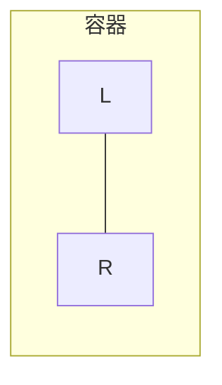

---
tags:
  - 热力学
  - 物理化学
Category:
  - 课内/笔记
  - 长篇笔记
---

# 热力学第零定律

如果两个系统分别和处于确定状态的第三个系统达到热平衡，则这两个系统彼此也将处于热平衡。

> [!note]
> 1. 指出温度这个状态函数的存在
> 2. 比较温度的方法

# 热力学第一定律

$$\Delta U = Q + W \quad \delta U = \delta Q + \delta W$$
$$U = U(T, p, n)$$

对封闭系统（n不变）：
$$\mathrm{d}U = \left(\frac{\partial U}{\partial T}\right)_p \mathrm{d}T + \left(\frac{\partial U}{\partial p}\right)_T \mathrm{d}p$$
功：
$$\delta W = -F\mathrm{d}L$$

## 例：气体膨胀与压缩

> 活塞横截面为 $A$，筒内气体压力 $p_i$，外压 $p_e$

$$\delta W = -F_{e}\mathrm{d}L = -\left(\frac{F_{e}}{A}\right)A\mathrm{d}L = -p_e\mathrm{d}V$$
### 不可逆过程

1. **自由膨胀**：$p_e = 0$，$\delta W_{e,1} = 0$

2. **外压恒定**：$W_{e,2} = -p_e(V_2 - V_1)$

3. **多次等外压膨胀**：
   $$W_{e,3} = -p_{e_{1}}\Delta V_1 - p_{e2}\Delta V_2$$

![[irreversible(PV).jpg]]

> [!error] Result
> 在始终态相同时，分步越多，系统对外做功越大

### 准静态过程

1. **气体膨胀**
由一系列接近于平衡的状态构成：
$$p_i - p_e = \mathrm{d}p$$
$$W_{e,4} = -\sum p_e\mathrm{d}V = -\sum (p_i - \mathrm{d}p)\mathrm{d}V$$

若是理想气体且恒温：
$$W = -\int_{V_1}^{V_2} p_i\mathrm{d}V = -\int_{V_1}^{V_2} \frac{nRT}{V}\mathrm{d}V = -nRT\ln\frac{V_2}{V_1}$$

> 系统做功最大

2. **气体压缩**
> 和膨胀相反，准静态过程中环境对系统做最小功

![[reversible(PV).jpg]]

### 等容过程
$$\Delta V = 0 \quad W = 0 \quad \Delta U = Q_V$$

### 等压过程
$$Q_P = (U_2 + PV_2) - (U_1 + PV_1) = \Delta H$$

$$H \xlongequal{\text{def}} U + PV$$

## 热容

> 系统升高单位热力学温度时所吸收的热

$$C(T) \xlongequal{\text{def}} \frac{\delta Q}{\delta T}$$

**摩尔热容**：$C_m(T) \xlongequal{\text{def}} \frac{C(T)}{n} = \frac{1}{n}\frac{\delta Q}{\delta T}$

**定压热容**：$C_p(T) = \frac{\delta Q_p}{\delta T} = \left(\frac{\partial H}{\partial T}\right)_p$
$$\Delta H = Q_P = \int C_p\mathrm{d}T$$

**定容热容**：$C_V(T) = \frac{\delta Q_V}{\delta T} = \left(\frac{\partial U}{\partial T}\right)_V$
$$\Delta U = Q_V = \int C_V\mathrm{d}T$$

**经验方程式**：
$$C_{p,m}(T) = a + bT + cT^2 + \cdots$$
$$C_{p,m}(T) = a' + b'T + c'T^{-2} + \cdots$$

# 热一对理想气体的应用

## 只与温度有关的函数

### 内能

> 从<mark style="background: #BBFABBA6;">实验</mark>得出：理想气体在自由膨胀中$\Delta T=0，\Delta U=0$。

对定量纯物质：

> $U(P,T)$

$$\mathrm{d}U = \left(\frac{\partial U}{\partial p}\right)_T\mathrm{d}p + \left(\frac{\partial U}{\partial T}\right)_p\mathrm{d}T$$
$$dT = 0 \quad \mathrm{d}U = 0 \Rightarrow \left(\frac{\partial U}{\partial p}\right)_T\mathrm{d}p = 0$$
$$\mathrm{d}p \neq 0 \Rightarrow \left(\frac{\partial U}{\partial p}\right)_T = 0 \quad U \text{ 与 } p \text{ 无关}$$
> $U(V,T)$

$$\mathrm{d}U = \left(\frac{\partial U}{\partial V}\right)_T\mathrm{d}V + \left(\frac{\partial U}{\partial T}\right)_V\mathrm{d}T$$
$$\mathrm{d}U = 0 \quad \mathrm{d}T = 0 \Rightarrow \left(\frac{\partial U}{\partial V}\right)_T\mathrm{d}V = 0$$
$$\mathrm{d}V \neq 0 \Rightarrow \left(\frac{\partial U}{\partial V}\right)_T = 0 \quad U \text{ 与 } V \text{ 无关}$$
> [!result]
> 1. **（理想）气体的 $U$ 仅是温度的函数**，$U = U(T)$
> 2. **实际气体**：分子间存在相互作用，$U$ 与 $T, V$ 有关

[[理想气体内能与压力无关的证明]]
### 焓

**焓**：$H(P,T)$ 
$$H = U + pV，等温时 d(pV) = 0，dH=0$$
$$\mathrm{d}H = \left(\frac{\partial H}{\partial T}\right)_p\mathrm{d}T + \left(\frac{\partial H}{\partial p}\right)_T\mathrm{d}p$$
$$\Rightarrow \left(\frac{\partial H}{\partial p}\right)_T = 0$$
同理：
$$\left(\frac{\partial H}{\partial V}\right)_T = 0$$

> [!result]
> 1. **理想气体的焓也仅为温度的函数**，$H = H(T)$
> 2. **理想气体的 $C_V$ 与 $C_p$ 也仅是温度的函数**

## 理想气体的 $C_p - C_V$

$$
\begin{aligned}
C_p - C_V &= \left(\frac{\partial H}{\partial T}\right)_p - \left(\frac{\partial U}{\partial T}\right)_V = \left(\frac{\partial (U + pV)}{\partial T}\right)_p - \left(\frac{\partial U}{\partial T}\right)_V\\ \\
&= \left(\frac{\partial U}{\partial T}\right)_p + p\left(\frac{\partial V}{\partial T}\right)_p - \left(\frac{\partial U}{\partial T}\right)_V
\end{aligned}
$$
计算$dU，dV$：
$$
\begin{aligned}
&U(V, T) \quad \mathrm{d}U = \left(\frac{\partial U}{\partial V}\right)_T\mathrm{d}V + \left(\frac{\partial U}{\partial T}\right)_V\mathrm{d}T\\ \\
&V(p, T) \quad \mathrm{d}V = \left(\frac{\partial V}{\partial p}\right)_T\mathrm{d}p + \left(\frac{\partial V}{\partial T}\right)_p\mathrm{d}T
\end{aligned}
$$
计算$(\frac{\partial U}{\partial T})_{P}$：
$$\mathrm{d}U = \frac{\partial U}{\partial V}\left[\left(\frac{\partial V}{\partial p}\right)_T\mathrm{d}p + \left(\frac{\partial V}{\partial T}\right)_p\mathrm{d}T\right] + \left(\frac{\partial U}{\partial T}\right)_V\mathrm{d}T$$
$$\left(\frac{\partial U}{\partial T}\right)_p = \left(\frac{\partial U}{\partial V}\right)_T\left(\frac{\partial V}{\partial T}\right)_p + \left(\frac{\partial U}{\partial T}\right)_V$$
计算$C_{P}-C_{{V}}$：
$$
\begin{aligned}
C_p - C_V &= \left(\frac{\partial U}{\partial V}\right)_T\left(\frac{\partial V}{\partial T}\right)_p + \left(\frac{\partial U}{\partial T}\right)_{V}+P \cdot \left(\frac{\partial V}{\partial T}\right)_{P}-\left(\frac{\partial U}{\partial T}\right)_{V}\\ \\
&= \left[p + \left(\frac{\partial U}{\partial V}\right)_T\right]\left(\frac{\partial V}{\partial T}\right)_p\\ \\
&=nR
\end{aligned}
$$
摩尔热容：
$$C_{p,m} - C_{V,m} = R$$

## 绝热过程的功和过程方程式

绝热过程：
$$Q = 0$$
$$\Delta U = \int_{T_1}^{T_2} C_V\mathrm{d}T = W$$
若 $C_V$ 为常数：
$$W = C_V(T_2 - T_1)$$

### 绝热过程方程式

$$
\begin{aligned}
&\mathrm{d}U + p\mathrm{d}V = 0\\ \\
&C_V\mathrm{d}T + \frac{nRT}{V}\mathrm{d}V = 0\\ \\
&\frac{\mathrm{d}T}{T} + \frac{nR}{C_V}\frac{\mathrm{d}V}{V} = 0 \\ \\
&\frac{\mathrm{d}T}{T} + \frac{C_p - C_V}{C_V}\frac{\mathrm{d}V}{V} = 0
\end{aligned}
$$

令 $\gamma = \frac{C_p}{C_V}$ （热容比）

$$\frac{C_p - C_V}{C_V} = \gamma - 1$$
$$\frac{\mathrm{d}T}{T} + (\gamma - 1)\frac{\mathrm{d}V}{V} = 0$$

积分：
$$\ln T + (\gamma - 1)\ln V = C$$
绝热过程方程式：
$$
\begin{aligned}
&TV^{\gamma-1} = C_{1}\\ \\
&pV^\gamma = C_{2} \\ \\
&p^{1-\gamma}T^\gamma = C_{3}
\end{aligned}
$$
功：
$$
\begin{aligned}
W &= -\int_{V_1}^{V_2} p\mathrm{d}V = -\int_{V_1}^{V_2} \frac{C_{2}}{V^\gamma}\mathrm{d}V = -\frac{C_{2}}{1-\gamma}\left(\frac{1}{V_2^{\gamma-1}} - \frac{1}{V_1^{\gamma-1}}\right)\\ \\
&= \frac{p_2V_2 - p_1V_1}{\gamma - 1} = \frac{nR(T_2 - T_1)}{\gamma - 1}  = C_V(T_2 - T_1)
\end{aligned}
$$

![[isothermal_vs_adiabatic_PV.png]]

等温线：$\left(\frac{\partial p}{\partial V}\right)_T = -\frac{p}{V}$，体积变大

绝热线：$\left(\frac{\partial p}{\partial V}\right)_S = -\gamma\frac{p}{V}$，体积变大，温度下降，使 $p \downarrow$

### 多方过程

$$pV^n = K \quad (\gamma > n > 1)$$

# 热力学第二定律

**Clausius 表述**：热不能自动从低温物体传给高温物体而不产生其他变化（热传导的方向性）

**Kelvin 表述**：不可能从单一热源吸热使之全部对外做功而不产生其他变化（第二类永动机不可能实现）

### 克劳修斯方向判据

**平衡态表述**：在任何确定环境下，任何系统都存在一个最稳定的状态（平衡态），如果环境不变，任何离开平衡态的过程都是非自发过程。

# 卡诺循环

![[Carnot Cycle.jpg]]

### 理想气体的 Carnot 循环

**1→2 等温可逆膨胀**：

$$\Delta U_1 = 0 \quad Q_1 = -W_1$$
$$W_1 = -\int_{V_1}^{V_2} \frac{nRT_1}{V}\mathrm{d}V = -nRT_1\ln\frac{V_2}{V_1}$$

**2→3 绝热可逆膨胀**：

$$Q = 0$$
$$W_2 = \Delta U_2 = n\int_{T_1}^{T_2} C_{V,m}\mathrm{d}T$$

**3→4恒温可逆压缩**：

$$\Delta U_3 = 0 \quad Q_2 = -W_3 < 0$$
$$W_3 = -\int_{V_3}^{V_4} \frac{nRT_2}{V}\mathrm{d}V = nRT_2\ln\frac{V_3}{V_4}$$

**4→1 绝热可逆压缩**：

$$Q_4 = 0$$
$$W_4 = \Delta U_4 = n\int_{T_2}^{T_1} C_{V,m}\mathrm{d}T = -W_2$$

### 整个循环

$$\Delta U = 0 \quad Q = -W$$
热：
$$Q = Q_1+ Q_2$$
功：
$$
\begin{aligned}
W &= W_1 + W_3 \\ \\
&= -nRT_1\ln\frac{V_2}{V_1} + nRT_2\ln\frac{V_3}{V_4}
\end{aligned}
$$

$$
\begin{cases}
T_1V_2^{\gamma-1} = T_2V_3^{\gamma-1} \\ \\
T_1V_1^{\gamma-1} = T_2V_4^{\gamma-1}
\end{cases}
$$
$$\Rightarrow \frac{V_2}{V_1} = \frac{V_3}{V_4}$$
$$\Rightarrow W = nR(T_1 - T_2)\ln\frac{V_1}{V_2}$$

### 热机效率

$$\eta = \frac{-W}{Q_1} = \frac{-nR(T_1 - T_2)\ln\frac{V_1}{V_2}}{-nRT_1\ln\frac{V_2}{V_1}} = \frac{T_1 - T_2}{T_1}$$

或
$$
\begin{gather}
\eta = \frac{-W}{Q_1} = \frac{Q_1 + Q_2}{Q_1} = 1 + \frac{Q_2}{Q_1}\\ \\
(Q_{2}<0)
\end{gather}
$$
可以推出：
$$
\begin{gather}
\frac{T_{1}-T_{2}}{T_{1}}=\frac{Q_{1}+Q_{2}}{Q_{1}}\\ \\
\frac{Q_{1}}{T_{1}}=\frac{Q_{2}}{T_{2}}
\end{gather}
$$

## 制冷机（逆卡诺循环）

系统自低温热源 $T_2$ 吸取热量 $Q'_2$，而放给高温热源 $T_1$ 的热量为 $Q'_1$。
$W$ 环境对系统做的功：
$$-W = Q = Q'_1 + Q'_2$$

**冷冻系数** 
$$\beta = \frac{Q'_2}{-W} = \frac{T_2}{T_1 - T_2}$$

> 相当于每耗一个单位功，制冷机从低温热源中所吸取热的单位数

## 卡诺定理证明

卡诺定理：在两个不同温度的热源之间工作的所有热机，以可逆热机效率最大。

**推论**：在两个不同热源工作的所有可逆热机中，其效率都相等，且与工作介质、变化的种类无关。

![[verify Carnot Cycle.jpg]]

反证法
设 $Q_A = -Q_B$， $\eta_S > \eta_C$
证明：
$$
\begin{aligned}
&Q'_{B} + \delta Q_B - W = 0 \\ \\
&Q_A + Q'_A + W + W' = 0
\end{aligned}
$$
推出：
$$
\begin{aligned}
&Q_A + Q'_B + W' = 0 \\ \\
&Q_A + Q'_B = -W' > 0
\end{aligned}
$$

经过一个循环，"耦合"热机从低温热源吸热 $Q'_A + Q'_B$，并将其完全转化为对环境的功，与开尔文表述矛盾。
说明卡诺定理成立：$\eta_S \leq \eta_C$

作业：[[违背 Clausius 表述的证明]]

# 熵与克劳修斯不等式
##  熵

卡诺循环：
$$\frac{Q_1}{T_1} + \frac{Q_2}{T_2} = 0$$

无限小：
$$\frac{\delta Q_1}{T_1} + \frac{\delta Q_2}{T_2} = 0$$
> 任何循环的可逆热与温度的商之和为0

对任意可逆循环，可分成无限多的卡诺循环：

每个小卡诺循环：
$$\frac{\delta Q_1}{T_1} + \frac{\delta Q_2}{T_2} = 0$$

整个大循环：
$$\sum \frac{\delta Q_r}{T} = 0$$

小卡诺循环无限多时：
$$\oint \frac{\delta Q_r}{T} = 0$$

**定义熵**：
$$\mathrm{d}S \xlongequal{\text{def}} \frac{\delta Q_r}{T}$$

**熵变**：
$$\Delta S = S_2 - S_1 = \int_1^2 \frac{\delta Q_r}{T}$$

> 任选可逆路径计算

##  克劳修斯不等式

[[熵产生普适表述热力学第二定律]]

工作于两个热源之间的任意热机 $i$ 与可逆热机 $r$：
$$\eta_i \leq \eta_r$$

$$\frac{Q_1 + Q_2}{Q_1} \leq \frac{T_1 - T_2}{T_1} \qquad \frac{Q_1}{T_1} + \frac{Q_2}{T_2} \leq 0$$
$$\frac{\delta Q_1}{T_1} + \frac{\delta Q_2}{T_2} \leq 0$$
$$\oint \frac{\delta Q}{T} \leq 0 \quad \text{（可逆取等）}$$

![[clausius inequality.jpg]]

$$
\begin{aligned}
&\int_1^2 \frac{\delta Q_ir}{T} + \int_2^1 \frac{\delta Q_r}{T} < 0\\ \\
&\int_2^1 \frac{\delta Q_r}{T} = -\int_1^2 \frac{\delta Q_r}{T} =- \Delta_{1}^2 S<-\int_{1}^2 \frac{\delta Q_{ir}}{T}\\ \\
\Rightarrow  \quad &\Delta_{1}^2 S\geq \int_1^2 \frac{\delta Q}{T} \qquad
(可逆时取等)\\ \\
&\Delta S_{\text{sys}} - \frac{Q_{\text{sys}}}{T_{\text{sur}}} \geq 0
\end{aligned}
$$

**系统**：
$$\mathrm{d}S \geq \frac{\delta Q}{T}  \qquad(-\mathrm{d}S_{\text{环}})$$

> 过程的方向与限度判断：
> 1. 若过程的热温商小于熵差，则过程不可逆
> 2. 若过程的热温商等于熵差，则过程可逆

熵变的计算
[[熵_热力学和统计力学的计算方法]]

## 等容过程的熵变

$$
\begin{gather}
\Delta S = \int_{\text{始}}^{\text{末}} \frac{\mathrm{d}q}{T} = \int_{\text{始}}^{\text{末}} \frac{C_V\mathrm{d}T}{T} = C_V\ln\frac{T_{\text{末}}}{T_{\text{始}}}\\ \\ 
(C_{V}不随T变化)
\end{gather}
$$

## 等压过程的熵变

$$
\begin{gather}
\Delta S = \int_{\text{始}}^{\text{末}} \frac{\mathrm{d}q}{T} = \int_{\text{始}}^{\text{末}} \frac{C_p\mathrm{d}T}{T} = C_p\ln\frac{T_{\text{末}}}{T_{\text{始}}}\\ \\
(C_{p}不随T变化) 
\end{gather}
$$
$$\Delta S_{\text{环}} = \int_{\text{始}}^{\text{终}} \frac{-\mathrm{d}q}{T}$$

## 组成不变的封闭系统，非机械功 = 0 的系统熵变通用公式

$$
\begin{aligned}
\mathrm{d}S &= \frac{\mathrm{d}q_{\text{可逆}}}{T} = \frac{\mathrm{d}U - \delta W_{\text{可逆}}}{T}\\ \\
&= \frac{\mathrm{d}U + p\mathrm{d}V}{T}\\ \\
\Delta S &= \int \frac{\mathrm{d}U}{T} + \int \frac{p\mathrm{d}V}{T}
\end{aligned}
$$
> 分解为一个等容过程和一个等内能过程

[[讨论_固体栓为什么不可逆]]
 
## 方向

1. 熵增大推动的热力学系统演化方向与热力学强度量驱动的系统演化方向是一致的。
2. 热力学系统的状态的变化是靠强度量的不平衡推动的。
3. 温度差推动了熵变化；压力差推动了体积变化；化学势推动了物质变化
$$\mathrm{d}U = T\mathrm{d}S - p\mathrm{d}V + \mu\mathrm{d}N$$
[[#化学势]]
$$\mathrm{d}S = \frac{1}{T}\mathrm{d}U + \frac{p}{T}\mathrm{d}V - \frac{\mu}{T}\mathrm{d}N$$
[[#热力学基本方程]]

# 自发过程的判据

## 恒温、恒容过程的自发性判据

### 公式推导
$$
\begin{aligned}
&\mathrm{d}S_{\text{总}} = \mathrm{d}S + \mathrm{d}S_{\text{环}} = \mathrm{d}S - \frac{\mathrm{d}q_{v}}{T_{\text{环}}} = \mathrm{d}S - \frac{\mathrm{d}U}{T} \geq 0\\ \\
&T\mathrm{d}S - \mathrm{d}U \geq 0\\ \\
&\mathrm{d}T \equiv 0 \qquad T\mathrm{d}S + S\mathrm{d}T - \mathrm{d}U = -\mathrm{d}(U - TS) \geq 0
\end{aligned}
$$
**定义亥姆霍兹函数**:
 $$A \xlongequal{\text{def}} U - TS$$

**亥姆霍兹自由能判据**：
$$
\begin{aligned}
&\mathrm{d}A = \mathrm{d}U \text{（环境部分）}- T\mathrm{d}S \text{（系统部分）}\leq 0\\ \\
&\Delta A = \Delta U - T\Delta S \leq 0\\ \\
&\text{(只需考虑系统状态)}
\end{aligned}
$$

**熵判据** :
$\mathrm{d}S_{\text{环}} + \mathrm{d}S \geq 0$（同时考虑环境和系统）
### 物理意义

1. 封闭系统在某状态的 $A$ 表述该状态在恒温恒容条件下的稳定度，恒温恒容条件下给定状态稳定度越低，$A$ 越大。

2. $\mathrm{d}A$ 或 $\Delta A$ 判断一个过程的自发性，只有在恒温恒容条件下才可使用。

3. 可以用来判断恒温恒容下体系涉及物质的变化的过程，如相变、化学反应等。

> 1. 在该约束下，系统的自发过程总是朝着亥姆霍兹自由能减小的方向进行。
> 2. 平衡态对应亥姆霍兹自由能最小的状态。
> 3. $A$ 同时有能量倾向和熵倾向，$A$ 的最小值对应着U和S平衡。

### $A$ 的热机诠释

公式推导：
$$
\begin{aligned}
\mathrm{d}S_{\text{总}} &= \mathrm{d}S + \mathrm{d}S_{\text{环}} = \mathrm{d}S + \frac{-\mathrm{d}q}{T} \geq 0\\ \\
&= \mathrm{d}S + \frac{- (\mathrm{d}U - \delta W)}{T} \geq 0
\end{aligned}
$$
去分母，移项：
$$T\mathrm{d}S - \mathrm{d}U \geq -\delta W$$
$dT \equiv 0$：
$$\mathrm{d}U - T\mathrm{d}S - S\mathrm{d}T = \mathrm{d}A \leq \delta W$$

> 在给定状态下，系统对环境所做的可逆功，等于假定的<mark style="background: #BBFABBA6;">等温</mark>条件下系统的 $\Delta A$ 。

等温条件下系统的 $-\Delta A$：

$\Delta A_T$ 反映了系统进行恒温状态变化时所具有的对外做功能力的大小。
$$
\begin{aligned}
\Delta A_T &= W_r \quad \text{（可逆体积功 + 可逆非体积功）} \\ \\
&= -\int_{V_1}^{V_2} p\mathrm{d}V + W'_r
\end{aligned}
$$

若恒温恒容：
$$\Delta A_{T,V} = W'_r$$

> 表示系统所具有的对外做非体积功的能力

### 能量最低原理

达到平衡时：
$$
\begin{aligned}
\mathrm{d}A &= \mathrm{d}U\text{(环境)} - T\mathrm{d}S \text{(系统)}\approx \mathrm{d}U \approx 0 \\ \\
&(\mathrm{d}U \gg T\mathrm{d}S)
\end{aligned}
$$
熵判据（对照）：
$$\mathrm{d}S_{\text{环}} + \mathrm{d}S \geq 0$$
<mark style="background: #BBFABBA6;">说明：</mark>
1. **环境熵变是决定因素。**
2. **在经典热力学框架内，能量最低原理可看作是环境熵变远远大于系统熵变的情况。**

## 恒温、恒压过程的自发性判据

### 公式推导
$$
\begin{aligned}
\mathrm{d}S_{\text{总}} &= \mathrm{d}S + \mathrm{d}S_{\text{环}} = \mathrm{d}S - \frac{\mathrm{d}q}{T_{\text{环}}} \\ \\
&= \mathrm{d}S - \frac{\mathrm{d}U - (-p\mathrm{d}V + \delta W_{\text{非}})}{T} \geq 0\\ \\
\mathrm{d}W_{\text{非}} &\geq \mathrm{d}U + p\mathrm{d}V - T\mathrm{d}S\\ \\
&= (\mathrm{d}U + p\mathrm{d}V + V\mathrm{d}p) - (T\mathrm{d}S + S\mathrm{d}T)
\end{aligned}
$$
由：
$$
\begin{aligned}
\mathrm{d}p &\equiv 0 \qquad \mathrm{d}T \equiv 0\\ \\
\Rightarrow\quad &\mathrm{d}(H - TS) \leq \delta W_{\text{非}}
\end{aligned}
$$
**定义**：
$$G \xlongequal{\text{def}} H - TS$$

**判据**:
$$
\begin{gather}
\mathrm{d}G_{T,p} \leq 0 \quad \mathrm{d}G_{T,p} \leq 0\\ \\
(W_{\text{非}} = 0)
\end{gather}
$$

> 用系统焓变表达环境熵变

### 物理意义

1. 封闭系统在某状态的 $G$ 表述该状态在恒温恒压条件下的稳定度，恒温恒压条件下给定状态稳定度越低，$G$ 越大。

2. $\mathrm{d}G$ 和 $\Delta G$ 可以用来判断恒温恒压下体系涉及物质的变化的过程，如相变、化学反应等。

# 热力学基本方程

## 状态函数

### 方程推导

> $S(U, V, N) \quad U(S, V, N)$

$$\mathrm{d}U = \left(\frac{\partial U}{\partial S}\right)_{V,N}\mathrm{d}S + \left(\frac{\partial U}{\partial V}\right)_{S,N}\mathrm{d}V + \left(\frac{\partial U}{\partial N}\right)_{S,V}\mathrm{d}N$$

由热力学第一定律：
$$\begin{cases} \mathrm{d}U = \delta Q_{r} + \delta W_r  \qquad \delta W_{r}=-pdV\\ \\
 \delta Q_r =TdS \end{cases}$$
推出：
$$
dU=TdS-pdV
$$
$$\mathrm{d}U = \left(\frac{\partial U}{\partial S}\right)_V\mathrm{d}S + \left(\frac{\partial U}{\partial V}\right)_S\mathrm{d}V$$
$$\left(\frac{\partial U}{\partial S}\right)_{V,N} = T \quad \left(\frac{\partial U}{\partial V}\right)_{S,N} = -p$$

**内能的变化** :
1. 等于等体积条件下可逆热的变化 $\mathrm{d}U = T\mathrm{d}S$

2. 等于等熵条件下可逆功的变化 $\mathrm{d}U = -p\mathrm{d}V$

> 等熵过程的统计力学意义：单原子理想气体的绝热可逆过程
> 通过统计力学的方法证明其绝热可逆压缩（膨胀）过程 $\Delta S = 0$， $\Delta U = \delta W_r$

### 证明（等熵过程）

<mark style="background: #BBFABBA6;">方法一：绝热过程前后粒子在各个量子态上的分布不变</mark>

$$
\begin{aligned}
&\frac{p_i}{p_f} = \frac{e^{-\varepsilon_t^i/k_{B}T_{i}}}{e^{-\varepsilon_t^f/k_{B}T_f}} = 1\\ \\
&\frac{\varepsilon_t^i}{T_i} = \frac{\varepsilon_i^f}{T_f}
\end{aligned}
$$

> 绝热过程 $V$ 变化缓慢，每个粒子始终停留在相应的量子数对应的态上。

单原子气体能量（平动能）：
$$\varepsilon_t = \frac{h^2}{8mV^{2/3}}(n_x^2 + n_y^2 + n_z^2)$$
离域子系统的熵：
$$
\begin{aligned}
S_t &= Nk\ln\frac{q_t^0}{N} + \frac{U_t^0}{T} + Nk\\ \\
&= Nk\ln\frac{(2\pi mkT)^{3/2}}{Nh^3}V + \frac{5}{2}Nk
\end{aligned}
$$
$$S_t^i = Nk\ln(AT_i^{3/2}V_i) + \frac{5}{2}Nk$$
$$S_t^f = Nk\ln(AT_f^{3/2}V_f) + \frac{5}{2}Nk$$
推出：
$$
\begin{gather}
\frac{T_i}{T_f} = \frac{\varepsilon_t^i}{\varepsilon_t^f} = \left(\frac{V_f}{V_i}\right)^{2/3}\\ \\
T_i^{3/2}V_i = T_f^{3/2}V_f\\ \\ 
S_t^i = S_t^f
\end{gather}
$$

<mark style="background: #BBFABBA6;">方法二：Gibbs 熵</mark>

$$S = -k\sum_j p_j\ln p_j$$

$p$ 是体系处于第 $j$ 个微观态的概率 $p_j(i) = p_j(f)$

## 热力学状态函数的自然变量

> $U(S, V, N)$
> 内能的自然变量是 $S, V$

> [!note]
> 自然变量的两重含义：
> 1. 在该变量下，函数的微分具有简洁清晰的物理含义
> 2. 控制这些变量的过程对这个函数来说具有清晰的物理意义

## 构造辅助热力学函数

#Legendre变换

$$f = f(x_1, \cdots, x_n)$$
$$\mathrm{d}f = \sum_{i=1}^n u_i\mathrm{d}x_i \quad u_i = \left(\frac{\partial f}{\partial x_i}\right)_j$$
令
$$g = f - \sum_{i=r+1}^n u_ix_i$$
$$
\begin{aligned}
\mathrm{d}g &= \mathrm{d}f - \sum_{i=r+1}^n (u_i\mathrm{d}x_i + x_i\mathrm{d}u_i)\\ \\
&= \sum_{i=1}^r u_i\mathrm{d}x_i + \sum_{i=r+1}^n (-x_i)\mathrm{d}u_i
\end{aligned}
$$
推出：
$$g = g(x_1, \cdots, x_r, u_{r+1}, \cdots, u_n)$$
g是 $x_1, \cdots, x_r$ 的自然函数，也是 $u_{r+1}, \cdots, u_n$ ($x_1, \cdots, x_r$ 的共轭变量) 的自然函数。

> **Legendre 变换**：实验容易调控的变量 $T, p$ 不是 $U$ 的自然变量，因此要通过变换构造新的状态函数，让 $T, p$ 成为新函数的自然变量

## 辅助热力学状态函数

### 公式
$$H = U + PV \quad \begin{cases} \mathrm{d}H = T\mathrm{d}S + V\mathrm{d}p \\ \mathrm{d}H = \mathrm{d}U + p\mathrm{d}V + V\mathrm{d}p \end{cases}$$

$$A = U - TS \quad \begin{cases} \mathrm{d}A = -S\mathrm{d}T - p\mathrm{d}V \\ \mathrm{d}A = \mathrm{d}U - T\mathrm{d}S - S\mathrm{d}T \end{cases}$$

$$G = U - TS + PV \quad \begin{cases} \mathrm{d}G = -S\mathrm{d}T + V\mathrm{d}p \\ \mathrm{d}G = \mathrm{d}H - T\mathrm{d}S - S\mathrm{d}T \end{cases}$$

| 可通过实验测定的物理量 | 不可通过实验测定的物理量 |
| ----------- | ------------ |
| P           | U            |
| V           | S            |
| T           | H            |
| $C_{V,m}$   | A            |
| $C_{p,m}$   | G            |

>[!attention]
>找到可测变量与不可测定的函数间的关系。
> 限定条件的过程量 $=$ 状态函数的变化量

### 物理意义（可逆平衡态）

<mark style="background: #BBFABBA6;">亥姆霍兹自由能A</mark>
$$\mathrm{d}A = -S\mathrm{d}T - p\mathrm{d}V + \delta W'$$

1. **等温**：$\mathrm{d}A = -p\mathrm{d}V + \delta W'$
亥姆霍兹自由能是等温下体系可逆功的度量。

2. **等温等体积**：$\mathrm{d}A = \delta W'$ 

3. 恒温恒容系统自发性的判据
亥姆霍兹自由能是等温等体积下体系可逆非体积功的度量。

<mark style="background: #BBFABBA6;">吉布斯自由能G</mark>
$$\mathrm{d}G = -S\mathrm{d}T + V\mathrm{d}p + \delta W'$$

1. **等温等压**：体系可逆非体积功的度量 $\mathrm{d}G = \delta W'$

2. **恒温恒压过程的自发性判据**
$$dG=\mathrm{d}(H - TS) \leq \delta W_{\text{非}}$$

## 热力学基本方程的物理意义

| 基本方程                                         | 物理意义                                                                                                         |
| -------------------------------------------- | ------------------------------------------------------------------------------------------------------------ |
| $\mathrm{d}U = T\mathrm{d}S - p\mathrm{d}V$  | $\left(\frac{\partial U}{\partial S}\right)_V = T, \quad \left(\frac{\partial U}{\partial V}\right)_S = -p$  |
| $\mathrm{d}H = T\mathrm{d}S + V\mathrm{d}p$  | $\left(\frac{\partial H}{\partial S}\right)_p = T, \quad \left(\frac{\partial H}{\partial p}\right)_S = V$   |
| $\mathrm{d}A = -S\mathrm{d}T - p\mathrm{d}V$ | $\left(\frac{\partial A}{\partial T}\right)_V = -S, \quad \left(\frac{\partial A}{\partial V}\right)_T = -p$ |
| $\mathrm{d}G = -S\mathrm{d}T + V\mathrm{d}p$ | $\left(\frac{\partial G}{\partial T}\right)_p = -S, \quad \left(\frac{\partial G}{\partial p}\right)_T = V$  |

# 热力学方程的应用

## 绝热、恒体积、内部温度不平衡的热力学演化方向

$$
\begin{aligned}
\mathrm{d}S &= \frac{1}{T}\mathrm{d}U + \frac{p}{T}\mathrm{d}V \\ \\
dS&= \frac{1}{T_{1}}\mathrm{d}U_1 + \frac{1}{T_{2}}\mathrm{d}U_2 = \frac{1}{T_{1}}\mathrm{d}U_1 - \frac{1}{T_{2}}\mathrm{d}U_1 > 0
\end{aligned}
$$
演化方向：
$$\mathrm{d}U_1 > 0 \qquad T_2 > T_1$$

## 总体积固定、绝热、两边温度相等、压力不等的演化方向

$$
\begin{aligned}
\mathrm{d}S &= \frac{1}{T}\mathrm{d}U + \frac{p}{T}\mathrm{d}V \\ \\
dS&= \frac{p_{1}}{T}\mathrm{d}V_1 + \frac{p_{2}}{T}\mathrm{d}V_2 = \frac{p_{1}}{T}\mathrm{d}V_1 - \frac{p_{2}}{T}\mathrm{d}V_1 > 0
\end{aligned}
$$
演化方向：
$$\mathrm{d}V_1 > 0 \qquad p_{1} > p_{2}$$

## 总体积固定、与外界恒温、内部压力不平衡的演化方向

$$
\begin{aligned}
dA&=-pdV-SdT\\ \\
\mathrm{d}A &= -p_1\mathrm{d}V_1 - p_2\mathrm{d}V_2 = -p_1\mathrm{d}V_1 + p_2\mathrm{d}V_1 <0
\end{aligned}
$$
演化方向：
$$\mathrm{d}V_1 > 0 \qquad p_2 < p_1$$

## 压强的热力学诠释

$$
\begin{aligned}
-p &= \left(\frac{\partial U}{\partial V}\right)_S = \left(\frac{\partial A}{\partial V}\right)_T \\ \\
p&=-\left(\frac{dA}{dV}\right)_{T}=-\left(\frac{d(U-TS)}{dV}\right)_{T}\\ \\
&=T\left(\frac{dS}{dV}\right)_{T}-\left(\frac{dU}{dV}\right)_{T}
\end{aligned}
$$

> 压强既是绝热下内能对体积的变化率，也是等温下亥姆霍兹自由能对体积的变化率。
> 等温条件下：压强取决于内能随体积的变化率，也取决于熵随体积的变化率。

## 温度对化学平衡的影响

$$\left(\frac{\partial G}{\partial T}\right)_p = -S$$
$$\left(\frac{\partial (G/T)}{\partial T}\right)_p = \frac{1}{T}\left(\frac{\partial G}{\partial T}\right)_p - \frac{G}{T^2} = -\frac{S}{T} - \frac{G}{T^2} = -\frac{TS + G}{T^2}$$
$G = H - TS$ 代入：
$$\left(\frac{\partial (G/T)}{\partial T}\right)_p = -\frac{H}{T^2}$$
同理：
$$\left(\frac{\partial (A/T)}{\partial T}\right)_V = -\frac{U}{T^2}$$

> [!note]
> **吉布斯—亥姆霍兹方程**

## 熵随温度的变化

$$\mathrm{d}U = T\mathrm{d}S - p\mathrm{d}V \qquad \xrightarrow{\text{恒容}} \qquad \left(\frac{\partial U}{\partial T}\right)_V = T\left(\frac{\partial S}{\partial T}\right)_V$$
$$\left(\frac{\partial S}{\partial T}\right)_V = \frac{nC_{V,m}}{T}$$

$$\mathrm{d}H = T\mathrm{d}S + V\mathrm{d}p\qquad \xrightarrow{\text{恒压}} \qquad \left(\frac{\partial H}{\partial T}\right)_p = T\left(\frac{\partial S}{\partial T}\right)_p$$
$$\left(\frac{\partial S}{\partial T}\right)_p = \frac{nC_{p,m}}{T}$$

# Maxwell 关系式

## 推导

全微分
$$\mathrm{d}z = M\mathrm{d}x + N\mathrm{d}y$$

则有 
$$\left(\frac{\partial M}{\partial y}\right)_x = \left(\frac{\partial N}{\partial x}\right)_y$$

## 用于基本方程

| 基本方程                                         | 关系式                                                                                            |
| -------------------------------------------- | ---------------------------------------------------------------------------------------------- |
| $\mathrm{d}U = T\mathrm{d}S - p\mathrm{d}V$  | $\left(\frac{\partial T}{\partial V}\right)_S = -\left(\frac{\partial p}{\partial S}\right)_V$ |
| $\mathrm{d}H = T\mathrm{d}S + V\mathrm{d}p$  | $\left(\frac{\partial T}{\partial p}\right)_S = \left(\frac{\partial V}{\partial S}\right)_p$  |
| $\mathrm{d}A = -S\mathrm{d}T - p\mathrm{d}V$ | $\left(\frac{\partial S}{\partial V}\right)_T = \left(\frac{\partial p}{\partial T}\right)_V$  |
| $\mathrm{d}G = -S\mathrm{d}T + V\mathrm{d}p$ | $\left(\frac{\partial S}{\partial p}\right)_T = -\left(\frac{\partial V}{\partial T}\right)_p$ |

<mark style="background: #BBFABBA6;">速记</mark>

共轭变量：
$$(S, T) \quad (V, p)$$

- 各挑出一个微分等于剩下二个的微分

- 分子分母与位置对应

- 控制变量是分母上变量的共轭变量

## 应用

<mark style="background: #BBFABBA6;">证明</mark>
$$
\begin{aligned}
\left(\frac{\partial C_{p,m}}{\partial p}\right)_T = -T\left(\frac{\partial^2 V_m}{\partial T^2}\right)_p\\ \\
\left(\frac{\partial S_m}{\partial T}\right)_p = \frac{C_{p,m}}{T} \quad C_{p,m} = T\left(\frac{\partial S_m}{\partial T}\right)_p\\ \\
\left(\frac{\partial C_{p,m}}{\partial p}\right)_T = T\left(\frac{\partial \left(\frac{\partial S_m}{\partial T}\right)_p}{\partial p}\right)_T = T\left(\frac{\partial \left(\frac{\partial S_m}{\partial p}\right)_T}{\partial T}\right)_p
\end{aligned}
$$

由 Maxwell 关系式：$\left(\frac{\partial S}{\partial p}\right)_T = -\left(\frac{\partial V}{\partial T}\right)_p$

$$\left(\frac{\partial C_{p,m}}{\partial p}\right)_T = -T\left(\frac{\partial \left(\frac{\partial V_m}{\partial T}\right)_p}{\partial T}\right)_p$$

$$= -T\left(\frac{\partial^2 V_m}{\partial T^2}\right)_p$$

---

## 化学势

**定义**：热力学多组分体系中 $B$ 的偏摩尔吉布斯函数 $G_B$ 定义为 $B$ 的化学势，用 $\mu_B$ 表示

$$\mu_B \xlongequal{\text{def}} G_B = \left(\frac{\partial G}{\partial n_B}\right)_{T,p,n_c}$$

纯物质的化学势即为其摩尔吉布斯函数

$$\mu_B = G_{m,B}^*$$

$$\mathrm{d}G = -S\mathrm{d}T + V\mathrm{d}p + \sum_B \mu_B\mathrm{d}n_B$$

**恒温恒压下**：系统可逆非体积功等于 $G$ 的变化。

### 基本方程

$$\mathrm{d}U = T\mathrm{d}S - p\mathrm{d}V + \sum_B \mu_B\mathrm{d}n_B$$

$$\mathrm{d}H = T\mathrm{d}S + V\mathrm{d}p + \sum_B \mu_B\mathrm{d}n_B$$

$$\mathrm{d}A = -S\mathrm{d}T - p\mathrm{d}V + \sum_B \mu_B\mathrm{d}n_B$$

（针对封闭系统：$n$ 是内部转化）

**判据**：
1. 恒温恒容：$\mathrm{d}A \leq 0 \quad \Rightarrow \sum_B \mu_B\mathrm{d}n_B \leq 0$
2. 恒温恒压：$\mathrm{d}G \leq 0$ ($W' = 0$)

封闭系统达到平衡：$\sum_B \mu_B\mathrm{d}n_B = 0$

### Maxwell 关系（新增）

$(-p, V) \quad (T, S) \quad (\mu, n)$

若 $W' \neq 0$：$\mathrm{d}G_t = \sum \mu_B\mathrm{d}n_B \leq \delta W'$

系统对外所做非机械功是通过改变系统内部组成而实现的。

---

$$\left(\frac{\partial U}{\partial n_B}\right)_{S,V,n_c} = \left(\frac{\partial S}{\partial n_B}\right)_{T,p,n_c} \quad \left(\frac{\partial A}{\partial n_B}\right)_{T,V,n_c} = \left(\frac{\partial H}{\partial n_B}\right)_{S,p,n_c}$$

$$\Rightarrow \mathrm{d}\mu = -S\mathrm{d}T + V\mathrm{d}p$$

$$\bar{S} = \left(\frac{\partial S}{\partial n_B}\right)_{T,p} \text{ 偏摩尔熵} \quad \bar{V} = \left(\frac{\partial V}{\partial n_B}\right)_{T,p} \text{ 偏摩尔体积}$$

### 理想气体化学势

$$\mathrm{d}\mu^* = V_m\mathrm{d}p = \frac{RT}{p}\mathrm{d}p$$

标准态：$T, p^\ominus = 100\,\text{kPa}$

恒温 $T$ 下：

$$\int_{\mu^\ominus}^{\mu^*} \mathrm{d}\mu^* = RT\int_{p^\ominus}^{p} \mathrm{d}\ln p$$

$$\mu^* = \mu^\ominus + RT\ln\frac{p}{p^\ominus}$$

$$\downarrow$$

> 只是温度的函数

### 理想气体化学势的应用

$L: 1\,\text{mol}, 200\,\text{kPa}, \frac{1}{2}V$

$R: 400\,\text{kPa}$

恒温 $T = 300\,\text{K}$

#### ① 同种气体

$$\mu_L = \mu^\ominus + RT\ln\frac{p_L}{p^\ominus}$$

$$\mu_R = \mu^\ominus + RT\ln\frac{p_R}{p^\ominus}$$

$$p_L > p_R \Rightarrow \mu_L > \mu_R$$

$$\mu_L\mathrm{d}n_L + \mu_R\mathrm{d}n_R \leq 0 \quad \mathrm{d}n_L = -\mathrm{d}n_R$$

$$\Rightarrow \mathrm{d}n_L < 0 \quad \text{气体从左向右移动}$$

#### ② 不同种气体

$$\mu_L = \mu_L^\ominus + RT\ln\frac{p_L}{p^\ominus} \quad \mu_1 = \mu_1^\ominus + RT\ln\frac{p_1}{p^\ominus}$$

$$\mu_R = \mu_R^\ominus + RT\ln\frac{p_R}{p^\ominus} \quad \mu_2 = \mu_2^\ominus + RT\ln\frac{p_2}{p^\ominus}$$

平衡时：$\mu_{1,L} = \mu_{1,R} \quad p_{1,L} = p_{1,R}$

$$\mu_{2,L} = \mu_{2,R} \quad p_{2,L} = p_{2,R}$$

---

## 辅助热力学函数与配分函数的关系

### 亥姆霍兹自由能 $A$

定域子系统：$A = U - TS = U - T(Nk\ln q + \frac{U}{T}) = -NkT\ln q$

离域子系统：$A = U - T(Nk\ln\frac{q}{N} + \frac{U}{T} + Nk) = -NkT\ln\frac{q}{N} - NkT$

$$= -NkT\ln\frac{q}{N}$$

### 系统压力 $p$

$$\mathrm{d}A = -p\mathrm{d}V - S\mathrm{d}T$$

$$p = -\left(\frac{\partial A}{\partial V}\right)_T = -\left(-\frac{\partial NkT\ln q}{\partial V}\right)_T = NkT\left(\frac{\partial \ln q}{\partial V}\right)_T$$

只有平动配分函数与 $V$ 有关

$$q_t = \left(\frac{2\pi mkT}{h^2}\right)^{3/2}V$$

$$p = NkT\left(\frac{\partial \ln q}{\partial V}\right)_T = \frac{NkT}{V}$$

> 理想气体状态方程

### 吉布斯自由能

$$G = A + pV = -NkT\ln q + NkTV\left(\frac{\partial \ln q}{\partial V}\right)_T$$

### 焓 $H$

$$H = U + pV = NkT^2\left(\frac{\partial \ln q}{\partial T}\right)_V + NkTV\left(\frac{\partial \ln q}{\partial V}\right)_T$$

---

## 化学势 $\mu$

$$\mu = \left(\frac{\partial A}{\partial N}\right)_{T,V}$$

定域子系统：$\mu = -\left(\frac{\partial NkT\ln q}{\partial N}\right)_{T,V} = -kT\ln q$

离域子系统：$\mu = -\left(\frac{\partial NkT\ln\frac{q}{N} + NkT}{\partial N}\right)_{T,V} = kT\ln\left(\frac{N}{q}\right)$

$$U, H, p \text{ 不区分定域子/离域子，与 } S \text{ 的微分有关}$$

$$S, A, G \text{ 区分定域子/离域子，与 } S \text{ 的绝对值有关}$$

> 理想气体的标准摩尔吉布斯自由能
> 理想气体的标准摩尔吉布斯函数
