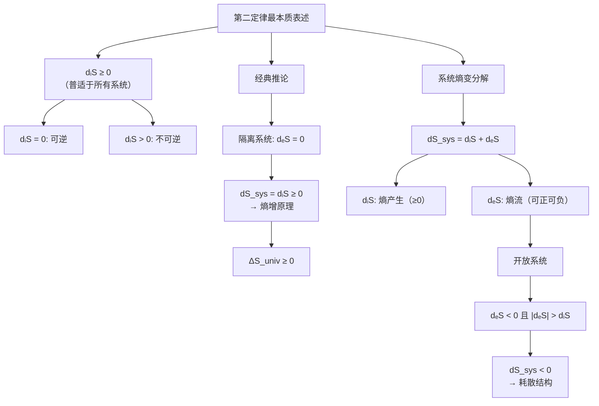

---
tags:
  - 热力学
  - 物理化学/熵
Category:
  - 课内/笔记
  - 卡片笔记
---
# 热力学第二定律 — dᵢS ≥ 0 与 $dS_{total}$ ≥ 0

## 1. 核心概念澄清

> [!important] 关键纠正
> **dᵢS 和 dₑS 都是对系统而言的**，不是你之前理解的「系统的熵变」和「环境的熵变」之分。

### 1.1 非平衡热力学符号体系（Prigogine 学派）

|     符号     | 含义                               |     性质     |
| :--------: | -------------------------------- | :--------: |
|  **dᵢS**   | 系统**内部**的熵产生（entropy production） | **永远 ≥ 0** |
|  **dₑS**   | 系统与**环境之间的熵流**（entropy flow）     | 可正、可负、可为零  |
| $dS_{sys}$ | 系统总熵变 = dᵢS + dₑS                | 可正、可负、可为零  |

- **dᵢS**：系统内部不可逆过程**自发产生**的熵（摩擦、扩散、化学反应、热传导等）。
- **dₑS**：系统通过边界与外界交换的熵流。
  - 传热贡献：$d_{e}S = δQ / T_{boundary}$
  - 物质交换贡献：物质流携带的熵。

---

## 2. 推导过程

### 2.1 熵变的分解

对于**任意系统**（敞开、封闭或隔离）：

$$
\boxed{dS_{\text{sys}} = d_iS + d_eS}
$$

### 2.2 两种表述的适用条件

|   系统类型   |    dₑS     | dS_sys = dᵢS + dₑS  |         第二定律约束          |
| :------: | :--------: | :-----------------: | :---------------------: |
| **隔离系统** |   **0**    | $dS_{sys} = d_{i}S$ | $dS_{sys} = d_{i}S ≥ 0$ |
| **封闭系统** | δQ/T（可正可负） |        可正可负         |         dᵢS ≥ 0         |
| **敞开系统** | 传热 + 物质流熵  |        可正可负         |         dᵢS ≥ 0         |

> [!tip] 你记忆中的 dᵢS + dₑS ≥ 0
> 你的记忆「dᵢS + dₑS ≥ 0」实际上是**隔离系统**的退化形式（dₑS = 0 时 $dS_{sys}$= dᵢS ≥ 0）。这个式子对隔离系统正确，但对开放/封闭系统并不要求 $dS_{sys}$ ≥ 0。

### 2.3 $d_{e}S$ 与 $\Delta S_{env}$ 的精细区别

$$
\Delta S_{\text{univ}} = \Delta S_{\text{sys}} + \Delta S_{\text{env}} = (d_iS + d_eS) + \Delta S_{\text{env}}
$$

- **dₑS**：流入**系统**的熵流。系统从环境吸热 δQ → dₑS = $δQ/T_{boundary}$ > 0。
- $ΔS_{env}$：**环境**的熵变。环境失去热量 → $ΔS_{env} = −δQ/T_{env}$< 0。

在可逆极限下：**dₑS = −$ΔS_{env}$**（系统获得的熵流恰好等于环境失去的熵）

因此：
- 可逆时：dₑS +$ΔS_{env}$ = 0 → $ΔS_{univ}$ = dᵢS ≥ 0
- 不可逆时：$ΔS_{univ}$ > dᵢS ≥ 0

---

## 3. 关键结论

> [!summary] 核心结论
> **热力学第二定律最本质的表述是 dᵢS ≥ 0**——任何宏观系统内部，不可逆过程产生的熵**永不为负**。这是对所有系统（隔离、封闭、敞开）普适的约束。

而「$dS_total ≥ 0$」（或「$ΔS_univ ≥ 0$」）仅在将「系统 + 环境」视为一个**隔离系统**时才成立——这是第二定律的**推论**，而非最普遍的表述。

### 为什么 Prigogine 要强调 dᵢS ≥ 0？

对于**非隔离系统**（特别是生命体、生态系统等开放系统）：
- $dS_{sys}$**可以减小**（靠 dₑS < 0 排出熵来维持秩序）
- 但 **dᵢS 始终 ≥ 0**——熵产生的箭头永远是正的
- 这就是**时间箭头**的热力学根源

---

## 4. 延伸思考

### 4.1 关联概念：耗散结构

当 dₑS < 0 且 |dₑS| > dᵢS 时，dS_sys < 0——系统可以「自组织」、熵减少。

> 这恰好是 Prigogine **耗散结构理论**的基础：开放系统可以通过向环境排出熵来维持或增强内部秩序。但这一切的前提仍然是 **dᵢS ≥ 0**，第二定律从未被违反。

### 4.2 对比辨析

| | **dᵢS ≥ 0**（普适表述） | **ΔS_univ ≥ 0**（经典表述） |
|:---|:---|:---|
| **适用对象** | 任何系统的内部过程 | 隔离系统（宇宙） |
| **物理本质** | 不可逆性的微观根源 | 宏观判断自发方向 |
| **开放性** | 对开放系统也成立 | 需要封闭「系统+环境」 |

### 4.3 应用举例：生物体

在生物体中：
- 葡萄糖氧化 → 系统 dᵢS > 0（不可逆化学反应产生熵）
- 生物体散热 → dₑS < 0
- 净效果：dS_sys ≈ 0（稳态维持）

> dᵢS ≥ 0 保证了生命代谢活动永远产生正熵——**衰老的不可逆性**正源于此。

### 4.4 与统计力学的关系

从统计力学角度，熵产生的不可逆性对应微观状态数的演化方向。系统自发趋向于**最大微观状态数（最大熵）的分布**——即 Boltzmann 分布所描述的平衡态。dᵢS ≥ 0 正是这一微观趋势的宏观表达。

---

## 5. 引导性问题 🌱

> [!question] 自我检测
> 1. 如果 dᵢS = 0（可逆过程），那么 dₑS 可以为负吗？如果可以，稳态（dS_sys = 0）下的开放系统需要满足什么条件？请写出关系式。
>
> 2. 「整个 universe 视为一个隔绝系统，其熵不也是系统的状态函数么？为什么我们得到结论说整个 universe 的熵变会与过程有关？」——现在你能用 dᵢS 和 dₑS 的语言来解释这个「悖论」吗？
>
> 3. 试推导：对于仅以温度 T 与外界换热的封闭系统，证明 dᵢS = dS_sys − δQ/T ≥ 0 等价于 Clausius 不等式 ∮ δQ/T ≤ 0。

---

## 6. 总结：知识体系化

```
热力学第二定律
├── 最本质表述：dᵢS ≥ 0（任何系统内部熵产生永不为负）
│ ├── dᵢS = 0 → 可逆过程（平衡态）
│ └── dᵢS > 0 → 不可逆过程（自发进行）
│
├── 系统熵变分解：dS_sys = dᵢS + dₑS
│ ├── dᵢS：内部熵产生（≥ 0）
│ └── dₑS：与环境熵流（可正可负可为零）
│
└── 经典推论：对于隔离系统（dₑS = 0）
 ├── dS_sys = dᵢS ≥ 0 → 熵增原理
 └── 延伸至宇宙：ΔS_sys + ΔS_env ≥ 0
```




---

## 7. 相关笔记

- Clausius 不等式与熵增原理
- 非平衡热力学基础
- Boltzmann 分布与最大熵
- 热力学第二定律的统计解释

---
# 总结对照

||传统表述|dᵢS/dₑS 表述|关系|
|---|---|---|---|
|系统熵变|$\Delta S_{\text{sys}}$|$dS_{\text{sys}}$|同一个|
|环境熵变|$\Delta S_{\text{环}}$|$\Delta S_{\text{env}}$|**同一个**|
|热温商|$\delta Q/T_{\text{sur}}$|$d_eS$|$d_eS = -\Delta S_{\text{环}}$|
|不可逆程度的度量|$\Delta S_{\text{sys}} - \delta Q/T_{\text{sur}}$|$d_iS$|**同一个**|
|第二定律|$\Delta S_{\text{sys}} + \Delta S_{\text{环}} \geq 0$|$d_iS \geq 0$|等价|