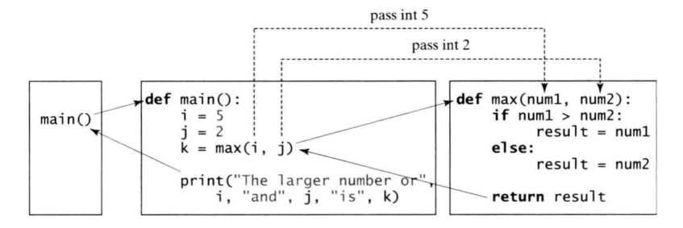
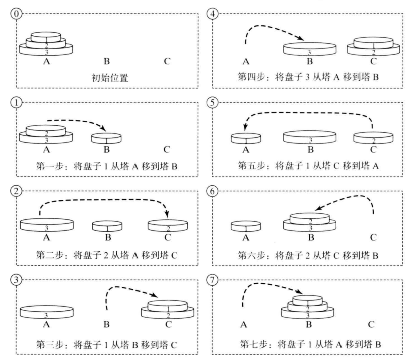
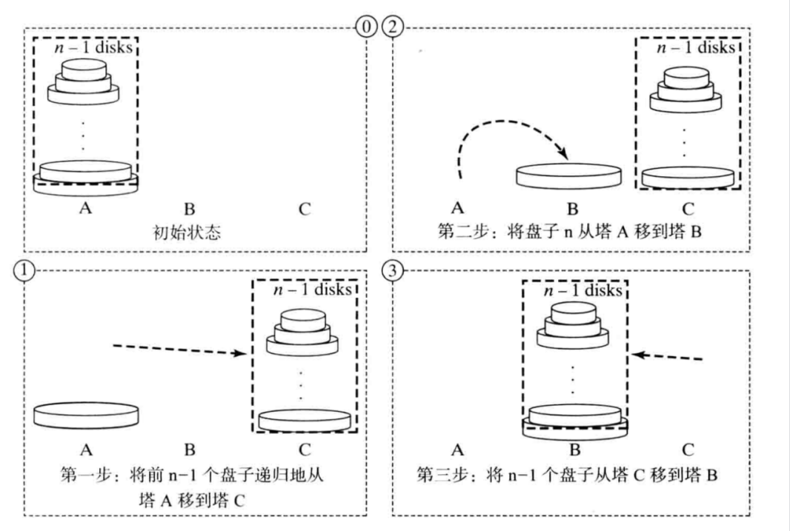

# 函数

## 函数基础知识

### 为什么要使用函数

如果在开发程序时，需要某块代码多次运行，为了提高编写的效率以及代码的重用，所以把具有独立功能的代码块组织为一个小模块，这就是函数。函数可以用来定义可重用代码、组织和简化代码。同print()、input()、range()一样，被调用后执行一个任务，返回控制权给原程序。函数的优点是：将代码拆成可管理的小块，易于编写和维护。例如，你有以下的需求：

```python
sum = 0
for i in range(1, 11):
    sum += i
print("Sum from 1 to 10 is", sum)

sum = 0
for i in range(28, 38):
    sum += i
print("Sum from 28 to 37 is", sum)

sum = 0
for i in range(35, 50):
    sum += i
print("Sum from 35 to 49 is", sum)
```

这些代码除了开始和结束的数，其它部分都非常类似。可以通过编写一个通用的代码重复使用。

```python
def sum(i1, i2):
    result = 0
    for i in range(i1, i2+1):
        result += i
    return result

def main():
    print("Sum from 1 to 10 is", sum(1, 10))
    print("Sum from 20 to 37 is", sum(20, 37))
    print("Sum from 35 to 49 is", sum(35, 49))
```

- DRY原则：Don't Repeat Yourself! 停止复制+粘贴！

### 函数的定义与调用

- 函数定义包括函数名称、形参以及函数体。
- 定义函数的语法如下：

```python
def functionName(list of parameters): 
    # Function body
```

- 例：定义一个求二个数字中较大值的函数

```python
def max(num1, num2):
    if num1 > num2:
        result = num1
    else:
        result = num2
    return result
```

- 函数头：`def max(num1, num2):`
- 函数名：max
- 形参：num1, num2
- 返回值：result
- 调用函数示例：

```python
def main():
    i = 5
	j = 2
	k = max(i, j)
	print("The larger number of", i, "and", j, "is", k)
    
main()
```



### 文档字符串

- 函数的特别机制：文档字符串

- 必须在函数的第一行，描述函数功能，可以多行，也可以没有

```python
def ask_yes_no(question):
    """Ask a yes or no question."""
    response = None
    while response not in ("y", "n"):
        response = input(question).lower()
    return response

ask_yes_no("Are you kidding? ")
```

### 函数的返回值

- 函数分为有返回值和无返回值。
- 举例：input()函数有返回值，所以要写成 s = input("Enter a word")，输入的文本作为 input() 的返回值放在 s 中。
- 对比：print()函数是没有返回值的，所以如果写成 s = print('Hello')，那么 s 中只会得到一个None。

#### 函数无返回值

示例：

```python
# Print grade for the score 
def printGrade(score):
    if score >= 90.0:
        print('A')
    elif score >= 80.0:
        print('B')
    elif score >= 70.0:
        print('C')
    elif score >= 60.0:
        print('D')
    else:
        print('F')

def main():
    score = eval(input("Enter a score: "))
    print("The grade is ", end = "")
    printGrade(score)

main() # Call the main function

```

所有的函数都将返回一个值，如果没有返回值，那么函数将返回一个特殊值：None 

```python
def sum(num1, num2):
    result = num1 + num2
print(sum(1, 2))  # None
```

函数会在运行结束后退出，也会在遇到return语句时退出运行（类似循环中遇到break）。它的语法是：return 或 return None 

```python
# Print grade for the score 
def printGrade(score):
    if score < 0 or score > 100:
        print("Invalid score")
        return # Same as return None
    if score >= 90.0:
        print('A')
    elif score >= 80.0:
        print('B')
    elif score >= 70.0:
        print('C')
    elif score >= 60.0:
        print('D')
    else:
        print('F')

def main():
    score = eval(input("Enter a score: "))
    print("The grade is ", end = "")
    printGrade(score)

main() # Call the main function

```

#### 函数有返回值

```python
# Return the grade for the score 
def getGrade(score):
    if score >= 90.0:
        return 'A'
    elif score >= 80.0:
        return 'B'
    elif score >= 70.0:
        return 'C'
    elif score >= 60.0:
        return 'D'
    else:
        return 'F'

def main():
    score = eval(input("Enter a score: "))
    print("The grade is", getGrade(score))

main() # Call the main function

```

#### 函数有多个返回值

函数也可以有多个返回值，以逗号隔开。在函数返回n（n>1）个值时，要么使用n个变量来接收返回值，要么使用1个变量以元组的形式接收返回值，其它个数的变量是不可接受的。

```python
def sort(number1, number2):
    if number1 < number2:
        return number1, number2
    else:
        return number2, number1

n1, n2 = sort(3, 2)
numbers = sort(5, 6)

print("n1 is", n1)	# n1 is 2
print("n2 is", n2)	# n2 is 3
print(numbers) # (5, 6)
```

### 函数传参

#### 函数的形参与实参

函数的作用就在于它处理参数的能力。当调用函数时，需要将实参传递给形参。

实参有两种类型：位置参数和关键字参数。

#### 位置参数

使用位置参数，要求参数按它们在函数头的顺序进行传递。

```python
def birthday1(name, age):
	print("Happy birthday,", name, "!", " I hear you're", 
          age, 	"today.\n")
    
birthday1("Jackson", 18)
# Happy birthday, Jackson !  I hear you're 18 today.
birthday1(18, "Jackson")
# Happy birthday, 18 !  I hear you're Jackson today.

```

#### 关键字参数

使用关键字参数时，参数可以以任何顺序出现，通过name=value的形式传递每个参数。

```python
def birthday1(name, age):
	print("Happy birthday,", name, "!", " I hear you're", 
          age, 	"today.\n")
    
birthday1(name = "Jackson", age = 18)
# Happy birthday, Jackson !  I hear you're 18 today.
birthday1(age = 18, name = "Jackson")
# Happy birthday, Jackson !  I hear you're 18 today.

```

位置实参和关键字实参在同一次调用时可以混用，但**位置参数不能出现在任何关键字参数之后**。

```python
def func1(x,y,z):
    print("x =",x,"y =",y,"z =",z)

func1(3,1,4)     # x = 3 y = 1 z = 4
func1(3,z=4,y=1) # x = 3 y = 1 z = 4
func1(3,z=4,1)   # SyntaxError: positional argument follows keyword argument
```

#### 默认值参数

函数定义时，当参数有默认值时，调用时可以没有参数

```python
# parameters with default values
def birthday2(name = "Jackson", age = 18):
	print("Happy birthday,", name, "!", " I hear you're", 
          age, "today.\n")

birthday2()
# Happy birthday, Jackson !  I hear you're 18 today.
birthday2(name = "Katherine")
# Happy birthday, Katherine !  I hear you're 18 today.
birthday2(age = 20)
# Happy birthday, Jackson !  I hear you're 20 today.
birthday2(name = "Katherine", age = 20)
# Happy birthday, Katherine !  I hear you're 20 today.
birthday2("Katherine", 20)
# Happy birthday, Katherine !  I hear you're 20 today.
```

另一个例子：

```python
def printArea(width = 1, height = 2):
    area = width * height
    print("width:", width, "\theight:", height, "\tarea:", area)

printArea() # Default arguments width = 1 and height = 2
printArea(4, 2.5) # Positional arguments width = 4 and height = 2.5
printArea(height = 5, width = 3) # Keyword arguments width 
printArea(width = 1.2) # Default height = 2
printArea(height = 6.2) # Default widht = 1

'''
width: 1 	height: 2 	area: 2
width: 4 	height: 2.5 	area: 10.0
width: 3 	height: 5 	area: 15
width: 1.2 	height: 2 	area: 2.4
width: 1 	height: 6.2 	area: 6.2
'''
```

函数定义中，可以混用默认值参数和非默认值参数。这种情况下，**非默认值参数必须定义在默认值参数之前**，即，定义中设置默认值的参数后面的所有参数也要设默认值。

```python
def func1(x=3,y=1,z=4):
    print("x =",x,"y =",y,"z =",z)
func1() # x = 3 y = 1 z = 4

def func2(x,y=1,z=4):
    print("x =",x,"y =",y,"z =",z)
func2(5) # x = 5 y = 1 z = 4

# SyntaxError: non-default argument follows default argument
def func3(x=3,y=1,z): # ERROR
    print("x =",x,"y =",y,"z =",z)
func3(5)
```

#### 限制使用位置参数和关键字参数

##### 仅限使用位置参数

- 如果想要函数的调用者，某些参数只能使用位置参数传参，而不能使用关键字参数传参，那么只需要在所需位置后面放置一个/。在/之前的所有参数，将只能使用位置参数传参，不能使用关键字参数传参。

```python
def f1(a, b, /):
    return a + b
```

- 对于上面这个函数而言，调用 f1() 时参数a，b只能使用位置参数传参，而不能以关键字传参，即 f1(2, 3) 执行正确而 f1(a=2, 3) 和 f1(2, b=3) 将执行错误。

##### 仅限使用关键字参数

- 如果希望函数的调用者使用某些参数时，必须以关键字参数的形式传参，那么你需要在所需位置的前一个位置放置一个\*。在\*之的的所有参数，将只能使用关键字参数传参，不能使用位置参数传参。

```python
def f1(a, *, b, c):
    return a + b + c
```

- 对于上面这个函数而言，调用时参数a可以使用位置参数传参, 但b,c参数一定要以关键字参数的形式传参，如 f1(1, b=4, c=5), 否则将会报错。

```python
def f2(a, *, b, c=5):
    return a + b + c
```

- 如果是这种情况下调用函数，参数a可以使用位置参数，但参数b一定要以关键字参数的形式传参，如f2(2, b=3),但是如果想传入c参数，那么c参数的要求和b参数一样都为关键字参数形式，如f2(2,b=3,c=4)。

##### 同时限制使用位置参数和关键字参数

- 如果希望调用者使用函数时一定不能使用关键字参数传参，那么只需要把这些参数放在/前即可
- 如果希望调用者使用函数时一定要使用某些参数，且必须为关键字参数传参，那么只需要把这些参数放在\*后面即可。
- /和*可以同时使用

```python
def f(a, b, /, c, *, d, e):
    print(a, b, c, d, e)
f(1, 2, c=3, d=4, e=5) 
```

- 当调用函数 f() 时
  - a,b 参数必须以位置参数传参，不能以关键字形式传参
  - c 参数既可以以位置参数传参，也可以以关键字形式传参
  - d,e 参数只能以关键字参数传参，不能以位置参数传参

### 参数的引用传递

- 形参与实参的关系，是引用传递的关系。

```python
def main():
    x = 1
    print("Before the call, x is", x)
    increment(x)
    print("After the call, x is", x)

def increment(n): 
    n += 1
    print("\tn inside the function is", n)

main() # Call the main function

'''
Before the call, x is 1
	n inside the function is 2
After the call, x is 1
'''
```

- 如果实参不是可变数据类型，那么在函数中是不会对实参的值造成修改的。
- 如果实参是可变数据类型（如列表、字典等），函数中可能修改实参的内容的。**这个问题非常重要，将在下一章重点讲解。**

## 函数应用示例

### 例子：判断某年是否为闰年

- 题目要求：编写一个函数 isLeapYear(year)，判断参数 year 是否为闰年
- 函数名：isLeapYear
- 形参：year，整数，代表要判断的年份
- 返回值：True/False，布尔值，year为闰年时返回True，否则返回False

```python
def isLeapYear(year):
    return year%400==0 or year%100!=0 and year%4==0
```

### 例子：判断一个正整数是否为素数

- 题目：编写一个函数 isPrime(number)，判断整数 number 是不是素数
- 函数名：isPrime
- 参数：number，为一个大于等于2的整数
- 返回值：True/False，布尔值，number为素数时，返回True，number为合数，返回False

```python
def isPrime(number):
    isPrime = True
    for i in range(2,number):
        if number % i == 0:
            isPrime = False
            break
    return isPrime

# 对照版：改 break 为 return
def isPrime(number):
    for i in range(2,number):
        if number % i == 0:
            return False
    return True
```

### 例子：求两个正整数的最大公约数

- 题目：编写一个函数 gcd(num1, num2)，求 num1 和 num2 两个整数的最大公约数
- 函数名：gcd
- 参数：num1, num2，为两个正整数
- 返回值：num1 和 num2 的最大公约数

```python
def gcd(num1, num2):
    i = min(num1, num2)
    while i>0:
        if num1 % i == 0 and num2 % i ==0:
            return i
        i -= 1
```


## 函数进阶知识

### 匿名函数 lambda 表达式

- 一个编写函数的方式是使用 lambda 表达式。lambda 接受一组参数以及组合这些参数的表达式，它会创建一个返回表达式值的匿名函数。函数的结果必须能够作为单独的表达式来计算。

- 任何 lambda 函数都可以改成使用 def 来定义，但有时使用 lambda 函数会让代码看起来更简洁。

```python
def add1(x, y): 
	return x + y

add2 = lambda x, y: x+y

print(add1(2, 3)) # 5
print(add2(4, 5)) # 9
```

### 高阶函数

- 在 Python 中，变量可以指向函数。

```python
f = abs
a = f(-123)
print(a) # 123

abs = 10
abs(-10) # TypeError: 'int' object is not callable
```

- 既然变量可以指向函数，函数的参数能接收变量，那么一个函数就可以接收另一个函数作为参数，这种函数就称之为高阶函数。
- 高阶函数是指把函数作为参数的一种函数。

```python
def add(a,b,func):
    return func(a) + func(b)
result = add(-10,10,abs)
print(result) # 20
print(add(-10,10,lambda x:x**2)) # 200
```

## 变量作用域

### 全局变量与局部变量（global vs local）

- 作用域：程序中各自区分开的不同区域
- 每个函数都有自己的作用域
- 全局变量：在全局作用域中创建的变量
- 局部变量：函数内部创建的变量
- 函数形参与局部变量作用域类似
- 局部变量的作用域从创建变量的地方开始，直到包含该变量的函数结束为止。

```python
globalVar = 1
def func1(argVar):
    localVar = 2
    print(globalVar) # 1
    print(localVar) # 2
    print(argVar) # 1
    
func1(globalVar)

print(globalVar) # 1
print(localVar) # ERROR
print(argVar) # ERROR

```

### 从函数内部读写全局变量

- 可以从程序任何作用域中读取全局变量。
- 函数中只可以读取全局变量，不可以修改全局变量。

```python
x = 1 
def f():
    print(x)
    
f() # 1
print(x) # 1 
```

- 通过在函数内部创建和全局变量同名的变量可以屏蔽全局变量，但只是屏蔽，会导致代码理解的问题。**这是非常不推荐的作法！**

```python
x = 1 
def f():
    x = 2
    print(x)

f() # 2
print(x) # 1
```

- 使用global关键字，从函数内部修改全局变量。**这是非常不推荐的作法！**

```python
x = 1 
def f():
    global x
    x = 2
    print(x)

f() # 2
print(x) # 2
```

- 综合示例

```python
# Global Reach
# Demonstrates global variables
def read_global():
	print("From inside the local scope of read_global(), value is:", value)
    
def shadow_global():
	value = -10
	print("From inside the local scope of shadow_global(), value is:", value)
    
def change_global():
	global value
	value = -10
	print("From inside the local scope of change_global(), value is:", value)

# main
# value is a global variable because we're in the global scope here
value = 10

print("In the global scope, value has been set to:", value)
# In the global scope, value has been set to: 10

read_global()
# From inside the local scope of read_global(), value is: 10

print("Back in the global scope, value is still:", value)
# Back in the global scope, value is still: 10

shadow_global()
# From inside the local scope of shadow_global(), value is: -10

print("Back in the global scope, value is still:", value)
# Back in the global scope, value is still: 10

change_global()
# From inside the local scope of change_global(), value is: -10

print("Back in the global scope, value has now changed to:", value)
# Back in the global scope, value has now changed to: -10

```

### 同名局部变量的屏蔽效应

```python
x = 1 
def f1():
    print(x) # UnboundLocalError: local variable 'x' referenced before assignment
    x = 2

f1()    
def f2():
    print(x) # SyntaxError: name 'x' is used prior to global declaration
    global x
    x = 2

f2()
```

### 全局变量小结

- 全局变量并不是好技术，尽量不要使用。
- 对在多个函数中均需要使用的变量，可以使用“全局常量”，即赋值后不再修改。这样有利于代码理解和程序修改。
- Python并没有专门的语法来指定“常量”，只能由程序员自行约束。

### 变量作用域（nonlocal）

- 如果在一个函数的内部定义了另一个函数，外部的叫外函数，内部的叫内函数。
- 与全局变量与局部变量的关系类似，内函数对外函数中的局部变量，仍然是只能只读，如果想修改，则会导致产生一个新的内函数中的局部变量。

```python
x = 1
def outer():
    x = 2
    def inner():
        x = 3
        print("inner ==>",x)
    inner()
    print("outer ==>",x)

outer()
print("global ==>",x)

# inner ==> 3
# outer ==> 2
# global ==> 1
```

- 使用 global 语句，可以绑定全局变量

```python
x = 1
def outer():
    x = 2
    def inner():
        global x
        x = 3
        print("inner ==>",x)
    inner()
    print("outer ==>",x)

outer()
print("global ==>",x)

# inner ==> 3
# outer ==> 2
# global ==> 3
```

- 如果内函数中想修改外函数中的局部变量），可以用 nonlocal 关键字声明一个变量， 表示这个变量不是局部变量空间的变量，需要向上一层变量空间查找这个变量。

```python
x = 1
def outer():
    x = 2
    def inner():
        nonlocal x
        x = 3
        print("inner ==>",x)
    inner()
    print("outer ==>",x)

outer()
print("global ==>",x)

# inner ==> 3
# outer ==> 3
# global ==> 1
```

- nonlocal 关键字声明的变量是向上一层变量域中查找并绑定变量，如果上一层不存在此变量，则继续向上查找，直到最外层的函数。
- 下面的代码中，inner()中的x绑定了middle()中的x

```python
x = 1
def outer():
    x = 2
    def middle():
        x = 2.5        
        def inner():
            nonlocal x
            x = 3
            print("inner ==>",x)
        inner()
        print("middle ==>",x)
    middle()
    print("outer ==>",x)

outer()
print("global ==>",x)

# inner ==> 3
# middle ==> 3
# outer ==> 2
# global ==> 1
```

- 下面的代码中，inner()中的x绑定了middle()中的x，而middle()中的x又绑定了outer()中的x

```python
x = 1
def outer():
    x = 2
    def middle():
        nonlocal x
        x = 2.5        
        def inner():
            nonlocal x
            x = 3
            print("inner ==>",x)
        inner()
        print("middle ==>",x)
    middle()
    print("outer ==>",x)

outer()
print("global ==>",x)

# inner ==> 3
# middle ==> 3
# outer ==> 3
# global ==> 1
```

- 下面的代码中，inner()中的x超过了middle()，直接绑定了outer()中的x

```python
x = 1
def outer():
    x = 2
    def middle():
        def inner():
            nonlocal x
            x = 3
            print("inner ==>",x)
        inner()
        print("middle ==>",x)
    middle()
    print("outer ==>",x)

outer()
print("global ==>",x)

# inner ==> 3
# middle ==> 3
# outer ==> 3
# global ==> 1
```

### 变量作用域总结

- 在Python中，**作用域**决定了变量的可见性和生命周期。Python的作用域分为四种，按照从内到外的顺序分别是：局部作用域（Local Scope）、嵌套作用域（Enclosing Scope）、全局作用域（Global Scope）和内置作用域（Built-in Scope）。变量的查找顺序遵循**LEGB规则**，即从局部到内置逐层查找。

  - 局部作用域（Local Scope）：局部作用域是函数内部定义的变量范围。这些变量只能在函数内部访问，函数执行完毕后会被销毁。
  - 嵌套作用域（Enclosing Scope）：嵌套作用域指的是嵌套函数中，内层函数可以访问外层函数的变量，但不能直接修改，除非使用 *nonlocal* 关键字。
  - 全局作用域（Global Scope）：全局作用域的变量在整个模块中都可访问，但在函数中默认是只读的。如果需要修改全局变量，需使用 *global* 关键字。
  - 内置作用域（Built-in Scope）：内置作用域包含Python解释器预定义的变量和函数，例如*print()*、*len()*等。这些变量在程序的任何地方都可以直接使用。

- 变量查找顺序（LEGB规则）。当访问变量时，Python会按照以下顺序查找：

  1. **L（Local）**：局部作用域，函数内部定义的变量。
  2. **E（Enclosing）**：嵌套作用域，外层函数的变量。
  3. **G（Global）**：全局作用域，模块级别的变量。
  4. **B（Built-in）**：内置作用域，Python内置的变量和函数。

  如果在所有作用域中都找不到变量，会抛出*NameError*。

- 在Python程序设计中，只有模块(module)，类(class)、函数(def、lambda)以及推导式中才会引入新的作用域，其他的代码块(如 if/elif/else/、try/except、for/while等)不会引用新的作用域，也就是说，这些语句内定义的变量，在外部也可以访问。

```python
sum = 0
for i in range(10):
    sum += i
# 在 for 循环外部访问 i，成功
print(i) # 9

def test():
    a = 1
# 在函数外部访问函数中的局部变量，失败
print(a) # NameError: name 'a' is not defined

list = [ x for x in 'python']
print(list) # ['p', 'y', 't', 'h', 'o', 'n']
print(x) # NameError: name 'x' is not defined
```

## 递归函数

- 使用递归，就是使用递归函数编程。
- 递归函数，就是直接或间接调用自身的函数。
- 在某些情况下，对于用其它方法很难解决的问题，使用递归就能给出一个很自然、直观、简单的解决方案。
- 如何进行“递归地思考”？

### 例子：计算阶乘

- 数字n的阶乘，可以按递归方式进行定义：
  - 0! = 1
  - n! = n * (n-1)!			n>0
- 计算factorial(n) 的递归算法可以描述如下

```python
def main():
    n = eval(input("Enter a nonnegative integer: "))
    print("Factorial of", n, "is", factorial(n))

# Return the factorial for a specified number 
def factorial(n):
    if n == 0: # Base case
        return 1
    else:
        return n * factorial(n - 1) # Recursive call

main() # Call the main function

```

- 使用循环来实现factorial()函数是更加简单而且高效的方法

```python
def factorial(n):
    sum = 1
    for i in range(1,n+1):
        sum *= i
    return sum
```

### 例子：计算斐波那契数列

- 斐波那契（Fibonacci）数列从0和1开始，之后的每个数都是序列中的前两个数字之和。
  - Fib(0) = 0
  - Fib(1) = 1
  - Fib(n) = Fib(n-1) + Fib(n-2)     n>1

```python
def main():
    index = eval(input("Enter an index for a Fibonacci number: "))
    # Find and display the Fibonacci number
    print("The Fibonacci number at index", index, "is", fib(index))

# The function for finding the Fibonacci number 
def fib(index):
    if index == 0: # Base case
        return 0
    elif index == 1: # Base case
        return 1
    else:  # Reduction and recursive calls
        return fib(index - 1) + fib(index - 2)

main() # Call the main function

```

- fib(n)中的递归调用次数

|     n      |  2   |  3   |  4   |  10  |  20   |   30    |    40     |     50     |
| :--------: | :--: | :--: | :--: | :--: | :---: | :-----: | :-------: | :--------: |
| # of calls |  3   |  5   |  9   | 177  | 21891 | 2692537 | 331160281 | 2075316483 |

- 使用循环来实现 fibonacci 函数是更加简单而且高效的方法。

```python
def fib(index):
    a = 0
    b = 1
    for i in range(2,index+1):
        a, b = b, a+b
    return b
```

然而，有些问题是本质是递归且不使用递归很难解决的。

### 例子：汉诺塔问题

- 汉诺塔问题是一个经典的问题，它可以使用递归很容易地解决，但是，不使用递归则非常难解决。
- 这个问题是将指定个数而大小互不相同的盘子从一个塔上移到另一个塔上。移动规则如下：
  - n 标记 1、2、3、……、n 的盘子，以及三个标记 A、B、C 的塔
  - 任何时候盘子都不能放在比它小的盘子的上方
  - 初始状态时，所有的盘子都被放在塔 A 上
  - 每次只能移动一个盘子，并且这个盘子必须在塔顶位置



- 汉诺塔问题可以被分解为三个子问题



```python
def main():
    n = eval(input("Enter number of disks: "))

    # Find the solution recursively
    print("The moves are:")
    moveDisks(n, 'A', 'B', 'C')

# The function for finding the solution to move n disks
#   from fromTower to toTower with auxTower 
def moveDisks(n, fromTower, toTower, auxTower):
    if n == 1: # Stopping condition
        print("Move disk", n, "from", fromTower, "to", toTower)
    else: 
        moveDisks(n - 1, fromTower, auxTower, toTower)
        print("Move disk", n, "from", fromTower, "to", toTower)
        moveDisks(n - 1, auxTower, toTower, fromTower)

main() # Call the main function

```

### 小结

- 递归是程序控制的一种可替代方式，它实质上就是不用循环控制的重复。
- 在递归中，函数重复地调用自己。必须使用一条选择语句来控制是否继续递归调用该函数。
- 递归会产生相当大的开销。每次递归都要占用大量的内存和时间。任何使用递归解决的问题，都可以用迭代（循环）非递归地解决。
- 那为什么还要用递归呢？因为本质上有递归特性的问题，有时候很难用其它方法解决，而递归可以给出清晰、简单的解决方案。

## 函数高级知识

### 函数变长传参

#### 可变长度参数

在实际使用函数时，可能会遇到“不知道函数需要接受多少个实参”的情况。

- 典型的例子：print(arg1, arg2, … , argN)

```python
def make_pizza(*toppings):
    """打印顾客点的所有配料"""
    print(toppings)

make_pizza('pepperoni')
# ('pepperoni',)

make_pizza('mushrooms','green peppers','extra cheese')
# ('mushrooms', 'green peppers', 'extra cheese')
```

例如，设计一个制作披萨的函数，我们知道，披萨中可以放置很多种配料，但无法预先确定顾客要多少种配料。

make_pizza() 函数中，只包含一个形参 *toppings，它表示创建一个名为 toppings 的空元组，并将收到的所有值都封装到这个元组中。

#### 函数接收任意数量的非关键字实参

```python
def make_pizza(size, *toppings):
    """概述要制件的披萨"""
    print("Making a " + str(size) + "-inch pizza with the following toppings:")
    for topping in toppings:
    	print("- " + topping)

make_pizza(16, 'pepperoni')
'''
Making a 16-inch pizza with the following toppings:
- pepperoni
'''

make_pizza(12, 'mushrooms','green peppers','extra cheese')
'''
Making a 12-inch pizza with the following toppings:
- mushrooms
- green peppers
- extra cheese
'''
```

#### 函数接收任意数量的关键字实参

如果在调用函数时是以关键字参数的形式传入实参，且数量未知，则需要使函数能够接收任意数量的键值对参数。

```python
def build_profile(first, last, **user_info):
    profile = {}
    profile['first_name'] = first
    profile['last_name'] = last
    for key, value in user_info.items():
        profile[key] = value
    return profile

user_profile = build_profile('Albert', 'Einstein', location='Princeton', field='physics')

print(user_profile)
# {'first_name': 'Albert', 'last_name': 'Einstein', 'location': 'Princeton', 'field': 'physics'}
```

#### 两种方式结合使用

```python
def build_profile(first, last, *infos, **user_info):
    profile = {}
    profile['first_name'] = first
    profile['last_name'] = last
    for info in infos:
        profile[info.split(':')[0]] = info.split(':')[1]
    for key, value in user_info.items():
        profile[key] = value
    return profile

user_profile = build_profile('Albert', 'Einstein', 'age:29', 'tel:123456', location='Princeton', field='physics')

print(user_profile)
# {'first_name': 'Albert', 'last_name': 'Einstein', 'age': '29', 'tel': '123456', 'location': 'Princeton', 'field': 'physics'}
```

#### 小结

可变参数 `*args`、`**kwargs`作为函数定义时：

- `*args `收集所有未匹配的位置参数组成一个tuple对象，局部变量args指向此tuple对象

- `**kwargs` 收集所有未匹配的关键字参数组成一个dict对象，局部变量kwargs指向此dict对象

**注意：函数定义时，二者同时存在，一定需要将`*args`放在`**kwargs`之前。**

#### 解包元组和字典

当函数调用时：

- `*参数`用于解包tuple对象的每个元素，作为一个一个的位置参数传入到函数中
- `**参数`用于解包dict对象的每个元素，作为一个一个的关键字参数传入到函数中

```python
numbers_tuple = ("1","2")
numbers_dict = {'second':"22", 'first':"11"}
 
def print_str(first, second):
    print(first,second)
 
print_str(*numbers_tuple) # 1 2
print_str(**numbers_dict) # 11 22
```

### 闭包 enclosing

- 如果在一个函数的内部定义了另一个函数，外部的叫外函数，内部的叫内函数。
- **闭包**：在一个外函数中定义了一个内函数，内函数里使用了外函数的局部变量，并且外函数的返回值是内函数的引用。这样就构成了一个闭包。
- 一般情况下，如果一个函数结束，函数的内部所有东西都会释放掉，还给内存，局部变量都会消失。但是闭包是一种特殊情况，如果外函数在结束的时候发现有自己的局部变量将来会在内部函数中用到，就把这个局部变量绑定给了内部函数，然后自己再结束。

```python
#闭包函数的实例
# outer是外部函数 a和b都是外函数的临时变量
def outer( a ):
    b = 10
    # inner是内函数
    def inner():
        #在内函数中 用到了外函数的临时变量
        return a+b
    # 外函数的返回值是内函数的引用
    return inner

# 在这里我们调用外函数传入参数5
# 此时外函数两个临时变量 a是5 b是10 ，并创建了内函数，然后把内函数的引用返回存给了demo
# 外函数结束的时候发现内部函数将会用到自己的临时变量，这两个临时变量就不会释放，会绑定给这个内部函数
demo = outer(5)
# 我们调用内部函数，看一看内部函数是不是能使用外部函数的临时变量
# demo存了外函数的返回值，也就是inner函数的引用，这里相当于执行inner函数
print(demo()) # 15
demo2 = outer(7)
print(demo2()) #17
```

### 函数装饰器

- 函数装饰器，是修改其他函数的功能的函数，它们有助于让代码更简短。
- 装饰器放在一个函数开始定义的地方，它就像一顶帽子一样戴在这个函数的头上。和这个函数绑定在一起。
- 在我们调用这个函数的时候，第一件事并不是执行这个函数，而是将这个函数做为参数传入它头顶上这顶帽子，这顶帽子我们称之为 装饰器 。

#### 不带参数的函数装饰器

- 例如：有两个用时较长的函数，想测量一下它们运行所需要的时间。

```python
def f1(n):
    for i in range(n+1):
        j = i
    return j
        
def f2(n):
    s = ''
    for i in range(n+1):
        s = str(i)    
    return s
    
print(f1(1000000)) # 1000000
print(f2(1000000)) # 1000000
```

- 不使用装饰器，就需要修改相关函数的源代码

```python
import time

def f1(n):
    t = time.time()
    for i in range(n+1):
        j = i
    print(time.time()-t)
    return j
        
def f2(n):
    t = time.time()
    s = ''
    for i in range(n+1):
        s = str(i)
    print(time.time()-t)        
    return s
    
print(f1(1000000))
print(f2(1000000))

'''
0.04761457443237305
1000000
0.3281538486480713
1000000
'''
```

- 使用了装饰器后，就可以不修改原来的函数了

```python 
import time

def timeit(f):
	def inner(*args,**kargs):
		t = time.time()
		r = f(*args,**kargs)
		print(time.time()-t)
		return r
	return inner

@timeit
def f1(n):
    for i in range(n+1):
        j = i
    return j
        
@timeit
def f2(n):
    s = ''
    for i in range(n+1):
        s = str(i)
    return s
    
print(f1(1000000))
print(f2(1000000))

'''
0.036684274673461914
1000000
0.25258517265319824
1000000
'''
```

#### 带参数的函数装饰器

- 装饰器本身是一个函数，做为一个函数，如果不能传参，那这个函数的功能就会很受限，只能执行固定的逻辑。
- 这意味着，如果装饰器的逻辑代码的执行需要根据不同场景进行调整，若不能传参的话，我们就要写两个装饰器，这显然是不合理的。
- 那如果实现这个装饰器，让其可以实现传参呢？这会比较复杂，需要两层嵌套。

```python
def say_hello(country):
    def wrapper(func):
        def deco(*args, **kwargs):
            if country == "China":
                print("你好!")
            elif country == "America":
                print('Hello!')
            # 真正执行函数的地方
            r = func(*args, **kwargs)
            return r 
        return deco
    return wrapper
    
# 小明，中国人
@say_hello("China")
def xiaoming():
    return ("我是小明。")

# jack，美国人
@say_hello("America")
def jack():
    return ("I'm Jack.")

print(xiaoming())
print(jack())

'''
你好!
我是小明。
Hello!
I'm Jack.
'''
```

### 生成器函数

#### 何谓生成器

- 在 Python 中，一边循环一边计算的机制，称为生成器（Generator）；
- 生成器是一个返回迭代器的函数，只能用于迭代操作；

#### 生成器函数

- 生成器是Python中的一个对象，对这个对象进行操作，可以依次生产出按生成器内部运算产生的数据；
- 生成器函数指的是函数体中包含yield关键字的函数（yield就是专门给生成器用的return）；
- 生成器可以通过生成器表达式和生成器函数获取到；

#### 生成器函数的定义

```python
def add():
    for i in range(10):
        yield i
g = add()
print(g)  # <generator object add at 0x10f6110f8>
print(next(g))  # 0
print(next(g))  # 1
```

- 我们可以通过yield关键字来定义一个生成器函数，这个生成器函数返回值就是一个生成器对象；

#### 生成器函数的调用

```python
def gen():
    print('111111')
    yield '111111'
    print('222222')
    yield '222222'
    print('333333')
    yield '333333'

g = gen()
print(g)  # <generator object gen at 0x0026BBF0>
next(g)   # 111111
next(g)   # 222222
next(g)   # 333333
next(g, 'over')
```

- 生成器函数可以使用next()迭代，且每次next()只会返回一次yield的值，然后暂停，下次一次next()时会在当前位置继续，如果没有元素可以迭代了，还 执在行next()则需要给定一个默认值，不给默认值会报错；
- 如果在生成器函数中使用return，则会终止迭代，且不能得到返回值；

```python
def gen():
    print('111111')
    yield '111111'
    print('222222')
    return '222222'
    print('333333')
    yield '333333'

g = gen()
print(g)  # <generator object gen at 0x0026BBF0>
next(g)   # 111111
next(g)   # 222222, 抛出异常
```

#### 生成器函数的使用场景

```python
# 死循环
def way():
    i = 0
    while True:
        i += 1
        yield i
c = way()
print(next(c)) # 1
print(next(c)) # 2
print(next(c)) # 3
print(next(c)) # 4
print(next(c)) # 5
```

- 在生成器中使用死循环，不会一直执行，仍旧是执行多少次next()，返回多少个值；

#### 生成器函数中的语法糖

```python
# 普通生成器函数way1
def way1():
    for i in range(5):
        yield i

# 带语法糖的生成器函数way2
def way2():
    yield from range(5)


#循环输出way1
for i in way1():
    print(i)  #0 1 2 3 4


#循环输出way2
for j in way2():
    print(j)  #0 1 2 3 4
```

- 语法糖指那些没有给计算机语言添加新功能，而只是对人类来说更“甜蜜”的语法；
- 语法糖给程序员提供了更实用的编码方式，有益于更好的编码风格，更易读；
- 生成器的语法糖也就是生成器的一种语法，作用是使代码更加简洁；

## 总结

### 函数抽象

- 封装：通过隐藏细节来保证代码的独立性
- 函数内部变量在函数外部不可见
- 封装是一种抽象
- 抽象：通观全局而不考虑细节
- 函数体可以被认为一个黑盒子，它包含这个函数的详细实现。

### 理解软件复用

- 软件复用：一个功能在不同地方被反复使用，避免重复造轮子

- 函数就是一种可复用的程序

- 软件复用的优点：

  - 提高生产力

  - 改进质量

  - 在软件产品之间提供一致性

  - 改进性能

- 复用的方法：函数，模块
