# 数据结构与算法初步

> 本章内容主要摘录自《Python数据结构与算法分析》一书，仅用于内部教学使用。

## 导论

### 何谓编程

​	编程是指通过编程语言将算法编码以使其能被计算机执行的过程。尽管有众多的编程语言和不同类型的计算机，但是首先得有一个解决问题的算法。如果没有算法，就不会有程序。

​	通常，编程就是为解决方案创造表达方式。因此，编程语言对算法的表达以及创造程序的过程是计算机科学的基础。

​	通过定义表达问题实例所需的数据，以及得到预期结果所需的计算步骤，算法描述出了问题的解决方案。编程语言必须提供一种标记方式，用于表达过程和数据。为此，编程语言提供了众多的控制语句和数据类型。

​	控制语句使算法步骤能够以一种方便且明确的方式表达出来。算法至少需要能够进行顺序执行、决策分支、循环迭代的控制语句。只要一种编程语言能够提供这些基本的控制语句，它就能够被用于描述算法。

​	计算机中的所有数据实例均由二进制字符串来表达。为了赋予这些数据实际的意义，必须要有数据类型。数据类型能够帮助我们解读二进制数据的含义，从而使我们能从待解决问题的角度来看待数据。这些內建的底层数据类型（又称原生数据类型）提供了算法开发的基本单元。

​	举例来说，大部分编程语言都为整数提供了相应的数据类型。根据整数（如 23、654 以及–19）的常见定义，计算机内存中的二进制字符串可以被理解成整数。除此以外，数据类型也描述了该类数据能参与的所有运算。对于整数来说，就有加减乘除等常见运算。并且，对于数值类型的数据，以上运算均成立。

### 为何学习数据结构及抽象数据类型

​	抽象数据类型（有时简称为 ADT）从逻辑上描述了如何看待数据及其对应运算而无须考虑具体实现。这意味着我们仅需要关心数据代表了什么，而可以忽略它们的构建方式。通过这样的抽象，我们对数据进行了一层封装，其基本思想是封装具体的实现细节，使它们对用户不可见，这被称为信息隐藏。

​	抽象数据类型的实现常被称为数据结构，这需要我们通过编程语言的语法结构和原生数据类型从物理视角看待数据。分成这两种不同的视角有助于为问题定义复杂的数据模型，而无须考虑模型的实现细节。这便提供了一个独立于实现的数据视角。由于实现抽象数据类型通常会有很多种方法，因此独立于实现的数据视角使程序员能够改变实现细节而不影响用户与数据的实际交互。用户能够始终专注于解决问题。

### 常见的数据结构

​	数据结构是计算机存储和组织数据的方式，不同的数据结构适用于不同的应用场景。以下是常见的数据结构及其特点：

- **数组** 数组是一种线性结构，存储在连续的内存空间中。它的优点是查询速度快，缺点是插入和删除操作效率较低，适用于频繁查询但增删较少的场景。

- **链表** 链表由节点组成，每个节点包含数据域和指针域。它的优点是插入和删除操作效率高，缺点是查询速度慢，适用于需要频繁增删操作的场景。

- **栈** 栈是一种后进先出（LIFO）的数据结构，只能在栈顶进行插入和删除操作。它常用于递归调用、表达式求值等场景。

- **队列** 队列是一种先进先出（FIFO）的数据结构，元素从队尾入队，从队首出队。它适用于任务调度、数据缓冲等场景。

- **哈希表** 哈希表通过哈希函数将键映射到数组索引，实现快速查找。它的优点是查找速度快，但需要处理哈希冲突，适用于需要高效查找的场景。

- **堆** 堆是一种完全二叉树，分为大根堆和小根堆，根节点分别是最大值或最小值。堆常用于优先队列和堆排序。

- **树** 树是一种层次结构，常见的有二叉树、平衡二叉树、红黑树等。它适用于需要快速查找、插入和删除的场景，如数据库索引。

- **图** 图由顶点和边组成，分为有向图和无向图，适用于表示复杂关系的数据，如社交网络、地图路径等。

这些数据结构在不同的应用场景中发挥着重要作用，选择合适的数据结构可以显著提升程序性能。**限于篇幅，本章我们重点介绍栈和队列这二种线性表。**

### 为何学习算法

​	计算机科学家通过经验来学习：观察他人如何解决问题，然后亲自解决问题。接触各种问题解决技巧并学习不同算法的设计方法，有助于解决新的问题。通过学习一系列不同的算法，可以举一反三，从而在遇到类似的问题时，能够快速加以解决。

​	各种算法之间往往差异巨大。算法一可能使用了较少的资源，算法二返回结果所需的时间可能是算法一的10 倍。我们需要某种方式来比较这两种算法。尽管这两种算法都能得到结果，但是其中一种可能比另一种“更好”——更高效、更快，或者使用的内存更少。随着对算法的进一步学习，你会掌握比较不同算法的分析技巧。这些技巧只依赖于算法本身的特性，而不依赖于程序或者实现算法的计算机的特性。

​	最坏的情况是遇到难以解决的问题，即没有算法能够在合理的时间内解决该问题。因此，至关重要的一点是，要能区分有解的问题、无解的问题，以及虽然有解但是需要过多的资源和时间来求解的问题。

​	在选择算法时，经常会有所权衡。除了有解决问题的能力之外，计算机科学家也需要知晓如何评估一个解决方案。总之，问题通常有很多解决方案，如何找到一个解决方案并且确定其为优秀的方案，是需要反复练习、熟能生巧的。

### 常见算法

​	算法是解决问题的一种方法或过程，通过一系列明确的步骤来实现特定任务。以下是常见的算法设计方式及其特点：

- **递归法** 递归法通过将复杂问题分解为更小的子问题来解决，分为直接递归和间接递归。直接递归是函数直接调用自身，而间接递归是通过其他函数间接调用自身。递归法适用于树的遍历、图的搜索等问题，但可能导致栈溢出或重复计算。

- **分治法** 分治法将问题分解为多个子问题，分别解决后再合并结果。典型应用包括归并排序和快速排序。它适用于具有“最优子结构”的问题。

- **动态规划法** 动态规划通过保存子问题的解来避免重复计算，适用于具有重叠子问题的最优化问题，例如01背包问题和旅行商问题。它能确保全局最优解，但时间复杂度较高。

- **贪心算法** 贪心算法在每一步选择当前最优解，期望通过局部最优解获得全局最优解。它适用于具有“贪心选择性质”的问题，例如活动选择问题和最小生成树问题。

- **回溯法** 回溯法通过递归搜索所有可能的解决方案，并在遇到问题时回退。它适用于复杂数据结构的处理，例如N皇后问题和迷宫问题。

- **迭代法** 迭代法通过变量递推实现重复操作，适用于逐步逼近问题的解，例如数值计算中的逼近方法。

- **分支定界法** 分支定界法通过分割搜索空间来寻找最优解，常用于解决组合优化问题。

- **排序算法** 排序算法包括冒泡排序、快速排序、归并排序等，用于对数据进行排序。不同算法在时间复杂度和空间复杂度上各有优劣。

- **查找算法** 查找算法包括顺序查找、二分查找和哈希查找等，用于在数据集中快速定位目标元素。

​	这些算法设计方式各有特点，适用于不同类型的问题。选择合适的算法需要根据问题的特性、规模以及性能要求进行权衡。**限于限幅，本章重点介绍常用的查找算法和排序算法。**

## 算法分析

### 何谓算法分析

​	一个有趣的问题：当两个看上去不同的程序解决同一个问题时，会有优劣之分么？要回答这个问题，需要记住，程序和它所代表的算法是不同的。前面说过，算法是为逐步解决问题而设计的一系列通用指令。给定某个输入，算法能得到对应的结果——算法就是解决问题的方法。程序则是用某种编程语言对算法编码。同一个算法可以对应许多程序，这取决于程序员和编程语言。

​	为了进一步说明算法和程序的区别，下面解决一个常见的问题，即计算前 *n* 个整数之和。算法1的思路是使用一个初始值为 0 的累加器变量，然后遍历 *n* 个整数，并将值加到累加器上。算法1的代码清单如下：

```python
def sumOfN1(n): 
    theSum = 0 
    for i in range(1, n+1): 
        theSum = theSum + i 
    return theSum
```

​	算法2给出了解决累加问题的新方法。函数 sumOfN2 使用以下公式计算前 *n* 个整数之和，不必使用循环。

​	$$ \sum_{i=1}^{n} i = \frac{(n)(n+1)}{2} $$

​	算法2的代码清单如下：

```python
def sumOfN2(n): 
	return (n*(n+1))/2
```

​	算法分析关心的是基于所使用的计算资源比较算法。我们说甲算法比乙算法好，依据是甲算法有更高的资源利用率或使用更少的资源。

​	计算资源究竟指什么？思考这个问题很重要。有两种思考方式。一是考虑算法在解决问题时要占用的空间或内存。解决方案所需的空间总量一般由问题实例本身决定，但算法往往也会有特定的空间需求，后文会详细介绍。另一种思考方式是根据算法执行所需的时间进行分析和比较。这个指标有时称作算法的执行时间或运行时间。要衡量 sumOfN 函数的执行时间，一个方法就是做基准分析。也就是说，我们会记录程序计算出结果所消耗的实际时间。

​	我们希望找到一个独立于程序或计算机的指标，来描述算法的执行时间。这样的指标在评价算法方面会更有用，可以用来比较不同实现下的算法。

### 大 *O* 记法

​	试图摆脱程序或计算机的影响而描述算法的效率时，量化算法的操作或步骤很重要。如果将每一步看成基本计算单位，那么可以将算法的执行时间描述成解决问题所需的步骤数。确定合适的基本计算单位很复杂，也依赖于算法的实现。

​	对于累加算法，计算总和所用的赋值语句的数目就是一个很好的基本计算单位。在 sumOfN1函数中，赋值语句数是 1（theSum = 0）加上 *n*（theSum = theSum + i 的运行次数）。可以将其定义成函数*T* ，令$T(n)=1+n$ 。参数 *n* 常被称作问题规模，可以将函数解读为“当问题规模为 *n* 时，解决问题所需的时间是$T(n)$，即需要1+ *n* 步”。

​	计算机科学家将分析向前推进了一步。精确的步骤数并没有$T(n)$函数中起决定性作用的部分重要。也就是说，随着问题规模的增长，$T(n)$函数的某一部分会比其余部分增长得更快。最后比较的其实就是这一起决定性作用的部分。数量级函数描述的就是，当 *n* 增长时，$T(n)$增长最快的部分。数量级（order of agnitude）常被称作大 *O* 记法（*O* 指 order），记作$O(f(n))$ 。它提供了步骤数的一个有用的近似方法。 $f(n)$ 函数为$T(n)$函数中起决定性作用的部分提供了简单的表示。

​	对于$T(n)=1+n$，随着 *n* 越来越大，常数1对最终结果的影响越来越小。如果要给出*T(n)* 的近似值，可以舍去1，直接说执行时间是$O(n)$  。注意，1对于$T(n)$  来说是重要的。但是随着 *n* 的增长，没有1也不会太影响近似值。

​	再举个例子，假设某算法的步骤数是 $T(n)=5n^2+27n+1005$。当 *n* 很小时，比如说1或 2 ，常数1005 看起来是这个函数中起决定性作用的部分。然而，随着 *n* 增长， $n^2$ 变得更重要。实际上，当 *n* 很大时，另两项的作用对于最终结果来说就不显著了，因此可以忽略这两项，只关注$5n^2$ 。另外，当 *n* 变大时，系数5的作用也不显著了。因此可以说，函数$T(n)$ 的数量级是$f(n)=n^2$，或者直接说是$O(n^2)$ 。

​	累加的例子没有体现的一点是，算法的性能有时不仅依赖于问题规模，还依赖于数据值。对于这种算法，要用最坏情况、最好情况和普通情况来描述性能。最坏情况指的是某一个数据集会让算法的性能极差；另一个数据集可能会让同一个算法的性能极好（最好情况）。大部分情况下，算法的性能介于两个极端之间（普通情况）。计算机科学家要理解这些区别，以免被某个特例误导。

​	在学习算法的路上，常见的函数会反复出现，如表 2-1 所示。要判断哪一个才是$T(n)$ 的决定性部分，必须了解它们在 *n* 变大时彼此有多大差别。图 3-1 展示了表 2-1 中的各个函数。注意，当 *n* 较小时，这些函数之间的界限不是很明确，很难看出哪个起主导作用。随着 *n* 的增长，它们之间的差别就很明显了。

**表2-1  常见的大O函数**

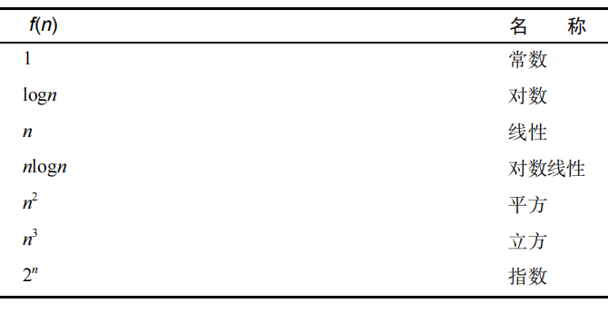

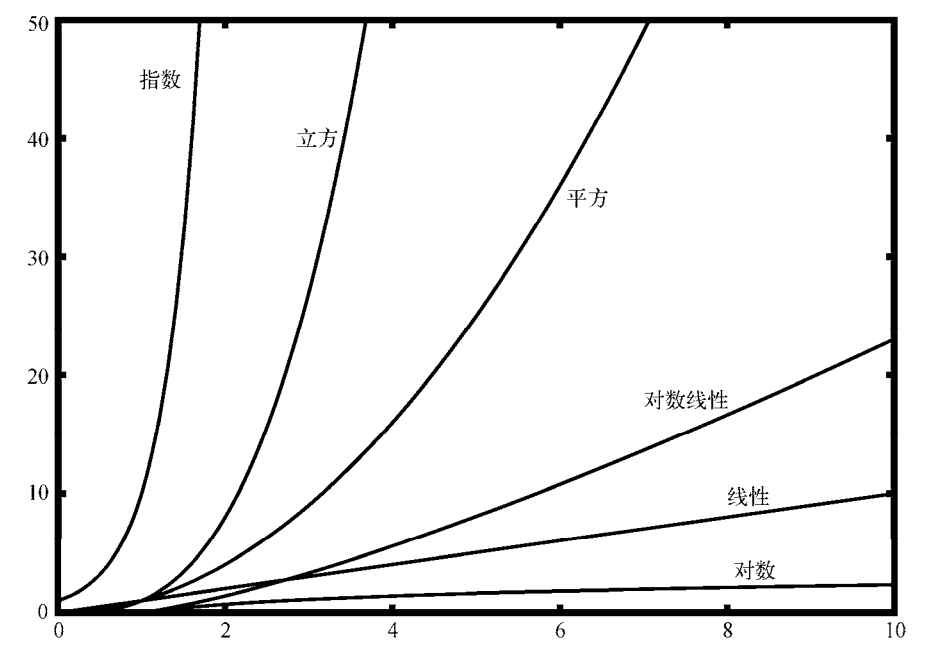

**图2-1  常见的大O函数**

### 异序词检测示例

​	要展示不同数量级的算法，一个好例子就是经典的异序词检测问题。如果一个字符串只是重排了另一个字符串的字符，那么这个字符串就是另一个的异序词，比如 heart 与 earth，以及 python与 typhon。为了简化问题，假设要检查的两个字符串长度相同，并且都是由 26 个英文字母的小写形式组成的。我们的目标是编写一个布尔函数，它接受两个字符串，并能判断它们是否为异序词。

#### 方案 1：清点法

​	清点第 1 个字符串的每个字符，看看它们是否都出现在第 2 个字符串中。如果是，那么两个字符串必然是异序词。清点是通过用 Python 中的特殊值 None 取代字符来实现的。但是，因为Python 中的字符串是不可修改的，所以先要将第 2 个字符串转换成列表。在字符列表中检查第 1个字符串中的每个字符，如果找到了，就替换掉。下面的代码清单给出了这个函数。

```python
def anagramSolution1(s1, s2): 
    alist = list(s2)
    pos1 = 0 
    stillOK = True 

    while pos1 < len(s1) and stillOK: 
        pos2 = 0 
        found = False 
        while pos2 < len(alist) and not found: 
            if s1[pos1] == alist[pos2]: 
                found = True 
            else: 
                pos2 = pos2 + 1 

        if found: 
            alist[pos2] = None 
        else: 
            stillOK = False 

        pos1 = pos1 + 1 

    return stillOK 
```

​	来分析这个算法。注意，对于 s1 中的 *n* 个字符，检查每一个时都要遍历 s2 中的 *n* 个字符。要匹配 s1 中的一个字符，列表中的 *n* 个位置都要被访问一次。因此，访问次数就成了从 1 到 *n*的整数之和。这可以用以下公式来表示。

​	$$ \sum_{i=1}^{n} i = \frac{(n)(n+1)}{2} = \frac{1}{2}n^2+\frac{1}{2}n$$

当 *n* 变大时，起决定性作用的是$n^2$ ，而$\frac{1}{2}$可以忽略。所以，这个方案的时间复杂度是$O(n^2)$。

#### 方案 2：排序法

​	尽管 s1 与 s2 是不同的字符串，但只要由相同的字符构成，它们就是异序词。基于这一点，可以采用另一个方案。如果按照字母表顺序给字符排序，异序词得到的结果将是同一个字符串。下面的代码清单给出了这个方案的实现代码。在 Python 中，可以先将字符串转换为列表，然后使用内建的 sort 方法对列表排序。

```python
def anagramSolution2(s1, s2): 
    alist1 = list(s1) 
    alist2 = list(s2) 

    alist1.sort() 
    alist2.sort() 

    pos = 0 
    matches = True 
    while pos < len(s1) and matches: 
        if alist1[pos] == alist2[pos]: 
            pos = pos + 1 
        else: 
            matches = False 

    return matches
```

​	乍看之下，你可能会认为这个算法的时间复杂度是$O(n)$，因为在排序之后只需要遍历一次就可以比较 *n* 个字符。但是，调用两次 sort 方法不是没有代价。我们在后面会看到，排序的时间复杂度基本上是$O(n^2)$或$O(n \log n)$ ，所以排序操作起主导作用。也就是说，该算法和排序过程的数量级相同。

#### 方案 3：蛮力法

​	用蛮力解决问题的方法基本上就是穷尽所有的可能。就异序词检测问题而言，可以用 s1 中的字符生成所有可能的字符串，看看 s2 是否在其中。但这个方法有个难处。用 s1 中的字符生成所有可能的字符串时，第 1 个字符有 *n* 种可能，第 2 个字符有 $n-1$种可能，第 3 个字符有 $n-2$种可能，依此类推。字符串的总数是 $n\times(n-1)\times(n-2)\times……\times3\times2\times1$ ，即 *n*！。也许有些字符串会重复，但程序无法预见，所以肯定会生成 *n*!个字符串。当 *n* 较大时， *n*!增长得比 $2^n$ 还要快。实际上，如果 s1 有 20 个字符，那么字符串的个数就是 20! = 2 432 902 008 176 640 000  。假设每秒处理一个，处理完整个列表要花 77 146 816 596 年。这可不是个好方案。

#### 方案 4：计数法

​	最后一个方案基于这样一个事实：两个异序词有同样数目的 a、同样数目的 b、同样数目的 c，等等。要判断两个字符串是否为异序词，先数一下每个字符出现的次数。因为字符可能有26 种，所以使用 26 个计数器，对应每个字符。每遇到一个字符，就将对应的计数器加 1。最后，如果两个计数器列表相同，那么两个字符串肯定是异序词。下面的代码清单给出了这个方案的实现代码。

```python
def anagramSolution4(s1, s2): 
    c1 = [0] * 26 
    c2 = [0] * 26 

    for i in range(len(s1)): 
        pos = ord(s1[i]) - ord('a') 
        c1[pos] = c1[pos] + 1 

    for i in range(len(s2)): 
        pos = ord(s2[i]) - ord('a') 
        c2[pos] = c2[pos] + 1 

    j = 0 
    stillOK = True 
    while j < 26 and stillOK: 
        if c1[j] == c2[j]: 
            j = j + 1 
        else: 
            stillOK = False 

    return stillOK
```

​	这个方案也有循环。但不同于方案 1，这个方案的循环没有嵌套。前两个计数循环都是 *n* 阶的。第 3 个循环比较两个列表，由于可能有 26 种字符，因此会循环 26 次。全部加起来，得到总步骤数$T(n)=2n+26$，即$O(n)$ 。我们找到了解决异序词检测问题的线性阶算法。

​	结束这个例子的讲解之前，需要聊聊空间需求。尽管方案 4 的执行时间是线性的，它还是要用额外的空间来存储计数器。也就是说，这个算法用空间换来了时间。这种情形很常见。很多时候，都需要在时间和空间之间进行权衡。本例中，额外使用的空间并不大。不过，如果有数以百万计的字符，那就有问题了。面对多种算法和具体的问题，计算机科学家需要决定如何利用好计算资源。

## 基本数据结构

常见的数据结构，包括线性表、树、图等。我们重点介绍线性表。

### 何谓线性数据结构

​	我们首先学习 4 种简单而强大的数据结构。栈、队列、双端队列和列表都是有序的数据集合，其元素的顺序取决于添加顺序或移除顺序。一旦某个元素被添加进来，它与前后元素的相对位置将保持不变。这样的数据集合经常被称为线性数据结构。

​	线性数据结构可以看作有两端。这两端有时候被称作“左端”和“右端”，有时候也被称作“前端”和“后端”。当然，它们还可以被称作“顶端”和“底端”。名字本身并不重要，真正区分线性数据结构的是元素的添加方式和移除方式，尤其是添加操作和移除操作发生的位置。举例来说，某个数据结构可能只允许在一端添加新元素，有些则允许从任意一端移除元素。

### 栈

#### 何谓栈

​	栈有时也被称作“下推栈”。它是有序集合，添加操作和移除操作总发生在同一端，即“顶端”，另一端则被称为“底端”。栈中的元素离底端越近，代表其在栈中的时间越长，因此栈的底端具有非常重要的意义。最新添加的元素将被最先移除。这种排序原则被称作 LIFO（last-in first-out），即后进先出。它提供了一种基于在集合中的时间来排序的方式。最近添加的元素靠近顶端，旧元素则靠近底端。图 3-1 展示了一个栈，它包含一些原生的 Python 数据对象。


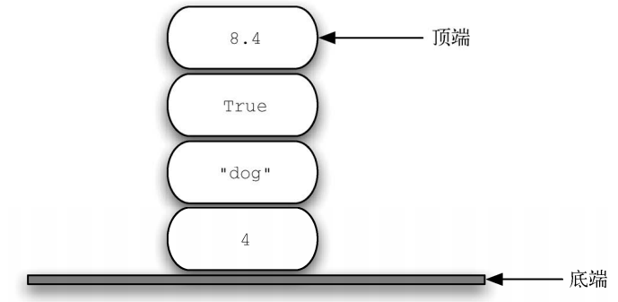

##### 图3-1  由原生的 Python 数据对象构成的栈

​	观察元素的添加顺序和移除顺序，就能理解栈的重要思想。假设桌面一开始是空的，每次只往桌上放一本书。如此堆叠，便能构建出一个栈。取书的顺序正好与放书的顺序相反。由于可用于反转元素的排列顺序，因此栈十分重要。元素的插入顺序正好与移除顺序相反。图3-2 展示了Python 数据对象栈的创建过程和拆除过程。请仔细观察数据对象的顺序。

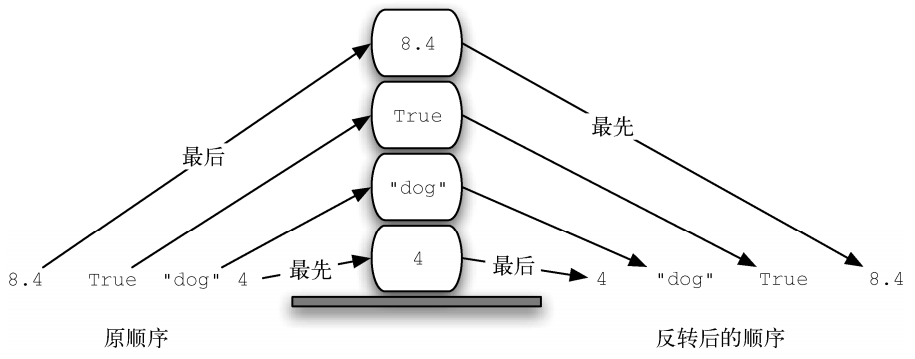

##### 图3-2 栈的反转特性

​	考虑到栈的反转特性，我们可以想到在使用计算机时的一些例子。例如，每一个浏览器都有返回按钮。当我们从一个网页跳转到另一个网页时，这些网页——实际上是 URL——都被存放在一个栈中。当前正在浏览的网页位于栈的顶端，最早浏览的网页则位于底端。如果点击返回按钮，便开始反向浏览这些网页。

#### 栈抽象数据类型

​	栈抽象数据类型由下面的结构和操作定义。如前所述，栈是元素的有序集合，添加操作与移除操作都发生在其顶端。栈的操作顺序是 LIFO，它支持以下操作。

- Stack()创建一个空栈。它不需要参数，且会返回一个空栈。

- push(item)将一个元素添加到栈的顶端。它需要一个参数 item，且无返回值。

- pop()将栈顶端的元素移除。它不需要参数，但会返回顶端的元素，并且修改栈的内容。

- peek()返回栈顶端的元素，但是并不移除该元素。它不需要参数，也不会修改栈的内容。

- isEmpty()检查栈是否为空。它不需要参数，且会返回一个布尔值。

- size()返回栈中元素的数目。它不需要参数，且会返回一个整数。

​	假设 s 是一个新创建的空栈。表 3-1 展示了对 s 进行一系列操作的结果。在“栈内容”一列中，栈顶端的元素位于最右侧。

##### 表 3-1 栈操作示例

| 栈 操 作 | 栈 内 容 | 返 回 值 |
| -------- | :-------- | -------- |
| s.isEmpty() | [] | True |
| s.push(4)  | [4] | |
|s.push('dog')  | [4, 'dog'] |  |
|s.peek()  | [4, 'dog']  | 'dog'|
|s.push(True)  | [4, 'dog', True] |  |
|s.size()  | [4, 'dog', True]  | 3|
|s.isEmpty()  | [4, 'dog', True]  | False|
|s.push(8.4)  | [4, 'dog', True, 8.4] |  |
|s.pop()  | [4, 'dog', True]  | 8.4|
|s.pop()  | [4, 'dog']  | True|
|s.size()  | [4, 'dog']  | 2|

#### 用 Python 实现栈

​	明确定义栈抽象数据类型之后，我们开始用 Python 来将其实现。如前文所述，抽象数据类型的实现常被称为数据结构。

​	正如前面所述，和其他面向对象编程语言一样，每当需要在 Python 中实现像栈这样的抽象数据类型时，就可以创建新类。栈的操作通过方法实现。更进一步地说，因为栈是元素的集合，所以完全可以利用 Python 提供的强大、简单的原生集合来实现。这里，我们将使用列表。

​	Python 列表是有序集合，它提供了一整套方法。举例来说，对于列表[2, 5, 3, 6, 7, 4]，只需要考虑将它的哪一边视为栈的顶端。一旦确定了顶端，所有的操作就可以利用 append 和pop 等列表方法来实现。

​	代码清单 3-1 是栈的实现，它假设列表的尾部是栈的顶端。当栈增长时（即进行 push 操作），新的元素会被添加到列表的尾部。pop 操作同样会修改这一端。

##### 代码清单 3-1 用 Python 实现栈

```python
class Stack: 
    def __init__(self): 
        self.items = [] 
   
    def isEmpty(self): 
        return self.items == [] 
   
    def push(self, item): 
        self.items.append(item) 
   
    def pop(self): 
        return self.items.pop()
   
    def peek(self): 
        return self.items[len(self.items)-1] 
   
    def size(self): 
        return len(self.items)
```

​	以下展示了表 3-1 中的栈操作及其返回结果。

```python
>>> s = Stack() 
>>> s.isEmpty() 
True 
>>> s.push(4) 
>>> s.push('dog') 
>>> s.peek() 
'dog' 
>>> s.push(True) 
>>> s.size() 
3 
>>> s.isEmpty() 
False 
>>> s.push(8.4) 
>>> s.pop() 
8.4 
>>> s.pop() 
True 
>>> s.size() 
2
```

​	值得注意的是，也可以选择将列表的头部作为栈的顶端。不过在这种情况下，便无法直接使用 pop 方法和 append 方法，而必须要用 pop 方法和 insert 方法显式地访问下标为 0 的元素，即列表中的第 1 个元素。代码清单3-2 展示了这种实现。

##### 代码清单 3-2 栈的另一种实现

```python
class Stack: 
    def __init__(self): 
        self.items = [] 
   
    def isEmpty(self): 
        return self.items == [] 
   
    def push(self, item): 
        self.items.insert(0, item) 
   
    def pop(self): 
        return self.items.pop(0) 
   
    def peek(self): 
        return self.items[0] 
   
    def size(self): 
        return len(self.items)
```

​	改变抽象数据类型的实现却保留其逻辑特征，这种能力体现了抽象思想。不过，尽管上述两种实现都可行，但是二者在性能方面肯定有差异。append 方法和 pop()方法的时间复杂度都是*O*(1) ，这意味着不论栈中有多少个元素，第一种实现中的 push 操作和 pop 操作都会在恒定的时间内完成。第二种实现的性能则受制于栈中的元素个数，这是因为 insert(0)和 pop(0)的时间复杂度都是*O n*( ) ，元素越多就越慢。显而易见，尽管两种实现在逻辑上是相等的，但是它们在进行基准测试时耗费的时间会有很大的差异。

#### 匹配括号

​	接下来，我们使用栈解决实际的计算机科学问题。我们都写过如下所示的算术表达式。其中的括号用来改变计算顺序。

​		`(5 + 6) * (7 + 8) / (4 + 3) `

​	括号需要前后匹配。匹配括号是指每一个左括号都有与之对应的一个右括号，并且括号对有正确的嵌套关系。下面是正确匹配的括号串。

```
(()()()()) 
(((()))) 
(()((())())) 
```

​	下面的这些括号则是不匹配的。
```
((((((()) 
())) 
(()()(() 
```

​	能够分辨括号匹配得正确与否，对于识别编程语言的结构来说非常重要。

​	我们的挑战就是编写一个算法，它从左到右读取一个括号串，然后判断其中的括号是否匹配。为了解决这个问题，需要注意到一个重要现象。当从左到右处理括号时，最右边的无匹配左括号必须与接下来遇到的第一个右括号相匹配，如图 3-3 所示。并且，在第一个位置的左括号可能要等到处理至最后一个位置的右括号时才能完成匹配。相匹配的右括号与左括号出现的顺序相反。这一规律暗示着能够运用栈来解决括号匹配问题。

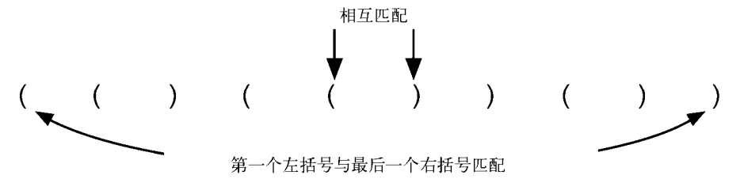

##### 图 3-3 匹配括号

​	一旦认识到用栈来保存括号是合理的，算法编写起来就会十分容易。由一个空栈开始，从左往右依次处理括号。如果遇到左括号，便通过 push 操作将其加入栈中，以此表示稍后需要有一个与之匹配的右括号。反之，如果遇到右括号，就调用 pop 操作。只要栈中的所有左括号都能遇到与之匹配的右括号，那么整个括号串就是匹配的；如果栈中有任何一个左括号找不到与之匹配的右括号，则括号串就是不匹配的。在处理完匹配的括号串之后，栈应该是空的。代码清单 3-3 展示了实现这一算法的 Python 代码。

##### 代码清单 3-3 匹配括号

```python
# class Stack: 见代码清单3-1
    
def parChecker(symbolString): 
    s = Stack() 
    balanced = True 
    index = 0 
    while index < len(symbolString) and balanced: 
        symbol = symbolString[index] 
        if symbol == "(": 
            s.push(symbol) 
        else: 
            if s.isEmpty(): 
                balanced = False 
            else: 
                s.pop() 
   
        index = index + 1 
   
    if balanced and s.isEmpty(): 
        return True
    else: 
        return False
```

​	parChecker 函数假设 Stack 类可用，并且会返回一个布尔值来表示括号串是否匹配。注意，布尔型变量 balanced 的初始值是 True，这是因为一开始没有任何理由假设其为 False。如果当前的符号是左括号，它就会被压入栈中（第 9~10 行）。注意第 15 行，仅通过 pop()将一个元素从栈中移除。由于移除的元素一定是之前遇到的左括号，因此并没有用到 pop()的返回值。在第 19~22 行，只要所有括号匹配并且栈为空，函数就会返回 True，否则返回 False。

#### 普通情况：匹配符号

​	符号匹配是许多编程语言中的常见问题，括号匹配问题只是一个特例。匹配符号是指正确地匹配和嵌套左右对应的符号。例如，在 Python 中，方括号[和]用于列表；花括号{和}用于字典；括号(和)用于元组和算术表达式。只要保证左右符号匹配，就可以混用这些符号。以下符号串是匹配的，其中不仅每一个左符号都有一个右符号与之对应，而且两个符号的类型也是一致的。

```
{{([][])}()} 
[[{{(())}}]] 
[][][](){}
```

​	以下符号串则是不匹配的。

```
([)] 
((()])) 
[{()]
```

​	要处理新类型的符号，可以轻松扩展代码清单 3-3 中的括号匹配检测器。每一个左符号都将被压入栈中，以待之后出现对应的右符号。唯一的区别在于，当出现右符号时，必须检测其类型是否与栈顶的左符号类型相匹配。如果两个符号不匹配，那么整个符号串也就不匹配。同样，如果整个符号串处理完成并且栈是空的，那么就说明所有符号正确匹配。

##### 代码清单 3-4 匹配符号

```python
# class Stack: 见代码清单3-1
def parChecker(symbolString): 
    s = Stack() 
   
    balanced = True 
    index = 0 
   
    while index < len(symbolString) and balanced: 
        symbol = symbolString[index] 
        if symbol in "([{": 
            s.push(symbol) 
        else: 
            if s.isEmpty(): 
                balanced = False 
            else: 
                top = s.pop() 
                if not matches(top, symbol): 
                    balanced = False
   
        index = index + 1 
   
    if balanced and s.isEmpty(): 
        return True 
    else: 
        return False 
   
def matches(open, close): 
    opens = "([{" 
    closers = ")]}" 
   
    return opens.index(open) == closers.index(close)
```

​	以上两个例子说明，在处理编程语言的语法结构时，栈是十分重要的数据结构。几乎所有记法都有某种需要正确匹配和嵌套的符号。

### 队列

​	接下来学习另一个线性数据结构：队列。与栈类似，队列本身十分简单，却能用来解决众多重要问题。

#### 何谓队列

​	队列是有序集合，添加操作发生在“尾部”，移除操作则发生在“头部”。新元素从尾部进入队列，然后一直向前移动到头部，直到成为下一个被移除的元素。最新添加的元素必须在队列的尾部等待，在队列中时间最长的元素则排在最前面。这种排序原则被称作 FIFO（first-in first-out），即先进先出，也称先到先得。

​	在日常生活中，我们经常排队，这便是最简单的队列例子。进电影院要排队，在超市结账要排队，买咖啡也要排队（等着从盘子栈中取盘子）。好的队列只允许一头进，另一头出，不可能发生插队或者中途离开的情况。图 3-4 展示了一个由 Python 数据对象组成的简单队列。

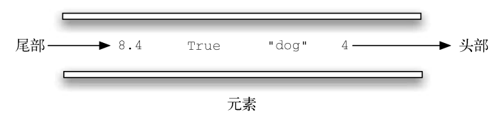

##### 图 3-4 由 Python 数据对象组成的队列

#### 队列抽象数据类型

​	队列抽象数据类型由下面的结构和操作定义。如前所述，队列是元素的有序集合，添加操作发生在其尾部，移除操作则发生在头部。队列的操作顺序是 FIFO，它支持以下操作。

- Queue()创建一个空队列。它不需要参数，且会返回一个空队列。

- enqueue(item)在队列的尾部添加一个元素。它需要一个元素作为参数，不返回任何值。

- dequeue()从队列的头部移除一个元素。它不需要参数，且会返回一个元素，并修改队列的内容。
- isEmpty()检查队列是否为空。它不需要参数，且会返回一个布尔值。
- size()返回队列中元素的数目。它不需要参数，且会返回一个整数。

​	假设 q 是一个新创建的空队列。表 3-2 展示了对 q 进行一系列操作的结果。在“队列内容”一列中，队列的头部位于右端。4 是第一个被添加到队列中的元素，因此它也是第一个被移除的元素。

##### 表 3-2 队列操作示例


| 队列操作 | 队列内容 | 返回值 |
| --- | --- | --- |
| q.isEmpty() | [] | True |
| q.enqueue(4) | [4] | 
| q.enqueue('dog') | ['dog', 4] | 
| q.enqueue(True) | [True, 'dog', 4] | 
| q.size() | [True, 'dog', 4] | 3 |
| q.isEmpty() | [True, 'dog', 4] | False |
| q.enqueue(8.4) | [8.4, True, 'dog', 4] | 
| q.dequeue() | [8.4, True, 'dog'] | 4 |
| q.dequeue() | [8.4, True] | 'dog' |
| q.size() | [8.4, True] | 2 |

#### 用 Python 实现队列

​	创建一个新类来实现队列抽象数据类型是十分合理的。像之前一样，我们利用简洁强大的列表来实现队列。

​	需要确定列表的哪一端是队列的尾部，哪一端是头部。代码清单 3-5 中的实现假设队列的尾部在列表的位置 0 处。如此一来，便可以使用 insert 函数向队列的尾部添加新元素。pop 则可用于移除队列头部的元素（列表中的最后一个元素）。这意味着添加操作的时间复杂度是O(n) ，移除操作则是*O*(1) 。

##### 代码清单 3-5 用 Python 实现队列

```python
class Queue: 
    def __init__(self): 
        self.items = [] 
   
    def isEmpty(self): 
        return self.items == [] 
   
    def enqueue(self, item): 
        self.items.insert(0, item) 
   
    def dequeue(self): 
        return self.items.pop() 
   
    def size(self): 
        return len(self.items)
```

以下展示了表 3-2 中的队列操作及其返回结果。

```python
>>> q = Queue() 
>>> q.isEmpty() 
True 
>>> q.enqueue('dog') 
>>> q.enqueue(4) 
>>> q = Queue() 
>>> q.isEmpty() 
True 
>>> q.enqueue(4) 
>>> q.enqueue('dog') 
>>> q.enqueue(True) 
>>> q.size() 
3 
>>> q.isEmpty() 
False 
>>> q.enqueue(8.4) 
>>> q.dequeue() 
4 
>>> q.dequeue() 
'dog' 
>>> q.size() 
2
```

#### 模拟：传土豆

​	展示队列用法的一个典型方法是模拟需要以 FIFO 方式管理数据的真实场景。考虑这样一个儿童游戏：传土豆。在这个游戏中，孩子们围成一圈，并依次尽可能快地传递一个土豆，如图3-13 所示。在某个时刻，大家停止传递，此时手里有土豆的孩子就得退出游戏。重复上述过程，直到只剩下一个孩子。

​	这个游戏其实等价于著名的约瑟夫斯问题。弗拉维奥·约瑟夫斯是公元 1 世纪著名的历史学家。相传，约瑟夫斯当年和 39 个战友在山洞中对抗罗马军队。眼看着即将失败，他们决定舍生取义。于是，他们围成一圈，从某个人开始，按顺时针方向杀掉第 7 人。约瑟夫斯同时也是卓有成就的数学家。据说，他立刻找到了自己应该站的位置，从而使自己活到了最后。当只剩下他时，约瑟夫斯加入了罗马军队，而不是自杀。这个故事有很多版本，有的说是每隔两个人，有的说最后一个人可以骑马逃跑。不管如何，问题都是一样的。

​	我们将针对传土豆游戏实现通用的模拟程序。该程序接受一个名字列表和一个用于计数的常量 num，并且返回最后一人的名字。至于这个人之后如何，就由你来决定吧。

​	我们使用队列来模拟一个环，如图 3-5 所示。假设握着土豆的孩子位于队列的头部。在模拟传土豆的过程中，程序将这个孩子的名字移出队列，然后立刻将其插入队列的尾部。随后，这个孩子会一直等待，直到再次到达队列的头部。在出列和入列 num 次之后，此时位于队列头部的孩子出局，新一轮游戏开始。如此反复，直到队列中只剩下一个名字（队列的大小为 1）。

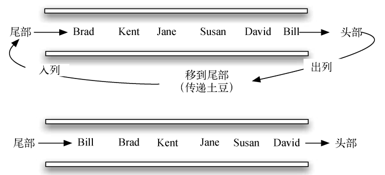

##### 图 3-5 使用队列模拟传土豆游戏

代码清单 3-6 展示了对应的程序。

##### 代码清单 3-6 传土豆模拟程序

```python
# Class Queue: 见代码清单3-5
def hotPotato(namelist, num): 
    simqueue = Queue() 
    for name in namelist: 
        simqueue.enqueue(name) 
   
    while simqueue.size() > 1: 
        for i in range(num): 
            simqueue.enqueue(simqueue.dequeue()) 
   
        simqueue.dequeue() 
   
    return simqueue.dequeue()
```

​	调用 hotPotato 函数，使用 7 作为计数常量，将得到以下结果。

```python
>>> hotPotato(["Bill", "David", "Susan", "Jane", "Kent", "Brad"], 7) 
'Susan'
```

​	注意，在上例中，计数常量大于列表中的名字个数。这不会造成问题，因为队列模拟了一个环。同时需要注意，当名字列表载入队列时，列表中的第一个名字出现在队列的头部。在上例中，Bill 是列表中的第一个元素，因此处在队列的最前端。

### 双端队列

​	接下来学习另一个线性数据结构。与栈和队列不同的是，双端队列的限制很少。注意，不要把它的英文名 deque（与 deck 同音）和队列的移除操作 dequeue 搞混了。

#### 何谓双端队列

​	双端队列是与队列类似的有序集合。它有一前、一后两端，元素在其中保持自己的位置。与队列不同的是，双端队列对在哪一端添加和移除元素没有任何限制。新元素既可以被添加到前端，也可以被添加到后端。同理，已有的元素也能从任意一端移除。某种意义上，双端队列是栈和队列的结合。图 3-6 展示了由 Python 数据对象组成的双端队列。

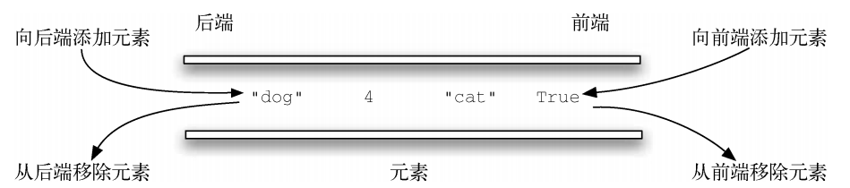

##### 图 3-6 由 Python 数据对象组成的双端队列

​	值得注意的是，尽管双端队列有栈和队列的很多特性，但是它并不要求按照这两种数据结构分别规定的 LIFO 原则和 FIFO 原则操作元素。具体的排序原则取决于其使用者。

#### 双端队列抽象数据类型

​	双端队列抽象数据类型由下面的结构和操作定义。如前所述，双端队列是元素的有序集合，其任何一端都允许添加或移除元素。双端队列支持以下操作。

- Deque()创建一个空的双端队列。它不需要参数，且会返回一个空的双端队列。

- addFront(item)将一个元素添加到双端队列的前端。它接受一个元素作为参数，没有返回值。
- addRear(item)将一个元素添加到双端队列的后端。它接受一个元素作为参数，没有返回值。
- removeFront()从双端队列的前端移除一个元素。它不需要参数，且会返回一个元素，并修改双端队列的内容。
- removeRear()从双端队列的后端移除一个元素。它不需要参数，且会返回一个元素，并修改双端队列的内容。
- isEmpty()检查双端队列是否为空。它不需要参数，且会返回一个布尔值。
- size()返回双端队列中元素的数目。它不需要参数，且会返回一个整数。

​	假设 d 是一个新创建的空双端队列，表 3-3 展示了对 d 进行一系列操作的结果。注意，前端在列表的右端。记住前端和后端的位置可以防止混淆。

##### 表 3-3 双端队列操作示例

| 双端队列操作 | 双端队列内容 | 返回值 |
| --- | --- | --- |
| d.isEmpty() | [] | True |
| d.addRear(4) | [4] |
| d.addRear('dog') | ['dog', 4] |
| d.addFront('cat') | ['dog', 4, 'cat'] |
| d.addFront(True) | ['dog', 4, 'cat', True] |
| d.size() | ['dog', 4, 'cat', True] | 4 |
| d.isEmpty() | ['dog', 4, 'cat', True] | False |
| d.addRear(8.4) | [8.4, 'dog', 4, 'cat', True] |
| d.removeRear() | ['dog', 4, 'cat', True] | 8.4 |
| d.removeFront() | ['dog', 4, 'cat'] | True |

#### 用 Python 实现双端队列

​	和前几节一样，我们通过创建一个新类来实现双端队列抽象数据类型。Python 列表再一次提供了很多简便的方法来帮助我们构建双端队列。在代码清单 3-7中，我们假设双端队列的后端是列表的位置 0 处。

##### 代码清单 3-7 用 Python 实现双端队列

```python
class Deque: 
    def __init__(self): 
        self.items = [] 
   
    def isEmpty(self): 
        return self.items == [] 
   
    def addFront(self, item): 
        self.items.append(item) 
   
    def addRear(self, item):
        self.items.insert(0, item) 
   
    def removeFront(self): 
        return self.items.pop() 
   
    def removeRear(self): 
        return self.items.pop(0) 
   
    def size(self): 
        return len(self.items)
```

​	removeFront 使用 pop 方法移除列表中的最后一个元素，removeRear 则使用 pop(0)方法移除列表中的第一个元素。同理，之所以 addRear 使用 insert 方法，是因为 append 方法只能在列表的最后添加元素。

​	以下展示了表 3-6 中的双端队列操作及其返回结果。

```python
>>> d = Deque() 
>>> d.isEmpty() 
True 
>>> d.addRear(4) 
>>> d.addRear('dog') 
>>> d.addFront('cat') 
>>> d.addFront(True) 
>>> d.size() 
4 
>>> d.isEmpty() 
False 
>>> d.addRear(8.4) 
>>> d.removeRear() 
8.4 
>>> d.removeFront() 
True
```

​	实现双端队列的 Python 代码与实现栈和队列的有许多相似之处。在双端队列的 Python 实现中，在前端进行的添加操作和移除操作的时间复杂度是*O*(1) ，在后端的则是*O n*( ) 。考虑到实现时采用的操作，这不难理解。再次强调，记住前后端的位置非常重要。

#### 回文检测器

​	运用双端队列可以解决一个非常有趣的经典问题：回文问题。回文是指从前往后读和从后往前读都一样的字符串，例如 radar、toot，以及 madam。我们将构建一个程序，它接受一个字符串并且检测其是否为回文。

​	该问题的解决方案是使用一个双端队列来存储字符串中的字符。按从左往右的顺序将字符串中的字符添加到双端队列的后端。此时，该双端队列类似于一个普通的队列。然而，可以利用双端队列的双重性，其前端是字符串的第一个字符，后端是字符串的最后一个字符，如图 3-7 所示。

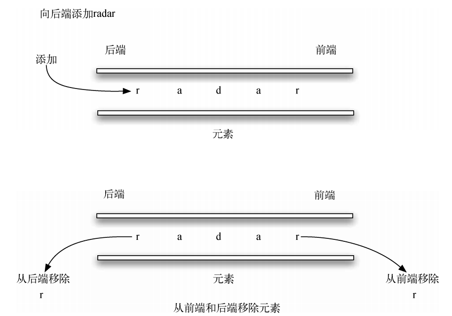

##### 图 3-7 双端队列示例

​	由于可以从前后两端移除元素，因此我们能够比较两个元素，并且只有在二者相等时才继续。如果一直匹配第一个和最后一个元素，最终会处理完所有的字符（如果字符数是偶数），或者剩下只有一个元素的双端队列（如果字符数是奇数）。任意一种结果都表明输入字符串是回文。代码清单 3-8 展示了完整的回文检测程序。

##### 代码清单 3-8 用 Python 实现回文检测器

```python
# class Deque : 见代码清单3-7
def palchecker(aString): 
    chardeque = Deque() 
   
    for ch in aString: 
        chardeque.addRear(ch) 
   
        stillEqual = True 
   
        while chardeque.size() > 1 and stillEqual: 
            first = chardeque.removeFront() 
            last = chardeque.removeRear() 
            if first != last: 
                stillEqual = False 
   
    return stillEqual
```

​	调用 palchecker 函数的示例如下所示。

```python
>>> palchecker("lsdkjfskf") 
False 
>>> palchecker("toot") 
True
```

### 小结

- 线性数据结构以有序的方式来维护其数据。

- 栈是简单的数据结构，其排序原则是 LIFO，即后进先出。

- 栈的基本操作有 push、pop 和 isEmpty。

- 队列是简单的数据结构，其排序原则是 FIFO，即先进先出。

- 队列的基本操作有 enqueue、dequeue 和 isEmpty。
- 双端队列是栈和队列的结合。
- 双端队列的基本操作有 addFront、 addRear、 removeFront、 removeRear 和 isEmpty。

## 搜索和排序

### 搜索（查找）

​	搜索是指从元素集合中找到某个特定元素的算法过程。搜索过程通常返回 True 或 False，分别表示元素是否存在。有时，可以修改搜索过程，使其返回目标元素的位置。不过，本节仅考虑元素是否存在。

​	Python 提供了运算符 in，通过它可以方便地检查元素是否在列表中。

```python
>>> 15 in [3, 5, 2, 4, 1] 
False 
>>> 3 in [3, 5, 2, 4, 1] 
True 
```

​	尽管写起来很方便，但是必须经过一个深层的处理过程才能获得结果。事实上，搜索算法有很多种，我们感兴趣的是这些算法的原理及其性能差异。

#### 顺序搜索

​	存储于列表等集合中的数据项彼此存在线性或顺序的关系，每个数据项的位置与其他数据项相关。在 Python 列表中，数据项的位置就是它的下标。因为下标是有序的，所以能够顺序访问，由此可以进行顺序搜索。

​	图 4-1 展示了顺序搜索的原理。从列表中的第一个元素开始，沿着默认的顺序逐个查看，直到找到目标元素或者查完列表。如果查完列表后仍没有找到目标元素，则说明目标元素不在列表中。

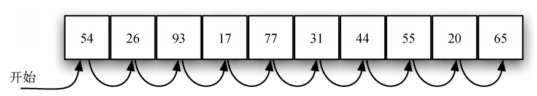

##### 图 4-1 在整数列表中进行顺序搜索

​	顺序搜索算法的 Python 实现如代码清单 4-1 所示。这个函数接受列表与目标元素作为参数，并返回一个表示目标元素是否存在的布尔值。布尔型变量 found 的初始值为 False，如果找到目标元素，就将它的值改为 True。

##### 代码清单 4-1 无序列表的顺序搜索

```python
def sequentialSearch(alist, item): 
    pos = 0 
    found = False 
   
    while pos < len(alist) and not found: 
        if alist[pos] == item: 
            found = True 
        else: 
            pos = pos +1 
   
    return found 
```

​	分析顺序搜索算法

​	在分析搜索算法之前，需要定义计算的基本单元，这是解决此类问题的第一步。对于搜索来说，统计比较次数是有意义的。每一次比较只有两个结果：要么找到目标元素，要么没有找到。本节做了一个假设，即元素的排列是无序的。也就是说，目标元素位于每个位置的可能性都一样大。

​	要确定目标元素不在列表中，唯一的方法就是将它与列表中的每个元素都比较一次。如果列表中有 *n* 个元素，那么顺序搜索要经过 *n* 次比较后才能确定目标元素不在列表中。如果列表包含目标元素，分析起来更复杂。实际上有 3 种可能情况，最好情况是目标元素位于列表的第一个位置，即只需比较一次；最坏情况是目标元素位于最后一个位置，即需要比较 *n* 次。普通情况又如何呢？我们会在列表的中间位置处找到目标元素，即需要比较 $ \frac{n}{2} $ 次。当 *n* 变大时，系数会变得无足轻重，所以顺序搜索算法的时间复杂度是 O(n) 。表 4-1 总结了 3 种可能情况的比较次数。

##### 表 4-1 在无序列表中进行顺序搜索时的比较次数

|                | 最好情况 | 最坏情况 | 普通情况        |
| -------------- | -------- | -------- | --------------- |
| 存在目标元素   | 1        | n        | $ \frac{n}{2} $ |
| 不存在目标元素 | n        | n        | n               |

​	前面假设列表中的元素是无序排列的，相互之间没有关联。如果元素有序排列，顺序搜索算法的效率会提高吗？

​	假设列表中的元素按升序排列。如果存在目标元素，那么它出现在 *n* 个位置中任意一个位置的可能性仍然一样大，因此比较次数与在无序列表中相同。不过，如果不存在目标元素，那么搜索效率就会提高。图 4-2 展示了算法搜索目标元素 50 的过程。注意，顺序搜索算法一路比较列表中的元素，直到遇到 54。该元素蕴含额外的信息：54 不仅不是目标元素，而且其后的元素也都不是，这是因为列表是有序的。因此，算法不需要搜完整个列表，比较完 54 之后便可以立即停止。代码清单 4-2 展示了有序列表的顺序搜索函数。

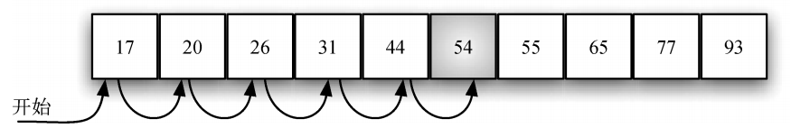

##### 图 4-2 在有序整数列表中进行顺序搜索

##### 代码清单 4-2 有序列表的顺序搜索

```python
def orderedSequentialSearch(alist, item): 
    pos = 0 
    found = False 
    stop = False 
    while pos < len(alist) and not found and not stop: 
        if alist[pos] == item: 
            found = True 
        else: 
            if alist[pos] > item: 
                stop = True 
            else: 
                pos = pos +1 
   
    return found
```

​	表 4-2 总结了在有序列表中顺序搜索时的比较次数。在最好情况下，只需比较一次就能知道目标元素不在列表中。普通情况下，需要比较 $ \frac{n}{2} $ 次，不过算法的时间复杂度仍是 O(n) 。总之，只有当列表中不存在目标元素时，有序排列元素才会提高顺序搜索的效率。

##### 表 4-2 在有序列表中进行顺序搜索时的比较次数

|                | 最好情况 | 最坏情况 | 普通情况        |
| -------------- | -------- | -------- | --------------- |
| 存在目标元素   | 1        | n        | $ \frac{n}{2} $ |
| 不存在目标元素 | 1        | n        | $ \frac{n}{2} $ |

#### 二分搜索

​	如果在比较时更聪明些，还能进一步利用列表有序这个有利条件。在顺序搜索时，如果第一个元素不是目标元素，最多还要比较 *n*–1 次。但二分搜索不是从第一个元素开始搜索列表，而是从中间的元素着手。如果这个元素就是目标元素，那就立即停止搜索；如果不是，则可以利用列表有序的特性，排除一半的元素。如果目标元素比中间的元素大，就可以直接排除列表的左半部分和中间的元素。这是因为，如果列表包含目标元素，它必定位于右半部分。

​	接下来，针对右半部分重复二分过程。从中间的元素着手，将其和目标元素比较。同理，要么直接找到目标元素，要么将右半部分一分为二，再次缩小搜索范围。图 4-3 展示了二分搜索算法如何快速地找到元素 54，完整的函数如代码清单 4-3 所示。

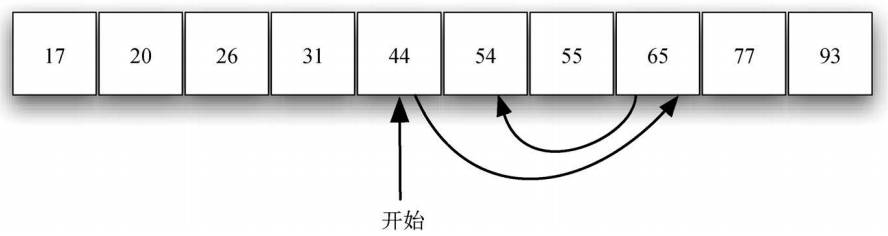

##### 图 4-3 在有序整数列表中进行二分搜索

##### 代码清单 4-3 有序列表的二分搜索

```python
def binarySearch(alist, item): 
    first = 0 
    last = len(alist) - 1 
    found = False 
   
    while first <= last and not found: 
        midpoint = (first + last) // 2 
        if alist[midpoint] == item: 
            found = True 
        else: 
            if item < alist[midpoint]: 
                last = midpoint - 1 
            else: 
                first = midpoint + 1 
   
    return found 
```

​	请注意，这个算法是分治策略的好例子。分治是指将问题分解成小问题，以某种方式解决小问题，然后整合结果，以解决最初的问题。对列表进行二分搜索时，先查看中间的元素。如果目标元素小于中间的元素，就只需要对列表的左半部分进行二分搜索。同理，如果目标元素更大，则只需对右半部分进行二分搜索。两种情况下，都是针对一个更小的列表递归调用二分搜索函数，如代码清单 4-4 所示。

##### 代码清单 4-4 二分搜索的递归版本

```python
def binarySearch(alist, item): 
    if len(alist) == 0: 
        return False 
    else: 
        midpoint = len(alist) // 2 
        if alist[midpoint] == item: 
            return True 
        else: 
            if item < alist[midpoint]: 
                return binarySearch(alist[:midpoint], item) 
            else: 
                return binarySearch(alist[midpoint+1:], item)
```

​	分析二分搜索算法

​	在进行二分搜索时，每一次比较都将待考虑的元素减半。那么，要检查完整个列表，二分搜索算法最多要比较多少次呢？假设列表共有 *n* 个元素，第一次比较后剩下 $ \frac{n}{2} $ 个元素，第 2 次比较后剩下 $ \frac{n}{4} $ 个元素，接下来是 $ \frac{n}{8} $  ，然后是 $ \frac{n}{16} $ ，依此类推。列表能拆分多少次呢？表 4-3 给出了答案。

##### 表 4-3 二分搜索算法的表格分析

| 比较次数 | 剩余元素的近似个数 |
| -------- | ------------------ |
| 1        | $ \frac{n}{2} $    |
| 2        | $ \frac{n}{4} $    |
| 3        | $ \frac{n}{8} $    |
| ……       | ……                 |
| i        | $ \frac{n}{2^i} $  |

​	拆分足够多次后，会得到只含一个元素的列表。这个元素要么就是目标元素，要么不是。无论是哪种情况，计算工作都已完成。要走到这一步，需要比较 *i* 次，其中 $ \frac{n}{2^i}  = 1 $ 。由此可得，$ i = \log{n} $。比较次数的最大值与列表的元素个数是对数关系。所以，二分搜索算法的时间复杂度是 $ O(\log{n}) $ 。

​	还有一点要注意。在代码清单 4-4 中，递归调用 binarySearch(alist[:midpoint], item) 使用切片运算符得到列表的左半部分，并将其传给下一次调用（右半部分类似）。前面的分析假设切片操作所需的时间固定，但实际上在 Python 中，切片操作的时间复杂度是 O(K) 。这意味着若采用切片操作，那么二分搜索算法的时间复杂度不是严格的对数阶。所幸，通过在传入列表时带上头和尾的下标，可以弥补这一点。作为练习，请参考代码清单 4-3 计算下标。

​	尽管二分搜索通常优于顺序搜索，但当 *n* 较小时，排序引起的额外开销可能并不划算。实际上应该始终考虑，为了提高搜索效率，额外排序是否值得。如果排序一次后能够搜索多次，那么排序的开销不值一提。然而，对于大型列表而言，只排序一次也会有昂贵的计算成本，因此从头进行顺序搜索可能是更好的选择。

#### 小结

- 不论列表是否有序，顺序搜索算法的时间复杂度都是 $O(n)$ 。

- 对于有序列表来说，二分搜索算法在最坏情况下的时间复杂度是  $O(\log n)$ 。

### 排序

​	排序是指将集合中的元素按某种顺序排列的过程。比如，一个单词列表可以按字母表或长度排序；一个城市列表可以按人口、面积或邮编排序。我们已经探讨过一些利用有序列表提高效率的算法（比如异序词的例子，以及二分搜索算法）。

​	排序算法有很多，对它们的分析也已经很透彻了。这说明，排序是计算机科学中的一个重要的研究领域。给大量元素排序可能消耗大量的计算资源。与搜索算法类似，排序算法的效率与待处理元素的数目相关。对于小型集合，采用复杂的排序算法可能得不偿失；对于大型集合，需要尽可能充分地利用各种改善措施。本节将讨论多种排序技巧，并比较它们的运行时间。

​	在讨论具体的算法之前，先思考如何分析排序过程。首先，排序算法要能比较大小。为了给一个集合排序，需要某种系统化的比较方法，以检查元素的排列是否违反了顺序。在衡量排序过程时，最常用的指标就是总的比较次数。其次，当元素的排列顺序不正确时，需要交换它们的位置。交换是一个耗时的操作，总的交换次数对于衡量排序算法的总体效率来说也很重要。

#### 冒泡排序

​	冒泡排序多次遍历列表。它比较相邻的元素，将不合顺序的交换。每一轮遍历都将下一个最大值放到正确的位置上。本质上，每个元素通过“冒泡”找到自己所属的位置。

​	图 4-4 展示了冒泡排序的第一轮遍历过程。深色的是正在比较的元素。如果列表中有 *n* 个元素，那么第一轮遍历要比较 *n*–1 对。注意，最大的元素会一直往前挪，直到遍历过程结束。

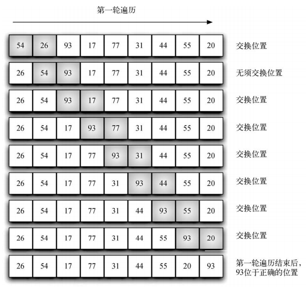

##### 图 4-4 冒泡排序的第一轮遍历过程

​	第二轮遍历开始时，最大值已经在正确位置上了。还剩 *n*–1 个元素需要排列，也就是说要比较 *n*–2 对。既然每一轮都将下一个最大的元素放到正确位置上，那么需要遍历的轮数就是 *n*–1。完成 *n*–1 轮后，最小的元素必然在正确位置上，因此不必再做处理。代码清单 4-5 给出了完整的 bubbleSort 函数。该函数以一个列表为参数，必要时会交换其中的元素。

##### 代码清单 4-5 冒泡排序函数 bubbleSort

```python
def bubbleSort(alist): 
    for passnum in range(len(alist)-1, 0, -1): 
        for i in range(passnum): 
            if alist[i] > alist[i+1]: 
                temp = alist[i] 
                alist[i] = alist[i+1] 
                alist[i+1] = temp
                # Python语法支持将上述三行合并成一行：alist[i], alist[i+1] = alist[i+1], alist[i]
```

​	在分析冒泡排序算法时要注意，不管一开始元素是如何排列的，给含有 *n* 个元素的列表排序需要遍历 *n*–1 轮。表 4-4 展示了每一轮的比较次数。总的比较次数是前 *n*–1 个整数之和。由于前 *n* 个整数之和是 $\frac{1}{2}n^2+\frac{1}{2}n$ ，因此前 *n*–1 个整数之和就是  $\frac{1}{2}n^2+\frac{1}{2}n-n$ ，即 $\frac{1}{2}n^2-\frac{1}{2}n$ 。这表明，该算法的时间复杂度是 $O(n^2)$ 。在最好情况下，列表已经是有序的，不需要执行交换操作。在最坏情况下，每一次比较都将导致一次交换。

##### 表 4-4 冒泡排序中每一轮的比较次数

| 轮次 | 比较次数 |
|--- | --- |
| 1| n–1| 
| 2| n–2| 
| 3| n–3| 
| …… | …… |
| n–1| 1 |

​	冒泡排序通常被认为是效率最低的排序算法，因为在确定最终的位置前必须交换元素。“多余”的交换操作代价很大。不过，由于冒泡排序要遍历列表中未排序的部分，因此它具有其他排序算法没有的用途。特别是，如果在一轮遍历中没有发生元素交换，就可以确定列表已经有序。可以修改冒泡排序函数，使其在遇到这种情况时提前终止。对于只需要遍历几次的列表，冒泡排序可能有优势，因为它能判断出有序列表并终止排序过程。代码清单 4-6 实现了如上所述的修改，这种排序通常被称作短冒泡。

##### 代码清单 4-6 修改后的冒泡排序函数

```python
def shortBubbleSort(alist): 
    exchanges = True 
    passnum = len(alist)-1 
    while passnum > 0 and exchanges: 
        exchanges = False 
        for i in range(passnum): 
            if alist[i] > alist[i+1]: 
                exchanges = True 
                temp = alist[i] 
                alist[i] = alist[i+1] 
                alist[i+1] = temp 
        passnum = passnum -1
```

#### 选择排序

​	选择排序在冒泡排序的基础上做了改进，每次遍历列表时只做一次交换。要实现这一点，选择排序在每次遍历时寻找最大值，并在遍历完之后将它放到正确位置上。和冒泡排序一样，第一次遍历后，最大的元素就位；第二次遍历后，第二大的元素就位，依此类推。若给 *n* 个元素排序，需要遍历 *n*–1 轮，这是因为最后一个元素要到 *n*–1 轮遍历后才就位。

​	图 4-5 展示了完整的选择排序过程。每一轮遍历都选择待排序元素中最大的元素，并将其放到正确位置上。第一轮放好 93，第二轮放好 77，第三轮放好 55，依此类推。代码清单 4-7给出了选择排序函数。

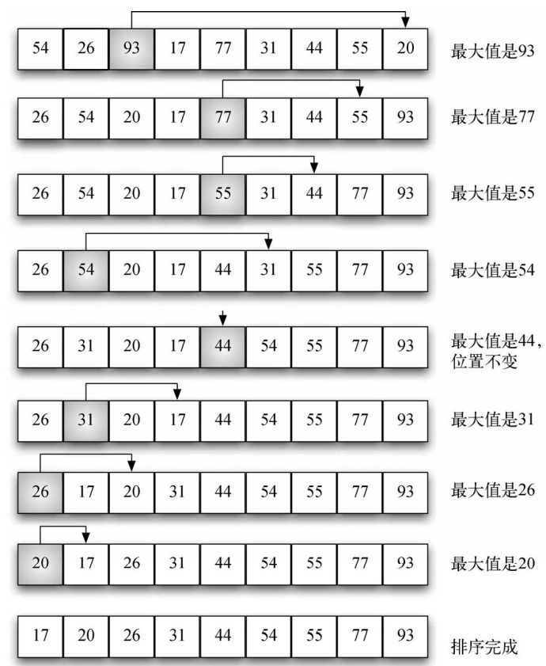

##### 图 4-5 选择排序

##### 代码清单 4-7 选择排序函数 selectionSort

```python
def selectionSort(alist): 
    for fillslot in range(len(alist)-1, 0, -1): 
        positionOfMax = 0 
        for location in range(1, fillslot+1): 
            if alist[location] > alist[positionOfMax]: 
                positionOfMax = location 
    
        temp = alist[fillslot] 
        alist[fillslot] = alist[positionOfMax] 
        alist[positionOfMax] = temp
```

​	可以看出，选择排序算法和冒泡排序算法的比较次数相同，所以时间复杂度也是 $O(n^2)$ 。但是，由于减少了交换次数，因此选择排序算法通常更快。就本节的列表示例而言，冒泡排序交换了 20 次，而选择排序只需交换 8 次

#### 快速排序

​	快速排序采用分治策略。快速排序算法首先选出一个基准值。尽管有很多种选法，但为简单起见，本节选取列表中的第一个元素。基准值的作用是帮助切分列表。在最终的有序列表中，基准值的位置通常被称作分割点，算法在分割点切分列表，以进行对快速排序的子调用。

​	在图 4-6 中，元素 54 将作为第一个基准值。从前面的例子可知，54 最终应该位于 31 当前所在的位置。下一步是分区操作。它会找到分割点，同时将其他元素放到正确的一边——要么大于基准值，要么小于基准值。

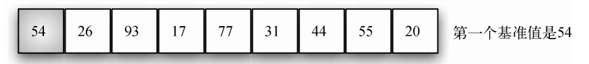

##### 图 4-6 快速排序的第一个基准值

​	分区操作首先找到两个坐标——leftmark 和 rightmark——它们分别位于列表剩余元素的开头和末尾，如图 4-7 所示。分区的目的是根据待排序元素与基准值的相对大小将它们放到正确的一边，同时逐渐逼近分割点。图 4-7 展示了为元素 54 寻找正确位置的过程。

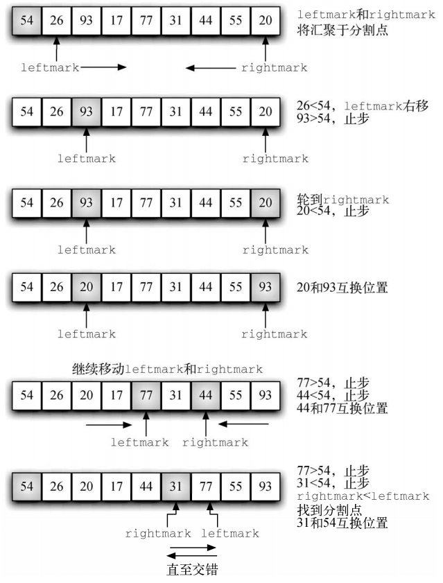

##### 图 4-7 为 54 寻找正确位置

​	首先加大 leftmark，直到遇到一个大于基准值的元素。然后减小 rightmark，直到遇到一个小于基准值的元素。这样一来，就找到两个与最终的分割点错序的元素。本例中，这两个元素就是 93 和 20。互换这两个元素的位置，然后重复上述过程。

​	当 rightmark 小于 leftmark 时，过程终止。此时，rightmark 的位置就是分割点。将基准值与当前位于分割点的元素互换，即可使基准值位于正确位置，如图 4-8 所示。分割点左边的所有元素都小于基准值，右边的所有元素都大于基准值。因此，可以在分割点处将列表一分为二，并针对左右两部分递归调用快速排序函数。

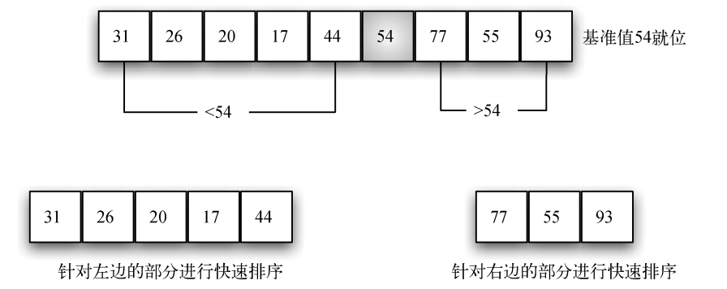

##### 图 4-8 基准值 54 就位

​	在代码清单 4-8 中，快速排序函数 quickSort 调用了递归函数 quickSortHelper。quickSortHelper 首先处理和归并排序相同的基本情况。如果列表的长度小于或等于 1，说明它已经是有序列表；如果长度大于 1，则进行分区操作并递归地排序。分区函数 partition 实现了前面描述的过程。

##### 代码清单 4-8 快速排序函数 quickSort

```python
def quickSort(alist): 
    quickSortHelper(alist, 0, len(alist)-1) 
   
def quickSortHelper(alist, first, last): 
    if first < last: 
        splitpoint = partition(alist, first, last) 
        quickSortHelper(alist, first, splitpoint-1) 
        quickSortHelper(alist, splitpoint+1, last) 
   
def partition(alist, first, last): 
    pivotvalue = alist[first] 
    leftmark = first + 1 
    rightmark = last 
    done = False 
    while not done: 
        while leftmark <= rightmark and alist[leftmark] <= pivotvalue: 
            leftmark = leftmark + 1 
        while alist[rightmark] >= pivotvalue and rightmark >= leftmark: 
            rightmark = rightmark – 1 
        if rightmark < leftmark: 
            done = True 
        else: 
            temp = alist[leftmark] 
            alist[leftmark] = alist[rightmark] 
            alist[rightmark] = temp 
    temp = alist[first] 
    alist[first] = alist[rightmark] 
    alist[rightmark] = temp 
    return rightmark
```

​	在分析 quickSort 函数时要注意，对于长度为 *n* 的列表，如果分区操作总是发生在列表的中部，就会切分 log*n* 次。为了找到分割点，*n* 个元素都要与基准值比较。所以，时间复杂度是 $O(n\log n)$ 。

​	不幸的是，最坏情况下，分割点不在列表的中部，而是偏向某一端，这会导致切分不均匀。在这种情况下，含有 *n* 个元素的列表可能被分成一个不含元素的列表与一个含有 *n*–1 个元素的列表。然后，含有 *n*–1 个元素的列表可能会被分成不含元素的列表与一个含有 *n*–2 个元素的列表，依此类推。这会导致时间复杂度变为 $O(n^2)$ ，因为还要加上递归的开销。

​	前面提过，有多种选择基准值的方法。可以尝试使用三数取中法避免切分不均匀，即在选择基准值时考虑列表的头元素、中间元素与尾元素。本例中，先选取元素 54、77 和 20，然后取中间值 54 作为基准值（当然，它也是之前选择的基准值）。这种方法的思路是，如果头元素的正确位置不在列表中部附近，那么三元素的中间值将更靠近中部。当原始列表的起始部分已经有序时，这一招尤其管用。

#### 小结

- 排序算法是计算机科学中最基本的算法之一，它的目的是将一组数据按照特定的顺序进行排列。在众多排序算法中，有些是基于比较的，如冒泡排序、快速排序和归并排序，而有些则不是，如计数排序和基数排序。排序算法的性能通常由时间复杂度和空间复杂度来衡量，同时稳定性也是一个重要的考量因素。

- 常用的排序算法有很多，篇幅所限，本章仅介绍了三种最常用的排序算法：冒泡排序、选择排序和快速排序。

- 冒泡排序和选择排序都是 $O(n^2)$ 算法。

- 快速排序的时间复杂度是 $O(n\log n)$ ，但当分割点不靠近列表中部时会降到  $O(n^2)$  。它不需要使用额外的存储空间。