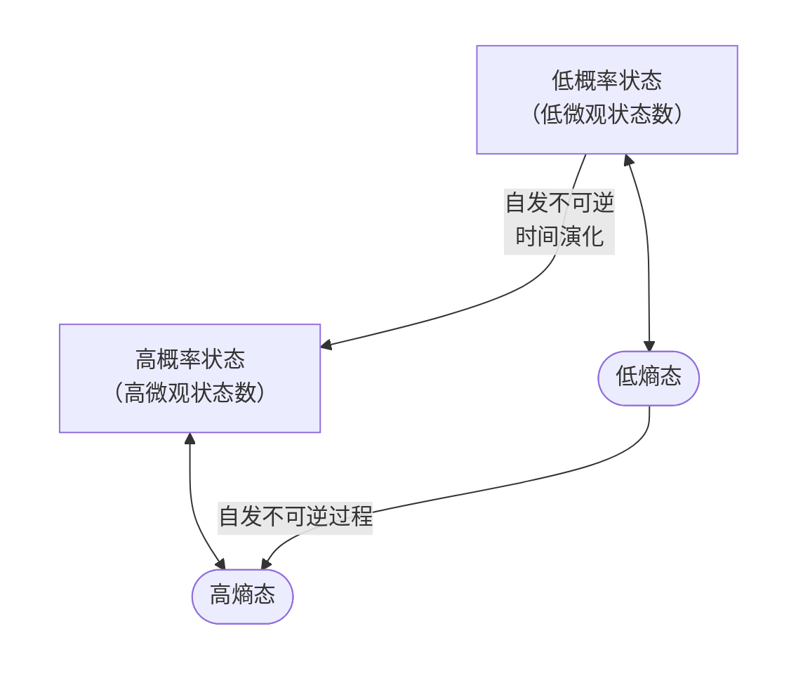

---
tags:
  - 物理化学/统计力学
Category:
  - 课内/笔记
  - 长篇
---
# 统计力学的目标

1. 对于一个有大量粒子组成的体系，在相当长的时间尺度上，系统的所有粒子在各个形式的运动能态上的分布状况？
2. 这种分布与宏观系统的性质有什么关系？

# 基本假设

1. 等概率假定：所有满足系统边界条件的微观状态，其出现概率相等。
2. 遍历态假定：无论系统在初始处于哪个状态，经过足够长的时间，一定会遍历所有状态，且在每一个状态上存在的时间相等。
3. 玻尔兹曼方程：$S=\ln\omega$
[[统计力学#玻尔兹曼熵公式（基本假设）]]

# 熵

## 微观状态

1. **分布**：一组宏观约束条件下，描述粒子在能级上占据数目的集合
2. **微观状态**：系统内所有粒子的状态被完全精确指定的状态
3. **微观状态数** ：微观状态的量
### 粒子是否可区分

1. 经典统计：定域子系统，靠位置坐标区分 (晶体：晶格上的原子被固定，波函数的重叠积分趋近于0)
2. 量子统计：非定域系统，不能区分 (气体，电子：波函数可重叠  )  
###  $\omega$计算（可区分） 

一个系统含$N$个粒子，$n$个能级，第$i$个能级上粒子数为$N_{i}$
$$
\omega=\frac{N!}{\prod_{i=1}^nN_{i}!}
$$
分母的意义 ：能级内部粒子的排列方式不可分辨
## 最可几分布

1. 最可几分布：具有最大微观结构数/最大权重的分布方式。可以代表体系，决定了体系的宏观性质
2. 系统最终必然在最可几分布附近 (到达平衡态)
3. 系统自发偏离到较低熵态的时间间隔远比加速回归时间。在有限人类观测尺度上，那极小概率事件等同于不可能事件

[[雨课堂讨论题汇总#2. 最可几分布的微观状态数]]
## 玻尔兹曼熵公式（基本假设）

$$
S=k\ln \omega
$$
- 熵是一个宏观状态的微观结构数的另一种数学描述
- 熵和权重$W$具有物理化学意义上的同质性
[[关于权重W]]

## 熵增加原理

- 熵增加原理**只对孤立系统（或绝热封闭系统）的熵本身**直接成立；对于其他系统，**系统的熵可升可降，唯一的普遍要求是系统内部的熵产生$d_iS \ge 0$，这也是热力学第二定律的最核心形式。**
[[热力学第二定律]]
[[关于熵增加原理]]
- 对于一个宏观系统，如果不受到环境扰动，那么该系统总是自发不可逆地朝熵增加的方向发展。当系统达到最可几宏观状态时，系统的熵达到最大，系统也就达到了平衡点
---

$$
对孤立系统：\Delta S \geq 0
$$

$$
\begin{cases}
\Delta S > 0 & \text{自发进行} \\
\Delta S = 0 & \text{孤立系统处于平衡态}
\end{cases}
$$
## 温度

1. 温度：熵与物质的质量条件下系统熵与能量的关系

2. 如果两个系统：
> 物体之间不通过做功的能量传递形式叫作传热

处于热平衡：
$$dS_{总} = dS_{热} + dS_{冷} = 0$$
$$dU_{热} + dU_{冷} = 0$$

非热平衡时：
$$
dU_1 = -dU_2 > 0 \quad (1\text{冷}\quad 2\text{热})
$$
$$dS_1 + dS_2 > 0 \Leftrightarrow \frac{dS_1}{dU_1} - \frac{dS_2}{dU_2}\geq0$$
$$\frac{\partial S_1}{\partial U_1} > \frac{\partial S_2}{\partial U_2}$$

> 熵对能量偏导：反映的是一个系统熵改变的难易程度
> 传热过程的方向决定各部分获得能量后熵变的多寡

$$\left(\frac{\partial S}{\partial U}\right)_{V,N} \geq 0$$

> 给定体积和物质的量，系统的熵总是随系统的能量增加而增加

3. 绝对温度的定义
$$
T=(\frac{\partial U}{\partial S})_{V,N}
$$
> 在不改变体积和物质的量的情况下，温度表示系统增加熵所耗费的能量
> 从低温到高温的过程，系统总熵减小，不会自发发生

4. 温度的特性

- 温度是系统熵变化难易程度的标度

- $T = \left(\frac{\partial U}{\partial S}\right)_{V,N}$

- 温度测量系统的冷热程度

- 温度决定热传导的方向
# 玻尔兹曼分布

# 配分函数

## 系统总能量与配分函数的关系

## 能量零点的选择对配分函数的影响

## 不同微观运动形式对热能的贡献

## 不同微观运动形式对定容热容的贡献

## 配分函数与熵的关系

# 吉布斯熵

# 香农信息熵
