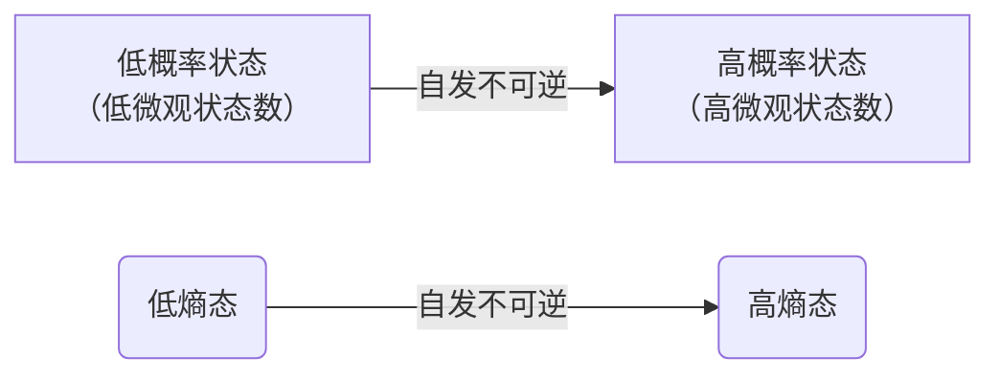

---
tags:
  - 统计力学
  - 物理化学
Category:
  - 课内/笔记
  - 长篇笔记
---
# 统计力学的目标

1. 对于一个有大量粒子组成的体系，在相当长的时间尺度上，系统的所有粒子在各个形式的运动能态上的分布状况？
2. 这种分布与宏观系统的性质有什么关系？

# 基本假设

1. 等概率假定：所有满足系统边界条件的微观状态，其出现概率相等。
2. 遍历态假定：无论系统在初始处于哪个状态，经过足够长的时间，一定会遍历所有状态，且在每一个状态上存在的时间相等。
3. 玻尔兹曼方程：$S=\ln\omega$
[[统计力学#玻尔兹曼熵公式（基本假设）]]

# 熵

## 微观状态

1. **分布**：一组宏观约束条件下，描述粒子在能级上占据数目的集合
2. **微观状态**：系统内所有粒子的状态被完全精确指定的状态
3. **微观状态数** ：微观状态的量

<mark style="background: #BBFABBA6;">**粒子是否可区分：**</mark>
1. 经典统计：定域子系统，靠位置坐标区分 (晶体：晶格上的原子被固定，波函数的重叠积分趋近于0)
2. 量子统计：非定域系统，不能区分 (气体，电子：波函数可重叠  )  

<mark style="background: #BBFABBA6;">**$\omega$计算（可区分）**：</mark>
1. 一个系统含$N$个粒子，$n$个能级，第$i$个能级上粒子数为$N_{i}$
$$
\omega=\frac{N!}{\prod_{i=1}^nN_{i}!}
$$
2. 分母的意义 ：能级内部粒子的排列方式不可分辨
## 最可几分布

1. 最可几分布：具有最大微观结构数/最大权重的分布方式。可以代表体系，决定了体系的宏观性质
2. 系统最终必然在最可几分布附近 (到达平衡态)
3. 系统自发偏离到较低熵态的时间间隔远比加速回归时间。在有限人类观测尺度上，那极小概率事件等同于不可能事件



[[雨课堂讨论题汇总#2. 最可几分布的微观状态数]]
## 玻尔兹曼熵公式（基本假设）

$$
S=k\ln \omega
$$
- 熵是一个宏观状态的微观结构数的另一种数学描述
- 熵和权重$W$具有物理化学意义上的同质性
[[关于权重W]]

## 熵增加原理

> [!tips]
>熵增加原理**只对孤立系统（或绝热封闭系统）的熵本身**直接成立；对于其他系统，**系统的熵可升可降，唯一的普遍要求是系统内部的熵产生$d_iS \ge 0$，这也是热力学第二定律的最核心形式。**

[[热力学第二定律]]
[[关于熵增加原理]]

对于一个宏观系统，如果不受到环境扰动，那么该系统总是自发不可逆地朝熵增加的方向发展。当系统达到最可几宏观状态时，系统的熵达到最大，系统也就达到了平衡点

---

$$
对孤立系统：\Delta S \geq 0
$$

$$
\begin{cases}
\Delta S > 0 & \text{自发进行} \\
\Delta S = 0 & \text{孤立系统处于平衡态}
\end{cases}
$$
## 温度

1. 温度：熵与物质的质量条件下系统熵与能量的关系

2. 如果两个系统：
> [!tips]
> 物体之间不通过做功的能量传递形式叫作传热

处于热平衡：
$$dS_{总} = dS_{热} + dS_{冷} = 0$$
$$dU_{热} + dU_{冷} = 0$$

非热平衡时：
$$
dU_1 = -dU_2 > 0 \quad (1\text{冷}\quad 2\text{热})
$$
$$dS_1 + dS_2 > 0 \Leftrightarrow \frac{dS_1}{dU_1} - \frac{dS_2}{dU_2}\geq0$$
$$\frac{\partial S_1}{\partial U_1} > \frac{\partial S_2}{\partial U_2}$$

> 熵对能量偏导：反映的是一个系统熵改变的难易程度
> 传热过程的方向决定各部分获得能量后熵变的多寡

$$\left(\frac{\partial S}{\partial U}\right)_{V,N} \geq 0$$

> 给定体积和物质的量，系统的熵总是随系统的能量增加而增加

3. 绝对温度的定义
$$
T=(\frac{\partial U}{\partial S})_{V,N}
$$
> 在不改变体积和物质的量的情况下，温度表示系统增加熵所耗费的能量
> 从低温到高温的过程，系统总熵减小，不会自发发生

4. 温度的特性

- 温度是系统熵变化难易程度的标度

- $T = \left(\frac{\partial U}{\partial S}\right)_{V,N}$

- 温度测量系统的冷热程度

- 温度决定热传导的方向

5. 负温度出现条件：
> 系统能级存在有限上限
> 系统处于非平衡激发态，处于高能级的粒子多于处于低能级的粒子数

此时 $U \uparrow$，$\frac{\partial S}{\partial U} < 0$，$\frac{1}{T} < 0$，出现负温度

> [!example]
> 核自旋系统的粒子数反转
> - 能量很低时：粒子大多在低能级，状态数少，熵小
> - 能量适中时：粒子在高低能级间均匀分布，$\omega$ 最大
> - 能量接近上限时：粒子几乎全在最高能级，$\omega$ 小，$S$ 下降


```easy-tikz
{
  "dimension": false,
  "documentSetup": true,
  "title": "S-U关系图",
  "size_x_cm": 10,
  "size_y_cm": 10,
  "show_axis_label": true,
  "axis_label_x": "U",
  "axis_label_y": "S",
  "documentClose": true,
  "showAxis": true,
  "showLargeGrid": false,
  "showSmallGrid": false,
  "gridSize": 5,
  "xmin": "0.67003",
  "xmax": "2.93846",
  "ymin": "0.27655",
  "ymax": "2.92306",
  "axis_style": "axes",
  "functions": [
    {
      "expression": "-2*(x-1.75)^2 + 2.6",
      "domain": "0.3:3.2",
      "showLegend": false,
      "fill": false,
      "fillOpacity": 0.2,
      "fillPattern": "solid",
      "tangent": true,
      "dashed": false,
      "tangentPoint": "1.75",
      "extrema": true,
      "color": "blue",
      "thickness": "very thick",
      "parametric": false,
      "expressionY": "",
      "name": "f1"
    }
  ],
  "zmin": "-5",
  "zmax": "5",
  "axis_label_z": "z",
  "rotationX": 30,
  "rotationZ": 45,
  "zoom3D": 1,
  "boxAspect": "true",
  "functions3D": [],
  "majorTickNum": 8,
  "previewSize": 760,
  "annotations": [],
  "tools": [],
  "coordinateSystem": "cartesian",
  "axis_label_x_polar": "",
  "axis_label_y_polar": "",
  "displayWidth": 590,
  "displayAlign": "center"
}
```

(1)、顶点$T \rightarrow \infty$：顶点附近无论加多少能量，熵几乎不变，意味着系统对能量变化无所谓
$$T = \frac{\partial U}{\partial S} \to \infty$$
(2)、能量流动方向：
$$\begin{cases}
dS_A + dS_B > 0 \\
dU_A + dU_B = 0
\end{cases}$$
$$T_A = \frac{\partial U_A}{\partial S_A} < 0 \qquad T_B = \frac{\partial U_B}{\partial S_B} > 0$$
$$\frac{dU_A}{T_A} + \frac{dU_B}{T_B} > 0 \Rightarrow \frac{dU_A}{T_A} > \frac{dU_A}{T_B} \Rightarrow dU_A < 0$$
> 结论：热量自发从负温系统A流向正温系统B
# 玻尔兹曼分布

## 介绍

> [!tips]
> 对与恒温热库接触的系统成立

[[玻尔兹曼分布成立条件]]

> [!lead]
> （考虑一个粒子的）小系统与大热源、接触达到平衡后，小系统可以在两个能级 $\varepsilon$ 和 $0$上转换 。

$$
\omega(\varepsilon)=\omega(0)=1
$$
$$
\text{大热源的能量：}
U_{源}\Rightarrow U_{源}-\varepsilon
$$

粒子处于 $\varepsilon$ 和处于 $0$ 的相对概率：

$$P = \frac{P(\varepsilon)}{P(0)} = \frac{W(\varepsilon)}{W(0)} \cdot \frac{W(U-\varepsilon)}{W(U)} = \frac{W(U-\varepsilon)}{W(U)} = \frac{e^{S(U-\varepsilon)/k}}{e^{S(U)/k}}$$

$$= e^{\frac{S(U-\varepsilon)-S(U)}{k}}$$

对 $S(U-\varepsilon)$ 在$U$处泰勒展开：
$$
S(U-\varepsilon) \approx S(U) - \varepsilon\left(\frac{\partial S}{\partial U}\right)_{V,n} = S(U) - \frac{\varepsilon}{T}
$$
代入上式，得到玻尔兹曼因子：
$$
\begin{aligned}
&P = \frac{P(\varepsilon)}{P(0)} = e^{-\frac{\varepsilon}{kT}} \quad \text{(每分子计量)}\\ \\
&P = \frac{P(\varepsilon)}{P(0)} = e^{-\frac{\varepsilon}{k_BT}} \quad \text{(每摩尔计量)} 
\end{aligned}
$$
$$E = N_A\varepsilon \quad R = N_Ak$$

> [!example]
> 二噻吩分子的两个噻吩环存在顺反异构体。已知两个异构体之间的能量差是2510J/mol，请计算该分子在室温和液氮温度（77K）时，顺反异构体各自的百分比。
> （顺式1）$\xleftarrow{2510J/mol}$ （反式2）

解：
$$\frac{P_{298}(1)}{P_{298}(2)} = e^{-\frac{2510}{8.314 \times 298}} = 0.363$$
$$
\begin{aligned}
&(1) = \frac{0.363}{0.363+1} \times 100\% = 26.6\% \\ \\
&(2) = 1-26.6\% = 73.9\%
\end{aligned}
$$
$$\frac{P_{77}(1)}{P_{77}(0)} = e^{-\frac{250}{8.314 \times 77}}=0.020$$
$$
\begin{aligned}
&(1) = \frac{0.020}{0.020+1} \times 100\% = 1.9\% \\ \\
&(2)= 1-1.9\% = 98.1\%
\end{aligned}
$$
> 结论：随着温度升高，系统粒子在高能级分布越多

## 说明

1. 体系能级越高，分布越少

2. 温度越高，系统在高能级分布越多，系统的内能越多

3. 能级间的能量差越大，系统在高能级分布的越少
## 特性

1.  系统到达平衡时，系统分子在不同能级上满足玻尔兹曼分布。在给定温度条件下，玻尔兹曼分布是系统的最可几分布

2. 玻尔兹曼是严格定域的指数分布

3. 对于孤立系统，玻尔兹曼分布对应于熵最大的宏观状态

4. 玻尔兹曼分布的任何两个能级之间，都满足玻尔兹曼因子。能量项为两个能级的差值

## $kT$ ($RT$) 的物理意义

从玻尔兹曼分布的角度，若两个能态的能量差 $= kT$

$$P = \frac{P(\varepsilon)}{P(0)} = e^{-\frac{kT}{kT}} = e^{-1} = \frac{1}{2.72}$$

则两个态之间的分布的粒子数之比为 $1:2.72$

若能量差高于 $kT$，则高能态分布占比相比于 $1:2.72$ 更低，低于 $kT$ 则会升高。

因此可以把 $kT$ 理解为一个能量标准。体系能量差高于$kT$的高能态，很少有分布；低于这个态则容易有更多的分布。

$kT$ 带有能量量纲，因为指数项必须无量纲。

## 最大法推导玻尔兹曼分布

> [!目标]
> 在粒子数固定，体系能量固定的条件下找到微观状态数目的最大值

$$\omega = N!\prod_i \frac{g_i^{n_i}}{n_i!} $$
<mark style="background: #BBFABBA6;">解释</mark>
- 处理对象是经典粒子，一个微观态可以有无数个粒子。
- $g_i: \text{能级} \varepsilon_i \text{的简并度}$。
- $g_i^{n_i}$：$n_i$ 个粒子同时独立选择 $g_i$ 个态。
- 高温低密度下：$g_i$ 极大，$n_i$ 较小。

约束条件：
$$N = \sum_i n_i \quad \text{粒子数}$$
$$U = \sum_i n_i\varepsilon_i \quad \text{总能量}$$
Stirling 近似：
$$\ln N! \approx N\ln N - N$$

转化为求 $\ln\omega$ 的极值：
$$
\begin{aligned}
\ln\omega &= N\ln N - N + \sum_i (n_i\ln g_i - n_i\ln n_i + n_i)\\
&= N\ln N + \sum_i (n_i\ln g_i - n_i\ln n_i)
\end{aligned}
$$
[[拉格朗日乘数法]]
设 
$$
\begin{aligned}
Z &= \ln\omega + \gamma(\sum_i n_i - N) + \beta(\sum_i n_i\varepsilon_i - U) \\
&= N\ln N + \sum_i (n_i\ln g_i - n_i\ln n_i) + \gamma(\sum_i n_i - N) + \beta(\sum_i n_i\varepsilon_i - U)
\end{aligned}
$$
令 $\frac{\partial Z}{\partial n_i} = 0$ (对一个特定能级求偏导，无 $\sum$)
$$
\begin{aligned}
&\ln g_i - \ln n_i - 1 + \gamma + \beta\varepsilon_i = 0 \\ \\
&\ln n_i = \ln g_i -1 + \gamma + \beta\varepsilon_i\\ \\
&n_i = e^{\gamma -1}g_i e^{\beta\varepsilon_i} = e^{\alpha}g_i e^{\beta\varepsilon_i} \quad (i=1,2,3\cdots)
\end{aligned}
$$
$$
\textcolor{red}{
e^{\alpha} = \frac{N}{\sum_i g_i e^{\beta\varepsilon_i}} \qquad n_i = N\frac{g_i e^{\beta\varepsilon_i}}{\sum_i g_i e^{\beta\varepsilon_i}}
}
$$

推导 $\beta$：
$$\ln\omega = N\ln N + \sum_i (n_i\ln g_i - n_i\ln n_i)$$
$n_i = e^{\alpha}g_i e^{\beta\varepsilon_i}$ 代入：
$$
\begin{aligned}
\ln\omega &= N\ln N + \sum_i [e^{\alpha}g_i e^{\beta\varepsilon_i}\ln g_i - e^{\alpha}g_i e^{\beta\varepsilon_i}(\alpha + \ln g_i + \beta\varepsilon_i)] \\
&= N\ln N -\alpha N -\beta U
\end{aligned}
$$
令
$$\alpha' = \alpha - \ln N $$
$$
\begin{aligned}
&\ln\omega = \alpha'N - \beta U\\ \\
&S = k\ln\omega = k(\alpha'N - \beta U)
\end{aligned}
$$

$$
\textcolor{red}{
\left(\frac{\partial S}{\partial U}\right)_N = -k\beta = \frac{1}{T} \Rightarrow \beta = -\frac{1}{kT}
}
$$
第$i$个能级的分布：
$$
\textcolor{red}{
n_i = N\frac{g_i e^{-\varepsilon_i/kT}}{\sum_i g_i e^{-\varepsilon_i/kT}}
}
$$
使 $\omega$ 取极大值，该分布为最概然分布，称为玻尔兹曼分布

# 物质体系微观运动的基本规律

## 形式

###  分子平动

$$\varepsilon_t = \frac{h^2}{8m}\left(\frac{n_x^2}{a^2} + \frac{n_y^2}{b^2} + \frac{n_z^2}{c^2}\right)$$

### 分子转动

> [!tips]
> 只考虑双原子分子
> 刚性转子模型

[[量子力学#球体上的粒子（刚性转子模型）]]
$$\varepsilon_r = \frac{h^2}{8\pi^2I}J(J+1) = \frac{\hbar^2}{2I}J(J+1)$$
$$I = \mu d^2 \quad \mu = \frac{m_1m_2}{m_1+m_2}$$

转动能级的简并度 $g_{r,J} = 2J+1$
简并度：同一个能级对应多个不同微观状态的数量

### 分子振动

[[量子力学#谐振子]]
$$
\begin{aligned}
&\varepsilon_v = (v+\frac{1}{2})h\nu \\
&\nu=\frac{1}{2\pi}\sqrt{ \frac{k}{\mu} }
\end{aligned}
$$

### 电子与核运动

只讨论系统中全部粒子的电子与核运动均处于基态的情况。

## 独立性与耦合性

(1) 分子的不同形式的微观运动可以独立处理，即微观运动具有独立性。

(2) 能量具有加和性：$\varepsilon_{tot} = \varepsilon_t + \varepsilon_r + \varepsilon_v + \varepsilon_e + \varepsilon_n$

(3) 微观状态：能量在不同运动形式不同粒子上的状况

(4) 耦合性：不同粒子的同一形式的运动的能量可以相互交换；同一粒子的不同形式微观运动的能量也可以相互转换

(5) 独立性是对于一个体系的某一时刻的状态而言
耦合性是对于体系的时间演化而言
# 配分函数

## 系统总能量与配分函数的关系

## 能量零点的选择对配分函数的影响

## 不同微观运动形式对热能的贡献

## 不同微观运动形式对定容热容的贡献

## 配分函数与熵的关系

# 吉布斯熵

# 香农信息熵
